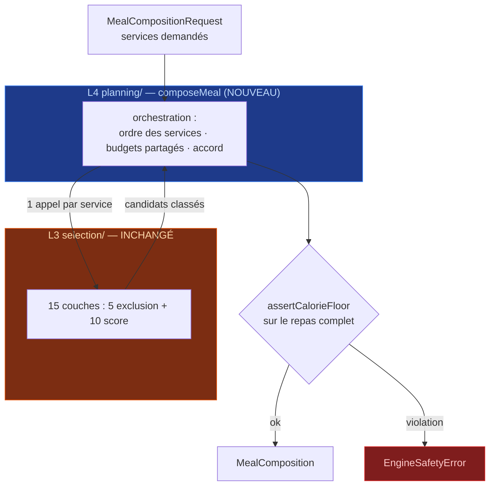

# Conception B — conseils vin & modes recette/repas

> Chantier de conception B annoncé en session 2 (`RECAP_SESSION_2.md` §6, `ENGINE.md` §6.5 ter).
> **Conception seule : aucun code, aucun contenu.** Les décisions ci-dessous ne font foi qu'une
> fois répercutées dans `ARCHITECTURE.md` / `ENGINE.md` / `DESIGN.md`, au moment de
> l'implémentation. Ce document est la pièce d'entrée de cette répercussion.

**Statut** : conception **validée** — les 8 décisions du §4 sont tranchées (2026-07-25). Restent
ouvertes uniquement les valeurs numériques, à calibrer au banc CLI (marquées ⚠).
**Date** : 2026-07-25

---

## 0. Les cinq points à retenir

1. **Le conseil vin ne touche jamais le moteur.** Métadonnée éditoriale portée par la recette,
   invisible pour les couches, absente du score et du calcul nutritionnel. Invariant testable.
2. **Il est masqué par défaut** et s'active dans les Réglages. Ce n'est pas de la pudeur : c'est
   la position la plus sûre vis-à-vis de la loi Évin (§1.2) et la seule cohérente avec le
   principe 6 (« informer, jamais juger »).
3. **Tout accord alcoolisé a son miroir sans alcool**, garanti au build. La contrainte est
   structurelle, comme `evidence_sheet_id NOT NULL` sur `topic_criterion`.
4. **Le mode repas est une orchestration (L4), pas une couche de sélection.** Composer
   entrée + plat + dessert, c'est appeler trois fois le pipeline existant avec des budgets
   partagés et un score d'accord entre services — le registre reste à 15 couches.
5. **Deux prérequis bloquants** avant tout code : une facette `service` au catalogue, et une
   migration `user.db` (colonne `service`) à faire **tant que la base est vide** — même fenêtre
   de tir que l'origine `choisi`/`reste` de `MealHistoryEntry`.

---

# Partie A — conseils vin

## 1.1 Ce que c'est, ce que ce n'est pas

| C'est | Ce n'est pas |
|---|---|
| Une **métadonnée éditoriale** attachée à une recette | Un ingrédient, un nutriment, un critère de score |
| Une indication de **famille** (« un rouge léger et fruité, servi frais ») | Une marque, une appellation valorisée, un millésime, un prix |
| Un contenu **consultable**, masqué par défaut | Une carte poussée à l'ouverture, une notification, une suggestion |
| Un **ton de service** (« se sert avec… ») | Un ton d'incitation (« à ne pas manquer », « offrez-vous ») |

Le modèle mental est celui du reste du produit : l'appli **décrit**, elle ne pousse pas. Un conseil
vin est de la même nature qu'une note de lexique — un complément qu'on va chercher.

## 1.2 Contrainte réglementaire — la loi Évin

Publication publique visée → la question n'est pas indicative. Ce que le cadre français impose en
substance (art. L. 3323-2 et L. 3323-4 du code de la santé publique) :

- La publicité en faveur des boissons alcooliques n'est autorisée que sur une **liste limitative de
  supports** ; les services de communication en ligne y figurent, **sauf** ceux destinés à la
  jeunesse ou au sport.
- Son **contenu est limité à des indications objectives** : degré volumique, origine, dénomination,
  composition, mode d'élaboration, modalités de vente et de consommation, terroir, appellation,
  distinctions.
- **Tout message doit porter la mention sanitaire** « L'abus d'alcool est dangereux pour la santé,
  à consommer avec modération ».

Un accord mets-vin générique et sans marque relève plutôt du **contenu gastronomique** que de la
publicité, et la distinction contenu éditorial / publicité a été clarifiée en 2016. Mais la
frontière se juge au cas par cas, et le produit n'a aucun intérêt à s'en approcher. Position
retenue, volontairement en retrait du maximum autorisé :

| Règle | Raison |
|---|---|
| **Aucune marque, aucun producteur, aucun lien d'achat, aucun prix** | Sort du terrain publicitaire par construction |
| **Familles génériques uniquement** (« un rouge léger et fruité ») | Utile en cuisine, sans valoriser un produit identifié |
| **Message sanitaire attaché à tout affichage d'accord alcoolisé** | Exigence légale, jamais optionnelle, jamais repliée |
| **Masqué par défaut, activé explicitement** (§1.5) | L'utilisateur demande le contenu, l'appli ne l'expose pas |
| **Jamais dans une notification, une carte du jour, une suggestion** | Un contenu poussé est un contenu promotionnel |
| **Garde-fou d'âge** dès que le vocabulaire de `tranche_age` sera figé | Aucun contenu alcool pour une tranche mineure |

> ⚠️ Ce paragraphe est une analyse de conception, **pas un avis juridique**. Il rejoint la décision
> ouverte n°3 d'`ARCHITECTURE.md` §11 (revue juridique avant publication publique) — le volet vin
> en devient l'un des points à faire relire, au même titre que les chapitres santé.

Effet de bord à ne pas oublier : mentionner de l'alcool influe sur la **classification d'âge** des
stores (Play / App Store) si la distribution store est activée (`STRATEGIE_DISTRIBUTION.md` §3).

## 1.3 Schéma — une table, une règle miroir

Table **catalogue** (lecture seule), à ajouter en même temps que le contenu, pas avant :

```sql
recipe_pairing(recipe_id, ordre, nature, famille, libelle, note)
    -- nature ∈ {'alcool','sans_alcool'}
    -- famille : vocabulaire OUVERT (texte) — 'rouge_leger', 'blanc_sec', 'effervescent',
    --           'infusion_froide', 'jus_acidule'… (pas d'enum figée, même parti que recipe_facet)
    -- libelle : phrase prête à afficher, générique, sans marque (§1.4)
    -- note    : service, température, alternative — optionnel
```

**Règle de build bloquante** : une recette qui porte au moins un `recipe_pairing` de nature
`alcool` **doit** porter au moins un `sans_alcool`. `build.mjs` échoue sinon.

> C'est le même mécanisme que `evidence_sheet_id NOT NULL` sur `topic_criterion` : rendre
> l'oubli **structurellement impossible** plutôt que compter sur la relecture. Conséquence directe :
> il ne peut pas exister d'écran où l'alcool est la seule option proposée.

L'inverse est libre : une recette peut porter uniquement des accords sans alcool.

## 1.4 Rédaction — le lexique banni s'étend

`ARCHITECTURE.md` §6.2 bannit déjà deux familles de vocabulaire (thérapeutique, jugement),
vérifiées par un test bloquant sur les fichiers de contenu. Le volet vin en ajoute une **troisième**
au même test :

| Famille | Termes (extrait) |
|---|---|
| **Incitation** *(nouveau)* | *à ne pas manquer · offrez-vous · craquez · indispensable · le meilleur · vous méritez · arrosez · pour se faire plaisir* |

Et deux contrôles structurels sur `recipe_pairing` :

- `libelle`/`note` ne doivent contenir **ni chiffre de prix, ni URL, ni nom propre commercial** —
  détectable par motif (`€`, `http`, majuscule interne suspecte à relire).
- La mention sanitaire n'est **pas** stockée dans le contenu : elle est **injectée par l'UI**, donc
  impossible à oublier dans un fichier YAML.

| ❌ Interdit | ✅ Attendu |
|---|---|
| « Un Chablis premier cru sublimera ce plat » | « Se sert avec un blanc sec et vif » |
| « À déguster absolument avec un rouge corsé » | « Pour un rouge : léger et fruité, servi frais » |
| « Le vin parfait pour ce plat » | « Sans alcool : une infusion de verveine glacée » |

## 1.5 Affichage — où, quand, jamais

| Emplacement | Règle |
|---|---|
| **Fiche recette** (`DESIGN.md` §4.6) | Section **« Accords »** repliée, sous Matériel — visible seulement si le réglage est actif |
| **Réglages** | `user_display.afficher_accords`, **`false` par défaut**, réversible en un tap |
| **Aujourd'hui / Semaine / carte occasion** | **Jamais.** Aucun accord dans un écran de suggestion |
| **Courses** | Jamais généré automatiquement (§1.8) |
| **Notification, tip du jour, partage** | Jamais. La carte-image de partage (§8.7 ARCHI) **exclut** les accords |
| **Message sanitaire** | Affiché **avec** tout accord alcoolisé, non repliable, non stylisé en petit gris illisible |

Quand le réglage est inactif — cas par défaut — la section n'existe pas dans le DOM : pas de titre
grisé, pas de « activez pour voir ». Un contenu masqué qui s'annonce reste une incitation.

## 1.6 Impact moteur — zéro, et vérifié

`recipe_pairing` **n'est pas chargée dans le `Catalog` en RAM**. Le moteur ne peut donc pas la lire,
même par accident. C'est la même mécanique que `equipment` de niveau `informatif` (§6.5 ENGINE),
qui n'est jamais chargé.

Invariant proposé, à couvrir par un test d'architecture au moment du code :

```
aucun fichier de engine/ ne référence 'pairing' ni 'accord'
```

Conséquence : un accord ne peut jamais faire monter ou descendre une recette dans un classement.
La question « le moteur privilégie-t-il les plats qui vont avec du vin ? » a une réponse
structurelle, pas déclarative.

## 1.7 L'alcool dans le calcul nutritionnel — tranché : option A

`ETAT.md` §4 (ligne 14) et `FICHE_REPRISE.md` affirment : *« alcool : jamais compté dans le calcul
nutritionnel d'un repas »*. **Le code fait autre chose.** `aggregateRecipe`
(`app/src/engine/nutrition/aggregation.ts`) somme **tous** les ingrédients, optionnels inclus — donc
aussi `vin_rouge_cuisine`, `vin_blanc_cuisine` et `cognac`, présents au catalogue depuis la
session 2.

Trois lectures possibles :

| Option | Effet | Coût |
|---|---|---|
| **A — la règle vise la boisson servie, pas l'ingrédient** *(recommandé)* | Le vin de cuisine reste compté comme n'importe quel ingrédient ; une boisson servie n'est de toute façon pas un ingrédient, donc rien à exclure | Nul : on corrige la phrase des docs, pas le code |
| **B — exclure le groupe `boissons alcoolisées` de l'agrégat** | Sous-estime l'énergie réellement servie ; crée un précédent « certains ingrédients ne comptent pas » | Faible en code, coûteux en cohérence |
| **C — modéliser l'évaporation** | Le taux résiduel dépend du temps, de la surface, du couvercle — très variable | Élevé, et non auditable |

**Retenu : option A** (validé le 2026-07-25). La formulation actuelle des docs est trop large ; elle
sera reprise en « une boisson alcoolisée n'est jamais un aliment du repas ; un alcool employé
**comme ingrédient** est agrégé comme les autres ». **Aucun changement de code** — la correction
porte sur `ETAT.md` §3 et `FICHE_REPRISE.md`, qui portent encore la phrase trop large.

## 1.8 Courses — l'alcool ne s'ajoute jamais tout seul

- **Ingrédient de cuisine** (vin blanc d'un risotto) : entre dans la liste comme n'importe quel
  ingrédient de la recette planifiée. C'est déjà le comportement de `buildShoppingList`.
- **Boisson servie** : **jamais générée**. L'utilisateur peut l'ajouter à la main via l'ajout
  manuel existant (`DESIGN.md` §4.3) — c'est un ajout libre, sans autocomplétion vers un accord,
  sans reprise du conseil affiché sur la fiche.
- Pas de rayon « alcools » dans `shopping_extra_item` : cette table reste **non alimentaire**
  (10 rayons, `ARCHITECTURE.md` §4.3), et ouvrir un rayon boissons reviendrait à ce que l'appli
  propose d'acheter de l'alcool.

---

# Partie B — modes recette et repas

## 2.1 Définitions

| Mode | Un créneau contient | État |
|---|---|---|
| **Recette** *(défaut, comportement actuel)* | **1 plat** | Implémenté (P1a/P1b) |
| **Repas** | **1 à 3 services** — entrée · plat · dessert, avec accords entre eux | À concevoir ici, à coder après P1c |

Le mode se choisit **par créneau**, jamais globalement : « ce soir je reçois » ne doit pas
transformer les quatorze autres créneaux de la semaine en menus trois services.

## 2.2 Où ça vit — L4, pas une nouvelle couche



**Le registre reste à 15 couches.** Composer un repas, c'est appeler le pipeline plusieurs fois avec
des contraintes qui évoluent entre les appels — exactement ce que fait déjà `planWeek` d'un créneau
à l'autre (§7.1 ENGINE). Une « couche accord » serait une erreur de nature : une couche note **un
candidat**, pas une **combinaison**.

## 2.3 Prérequis catalogue — la facette `service`

Aujourd'hui `recipe.types_repas` porte le **créneau** (`petit_dejeuner`, `dejeuner`, `gouter`,
`diner`), jamais le **rôle dans le repas**. Rien ne dit qu'une salade de pois chiches peut être une
entrée.

Proposition : une **cinquième facette**, `service`, dans `recipe_facet` — vocabulaire ouvert
`entree · plat · dessert · accompagnement`. Une recette peut en porter plusieurs (une soupe est
entrée *et* plat).

| Option | Coût réel |
|---|---|
| **Facette `service`** *(recommandé)* | CHECK de `recipe_facet` + tableau de validation de `build.mjs` + union `FacetteKind` — 3 lignes ; multi-valeur gratuite (une ligne par valeur) |
| Colonne `recipe.services TEXT` | Schéma + insertion + mapping loader + type domaine + YAML — plus de surface pour le même résultat |

Contenu à produire : annoter les recettes existantes. Les 10 recettes de test sont toutes des plats
sauf `blancs-neige-citron` (dessert) — le catalogue de test devra gagner **2 entrées et 2 desserts**
pour que le mode repas soit exerçable en CLI.

## 2.4 Algorithme de composition

Glouton, dans un **ordre figé** — le déterminisme (§1 ENGINE) l'exige autant que le bon sens
culinaire :

```
plat  →  entrée  →  dessert
```

Le plat porte l'identité du repas et l'essentiel de l'apport ; l'entrée et le dessert s'accordent à
lui, jamais l'inverse.

Pour chaque service, le pipeline complet tourne, avec trois choses qui changent entre les appels :

| Ce qui évolue | Règle |
|---|---|
| **Candidats** | Restreints à la facette `service` demandée (avant les couches, comme `onlyFavorites` §8.1 ENGINE) |
| **Budget temps** | `tempsDisponibleMin` est celui du **repas entier** ; après chaque service retenu, le reste est passé à la couche `temps` du service suivant. Somme, pas parallélisme — le mode cuisine (§5bis ARCHI) gère l'exécution simultanée, pas le budget |
| **Cible nutritionnelle** | Répartie entre services (§2.5), jamais dupliquée |

Puis le score de chaque candidat est recombiné avec un **score d'accord** vis-à-vis des services
déjà retenus :

```
score_final(r) = (1 − μ) · score_pipeline(r) + μ · accord(r, retenus)      μ ≈ 0.3 ⚠
```

C'est **la formule de la diversification** (§6.6 ENGINE) appliquée à l'intérieur d'un repas au lieu
d'entre suggestions — même code, autre portée.

```
accord(r, retenus) = 1
    − λ_ing  · [ ingrédient principal de r déjà présent ]        λ_ing ≈ 0.5   ⚠ pénalité forte
    − λ_tex  · [ texture identique à un service retenu ]         λ_tex ≈ 0.2
    − λ_lourd· max(0, Σ legerConsistant − seuil)                 seuil ≈ 1.0   ⚠
    + λ_cuis · [ même facette cuisine que le plat ]              λ_cuis ≈ 0.1  (bonus doux)
                                                                 → clamp [0, 1]
```

Ce que chaque terme empêche, concrètement :

| Terme | Empêche |
|---|---|
| `λ_ing` | Tarte à la tomate en entrée **et** sauce tomate en plat — réutilise `recipeMainIngredient` (P1b-1, déjà codé) |
| `λ_tex` | Trois services fondants d'affilée |
| `λ_lourd` | Gratin + cassoulet + fondant au chocolat : la somme des consistances plafonne |
| `λ_cuis` | Rien — c'est un **bonus** : un menu cohérent (tout italien) est agréable, mais un menu panaché n'est pas fautif |

Aucune de ces valeurs n'est calibrée : elles se règlent au banc CLI sur le catalogue réel, comme
`λ ≈ 0.4` de la diversification.

## 2.5 Nutrition et garde-fous

La cible du créneau (§6.5 précision 1 ENGINE) est **répartie**, jamais multipliée :

| Services demandés | Répartition proposée ⚠ |
|---|---|
| plat seul | 100 % |
| plat + dessert | 75 / 25 |
| entrée + plat + dessert | 20 / 60 / 20 |

Garde-fous, deux points fermes :

- **`assertCalorieFloor` compte le repas complet** (somme des services), et reste **journalier**.
  Aucun plancher par service.
- **Aucun message de compensation.** « Vous avez de la marge pour un dessert », « repas léger, donc
  entrée possible » sont **interdits** (`ARCHITECTURE.md` §6.5 — compteur de reste déguisé). Le mode
  repas propose une composition, il ne tient pas un budget.

## 2.6 API proposée

```ts
export type CourseKind = 'entree' | 'plat' | 'dessert' | 'accompagnement'

export interface MealCompositionRequest extends SuggestionRequest {
  /** 1 à 3 services ; 'plat' obligatoire — un repas sans plat n'existe pas. */
  readonly services: readonly CourseKind[]
  /** Services déjà validés par l'utilisateur : traités comme verrouillés, jamais rejoués. */
  readonly locked?: Partial<Record<CourseKind, RecipeId>>
}

export interface MealComposition {
  readonly courses: readonly ComposedCourse[]
  readonly accord: number                 // 0-1, qualité d'accord du repas retenu
  readonly nutrition: NutrientSummary     // somme des services
  readonly diagnostics: EngineDiagnostics // rejouable à l'identique (même graine)
}

export interface ComposedCourse {
  readonly kind: CourseKind
  readonly suggestion: ScoredSuggestion
}

// Sur Engine :
composeMeal(req: MealCompositionRequest): MealComposition
rerollCourse(meal: MealComposition, kind: CourseKind): MealComposition
```

`rerollCourse` rejoue **un seul service**, les autres étant `locked` — transposition directe de
`rerollSlot` (§7.2 ENGINE), et la raison pour laquelle `locked` est dans la requête plutôt que dans
un état interne.

## 2.7 ⚠ Migration `user.db` — à faire pendant que la base est vide

`meal_plan_entry(plan_id, date, creneau, recipe_id, portions, verrouille)` ne peut pas représenter
deux recettes sur le même créneau.

```sql
meal_plan_entry(plan_id, date, creneau, service, recipe_id, portions, verrouille)
    -- service : NULL en mode recette (un plat unique), sinon 'entree' | 'plat' | 'dessert'
    -- la clé s'étend à (plan_id, date, creneau, service)
```

Même remarque pour `MealHistoryEntry`, qui doit **aussi** recevoir son origine `choisi` / `reste`
(étape 3 de `FICHE_REPRISE.md`). **Les deux champs relèvent de la même migration** : tant qu'aucun
planning ni historique n'existe, c'est un changement de schéma gratuit ; après, c'est une migration
versionnée sur des données réelles.

> C'est le seul point de ce document qui a une **fenêtre de tir**. Le reste peut attendre.

## 2.8 Parcours

| Écran | Comportement |
|---|---|
| **Aujourd'hui** | Reste en 1-up plein écran (mode recette). Une action explicite « Composer un repas » ouvre le mode repas pour ce créneau |
| **Semaine** | Un créneau en mode repas s'affiche comme une carte à 2-3 lignes ; les états (proposé / gardé / reste) valent **par service** |
| **Occasion active** | Peut **proposer** le mode repas (`envergure: 'fete'` existe déjà au schéma) — jamais l'imposer, cohérent avec §8.6 ARCHITECTURE |
| **Courses** | Agrège les services comme n'importe quels plats — aucun changement |
| **Mode cuisine** (§5bis ARCHI) | C'est **le** cas d'usage du suivi multi-recettes : trois services, trois séries de timers. Le mode repas rend le mode cuisine utile, et réciproquement |

Le mode repas n'ajoute **aucun réglage global** : ni « je suis plutôt trois services », ni compteur.

---

## 3. Ce que ça changera dans les docs de référence

À répercuter **au moment de l'implémentation**, pas avant (le code fait foi) :

| Document | Ajout |
|---|---|
| `ARCHITECTURE.md` | §4.2 table `recipe_pairing` + règle miroir · §4.3 colonne `service` sur `meal_plan_entry` · §6.2 troisième famille de lexique banni (incitation) · §2 périmètre v1/v1.5 du mode repas |
| `ENGINE.md` | §7 `composeMeal` / `rerollCourse` · §8 API · §6.6 réemploi de la similarité pour l'accord · rappel « le registre reste à 15 couches » |
| `DESIGN.md` | §4.6 section « Accords » repliée · §4.1/§4.2 entrée du mode repas · §7 deux écrans à maquetter |
| `ETAT.md` | §3 correction de la ligne alcool (§1.7) · §4 nouvelles décisions ouvertes |

## 4. Décisions — tranchées le 2026-07-25

Les huit points ci-dessous sont **validés**. Ils ne se rediscutent plus sans raison nouvelle
(convention `ETAT.md` §3).

| # | Question | Décision |
|---|---|---|
| 1 | Accords masqués par défaut (opt-in) ou visibles et masquables ? | ✅ **Masqués par défaut** — §1.2 |
| 2 | Miroir sans alcool obligatoire au build ? | ✅ **Oui**, contrainte structurelle — §1.3 |
| 3 | Alcool dans l'agrégat nutritionnel : option A / B / C ? | ✅ **A** — la règle vise la boisson servie, pas l'ingrédient ; on corrige la doc, pas le code — §1.7 |
| 4 | Rôle des services : facette `service` ou colonne dédiée ? | ✅ **Facette** — §2.3 |
| 5 | Mode repas en v1 ou v1.5 ? | ✅ **v1.5** — la valeur v1 est le quotidien ; le menu trois services sert les occasions |
| 6 | Ordre de composition figé `plat → entrée → dessert` ? | ✅ **Oui**, déterminisme + le plat porte le repas — §2.4 |
| 7 | Valeurs `μ`, `λ_ing`, `λ_tex`, `λ_lourd`, `λ_cuis`, répartition 20/60/20 | ✅ **À calibrer au banc CLI**, jamais tranchées sur le papier — restent marquées ⚠ dans le corps du document |
| 8 | Accord vin porté par le plat seul en mode repas ? | ✅ **Oui** — un conseil par repas, jamais un par service |

Deux corrections de docs découlent de la décision 3 et **restent à faire** (`ETAT.md` §3 ligne
alcool, `FICHE_REPRISE.md` § décisions ouvertes) — voir §3 ci-dessus.

## 5. Ordre d'implémentation proposé

| Rang | Lot | Dépendance |
|---|---|---|
| **0** | **Migration `user.db`** : `service` sur `meal_plan_entry` + origine `choisi`/`reste` sur `MealHistoryEntry` | **Aucune — à faire tout de suite**, la fenêtre se referme dès qu'un planning existe |
| 1 | Facette `service` (schéma + build + loader + type) et annotation des recettes de test | Aucune |
| 2 | `composeMeal` + `rerollCourse` + score d'accord + banc CLI | **Après P1c** (`suggestMeals` bout-en-bout) |
| 3 | `recipe_pairing` + règle miroir + lexique d'incitation au test bloquant | Aucune — mais sans consommateur tant que la fiche recette n'existe pas (P5) |
| 4 | Affichage : section « Accords », réglage, message sanitaire | P5 |

> Rang 3 est volontairement **après** rang 2 alors qu'il n'en dépend pas : coder une table sans
> consommateur est exactement ce qu'on a refusé pour les courses non alimentaires
> (`RECAP_SESSION_2.md` §6). Le vin attend son écran.
