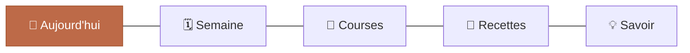
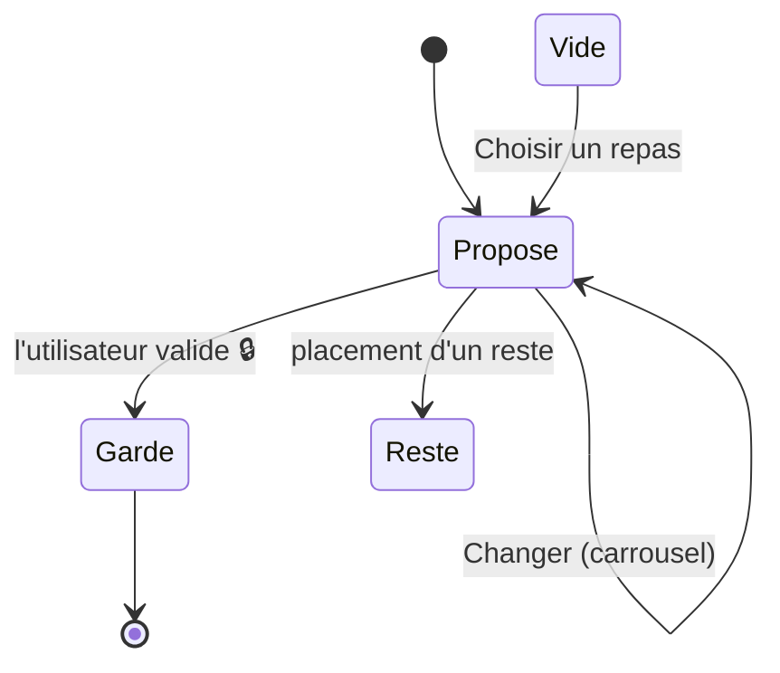
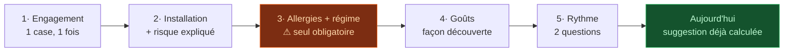

# Design & parcours utilisateur

> Décisions d'interface figées à partir des maquettes Claude Design
> (`../maquete claude design/`, bundle du 2026-07-22). Ce document tient lieu de spécification
> d'écran pour la phase P5. Compléments de [ARCHITECTURE.md](./ARCHITECTURE.md) et
> [ENGINE.md](./ENGINE.md), qui restent la référence pour le périmètre et le moteur.

**Statut** : maquettes validées en première passe, à intégrer au code en P5
**Date** : 2026-07-23

---

## 1. Jetons visuels (extraits des maquettes)

| Jeton | Valeur | Usage |
|---|---|---|
| Fond application | `#e9e2d6` (sable) / `#faf6ef` (surface) | Neutres chauds, jamais de blanc clinique |
| Encre | `#2b2621` | Texte principal |
| Encre atténuée | `#6f665e` · `#8a8077` | Texte secondaire, libellés |
| Accent | `#bd6a48` (terracotta), survol `#a3542f` | **Couleur d'accent unique** |
| Police titres | Newsreader (serif) | Registre éditorial |
| Police texte | Instrument Sans | Lisibilité |
| Cible tactile | 44-48 px minimum | Toutes tranches d'âge |
| Rayon | 12-14 px composants, 44 px cadre téléphone | — |

Mode clair et mode sombre prévus dès la maquette. **Une seule couleur d'accent** — la photographie
culinaire porte l'ambiance, pas la couleur.

**Thèmes d'accent curatés** (option retenue) : un petit jeu de teintes d'accent pré-validées pour le
contraste en clair *et* sombre, échangées en bloc via les jetons CSS — **pas** de nuanceur libre (qui
casserait l'accessibilité et pourrait teinter le badge de preuve). Le badge reste neutre quel que
soit le thème.

---

## 2. Navigation — 5 onglets, stables v1 → v2

Barre en bas sur mobile, colonne à gauche sur bureau. **Même ordre, mêmes libellés, mêmes icônes**
sur les deux — l'utilisateur ne réapprend rien en changeant d'appareil.



| Onglet | v1 | v2 |
|---|---|---|
| **Aujourd'hui** | Repas du jour, tags, aide à la décision, accès frigo | — |
| **Semaine** | Planning 2-14 jours, états, reroll | — |
| **Courses** | Liste rangeable, ajout manuel, partage | — |
| **Recettes** | Catalogue, recherche, filtres, entonnoir | — |
| **Savoir** | Le saviez-vous, gestes de cuisine, Comprendre (amorce) | **Bibliothèque santé complète** |

Le 5ᵉ onglet a du contenu dès le premier jour et **absorbe les chapitres santé sans déplacer les
autres** — d'où le choix de 5 onglets plutôt que 4 (§ décisions).

Anti-patterns bannis, appliqués dans toutes les maquettes : **pas de menu hamburger**, **pas
d'icône sans libellé**, **aucune action uniquement gestuelle**.

---

## 3. Principe transversal — le geste est un accélérateur

Chaque interaction gestuelle des maquettes est **doublée d'un contrôle visible** :

| Écran | Geste | Contrôle visible équivalent |
|---|---|---|
| Aujourd'hui | Glisser pour changer de plat | Flèches ◀ ▶ de part et d'autre |
| Aujourd'hui | Tirer « le reste de la journée » | Poignée avec libellé + chevron |
| Semaine | Glisser dans « Changer » | Flèches du carrousel |
| Savoir | Glisser « Le saviez-vous ? » | Flèches du carrousel |
| Premier lancement | Glisser j'aime/j'aime pas | Deux gros boutons |

Un geste invisible n'existe pas pour une partie des utilisateurs. Cette règle prime sur l'élégance.

---

## 4. Les écrans

### 4.1 Aujourd'hui — répond à la question principale en 0 tap

- Repas du jour **plein écran** : photo dominante, nom, heure du repas
- Tags **cliquables** sous la photo (végétarien, léger, crémeux, de saison) — informent *et*
  servent à réorienter la sélection
- Bouton « Voir la recette »
- Changement de plat par flèches visibles, glissement en raccourci ; le plat suivant défile en
  plein écran
- **Aide à la décision** : après ~4 changements, encart « Dites-moi ce que vous cherchez » avec
  pastilles Léger/Consistant · Chaud/Froid · Rapide/Mijoté · **Salé/Sucré/Salé-sucré** → alimente la
  couche `craving` (l'axe salé/sucré existe déjà : `recipe.axe_sucre_sale`). Envie exprimée →
  `craving` passe **n°1** (§6.5 ENGINE)
- Poignée visible « Le reste de la journée » : les autres repas y vivent, hors de la vue principale
- Carte « Le saviez-vous ? »
- **Carte occasion** « idée pour… » à l'ouverture, throttlée (~1×/3-4 j), occasions **activées**
  seulement, écartable — jamais un repas imposé (§8.6 ARCHITECTURE)

> Détecter l'indécision *puis* proposer, plutôt qu'interroger d'emblée. C'est la nuance qui distingue
> une aide d'un questionnaire.

### 4.2 Semaine — l'écran le plus dense

- Titre et plage de dates en haut, **sélecteur de fenêtre 2-14 jours** dès n'importe quel jour
- Bouton **« Proposer une autre semaine »** (ex-« Refaire ») + mention « vos repas gardés ne
  changeront pas »
- **Quatre états immédiatement distinguables, avec légende** :



- « Changer » ouvre le plat en carrousel plein écran, flèches visibles
- **Vue « 3 propositions » comparative** (Semaine seulement, écran déjà dense) : verrouiller ceux
  qu'on garde, « en voir d'autres » (reroll, exclut les déjà-vus), écarter les autres. **Écarter =
  exclusion éphémère de session** ; seul un pouce-bas explicite écrit `user_signal`. Aujourd'hui
  reste en 1-up plein écran (§4.1)
- Nombre de repas/jour réglable (1-3) : la maquette tient dense à 3, aérée à 1
- Bas d'écran : bouton dominant « Créer ma liste de courses »
- Bureau : grille jours × créneaux

### 4.3 Courses

- **Sélecteur « Ranger par » : Rayon / Repas / Jour** — trois usages réels
- Bouton visible « Ajouter un article » (autocomplétion)
- « Partager » conservé et visible ; **« Imprimer » et export CSV/JSON rangés dans un menu discret**
- Cases à cocher 48 px, ligne entière cliquable ; article coché barré mais **conservé à sa place**
- Quantités arrondies aux conditionnements réels (« 250 g », « 1 botte »)
- **Ajout manuel** : classé au rayon en vue Rayon ; en **pied de liste** en vues Repas/Jour (pas
  d'origine repas/jour), distingué par un **marqueur typographique discret**, jamais une 2ᵉ couleur
- **Chemin inverse** : après un ajout manuel, invite discrète « Que cuisiner avec ? » → recettes
  utilisant l'aliment (couche `pantry`). **2 ajouts ou plus** → ouvre « Vider le frigo » pré-rempli

### 4.4 Recettes

- Recherche avec **autocomplétion** (plats, ingrédients, cuisines)
- Filtres en pastilles sur **deux rangées**, le reste replié derrière « Plus de filtres » ;
  filtres actifs **retirables d'un tap**
- Section **« Mes favoris »** en tête, à un tap (marque-page `user_favorite`)
- Catégorie **« Loufoque »** (recettes virales, facette de style) parmi les filtres — contenu original
- Bloc d'entrée distinct « Vider le frigo »
- **Entonnoir des écartées** visible quand des filtres sont actifs (différenciateur §6.8 ENGINE) :

```
1 240 recettes → allergies −89 → régime −31 → temps −22 = 1 098 proposées
```

- État **« Pourquoi pas ce plat ? »** : nomme la raison d'exclusion et le critère à assouplir

### 4.5 Vider le frigo *(nouvel écran)*

- « Qu'avez-vous sous la main ? » : champ + autocomplétion, aliments en pastilles supprimables,
  grille de raccourcis (œufs, pâtes, tomates…)
- Résultats **classés par taux de couverture, jamais filtrés** :
  - « 6 ingrédients sur 8 déjà chez vous » + jauge
  - « Il vous manque : crème, thym » écrit en clair
  - substitution suggérée le cas échéant
- Réglage « Tout montrer » / « Seulement ce que je peux faire maintenant »

### 4.6 Détail d'une recette *(nouvel écran)*

Conçu pour être **lu debout, mains occupées, parfois de loin** — gros caractères, beaucoup d'air.

- Photo, retour, favori · nom · temps prep/cuisson, portions, difficulté · tags
- **Sélecteur de portions** qui recalcule les quantités en direct
- Ingrédients (absents du garde-manger signalés discrètement)
- Préparation en **gros blocs numérotés** ; mots techniques soulignés → fiche lexique + animation
- Section **« Valeurs nutritionnelles » repliée**, visible seulement en mode avancé, strictement
  descriptive
- Section **« Matériel »** : ustensiles et équipement, chacun cliquable → photo + définition
  (`equipment` niveau `informatif`)
- **Alternatives** : substitution d'ingrédients **secondaires** (jamais le principal), quantités et
  **allergènes recalculés** ; possibilité de créer une **variante perso** (« non vérifié »)
- **Notes** : commentaires locaux par recette et par étape, exportables (opt-in) avec le partage
- Bas : « Ajouter à ma semaine »

### 4.7 Savoir

- **« Le saviez-vous ? »** en carrousel (flèches + glissement)
- **« Gestes de cuisine »** : grille de vignettes → définition simple + animation muette en boucle
- **« Comprendre »** en deux niveaux (familles → chapitres, voir §6.3 ARCHITECTURE)
  - chapitre = titre-question → affirmations courtes, chacune avec **badge de preuve**, dépliables
    en résumé long + sources cliquables
  - filtre en tête : « preuve forte seulement » ou tout voir
- Lien permanent « Sources et limites »

### 4.8 Premier lancement — 5 écrans, rien d'obligatoire sauf les allergies



- **Écran 1 (engagement)** mène avec la **confidentialité comme valeur** : « vos données restent à
  100 % sur cet appareil, aucun compte, aucun tiers, aucune pub, gratuit » — 1 case, 1 fois
- **Écran 2 (installation)** en clair, sans jargon : « pour ne pas perdre vos réglages, ajoutez
  l'appli à l'écran d'accueil » → active le **stockage persistant** (§7 ARCHI)
- **Écran 3 (allergies)** : les **8 allergènes fréquents** en accès rapide + dépliant **« les 14 UE »**
  (aucun caché, sécurité) ; régime = liste **dérivée du catalogue**
- **Interrupteur « mémoriser mes goûts »** (réversible) — présenté comme mémoire de préférences,
  jamais comme historique (couche `habit`, bouton « oublier mes habitudes »)
- **Écran 4 façon « découverte »** : pile de photos de plats, j'aime/j'aime pas par boutons
  **et** glissement, « Passer » toujours visible. Résout le démarrage à froid de la couche
  `preference` **sans questionnaire** et de façon agréable.
- Arrivée directe sur une première suggestion — **divulgation progressive** : tout le reste se
  découvre à l'usage, rien n'exige de configuration pour que l'appli serve.

---

## 5. Le badge de niveau de preuve — l'élément le plus surveillé

Différenciateur n°1 de l'application, et le plus piégeux. Règle absolue : **il informe, il ne juge
pas.**

| ❌ Interdit | ✅ Attendu |
|---|---|
| Rouge / vert | Neutre, typographique |
| Note, score, étoiles | Mention de fiabilité |
| Hiérarchie de couleur type feu tricolore | Lecture « source citée dans un article sérieux » |

Quatre niveaux : `preuve forte` · `modérée` · `faible` · `préliminaire`. Les maquettes proposent
plusieurs variantes de badge — le choix final se fait à l'intégration, sous cette contrainte.

---

## 6. Conformité des maquettes aux garde-fous

Vérifié sur le bundle : aucune maquette ne contient de compteur de calories mis en avant, de
Nutri-Score, de streak, d'avatar ni de vocabulaire de jugement. Le mode avancé (macros) est **opt-in
et descriptif**. Ces invariants (§6 ARCHITECTURE) devront être re-vérifiés à l'intégration React,
puis garantis par le test de lint de contenu.

---

## 7. Reste à concevoir

| Écran / élément | État |
|---|---|
| Réglages / préférences (détail) | Esquissé (icône ⚙), pas maquetté |
| Sauvegarde / export / import | Décrit en spec, pas maquetté |
| Bandeau « persistance refusée » (§7 ARCHI) | Pas maquetté |
| Écran d'humeur → envie (Note designe §67) | Décidé sur le principe, pas maquetté |
| Mode sombre complet | Prévu, à décliner sur chaque écran |
| Choix final du badge de preuve | Variantes proposées, à trancher |
| **Écran de partage** (fichier `.nutri-recipe` + carte-image) | Décidé, pas maquetté |
| **Mode cuisine** (multi-recettes, suivi d'étape, timers) | Décidé, à spécifier — v1/v1.5 (§5bis ARCHI) |
| **Thèmes d'accent curatés** | Décidé, jetons à définir |