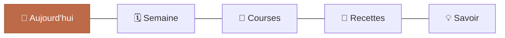
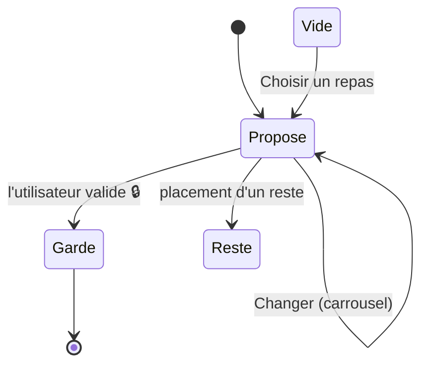
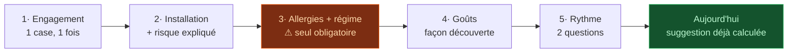

# Design & parcours utilisateur

> Décisions d'interface figées à partir des maquettes Claude Design
> (`../maquete claude design/`, bundle du 2026-07-22). Ce document tient lieu de spécification
> d'écran pour la phase P5. Compléments de [ARCHITECTURE.md](./ARCHITECTURE.md) et
> [ENGINE.md](./ENGINE.md), qui restent la référence pour le périmètre et le moteur.

**Statut** : maquettes validées en première passe, à intégrer au code en P5
**Date** : 2026-07-23

---

## 1. Jetons visuels (extraits des maquettes)

**Codés le 2026-07-30** dans `app/src/ui/theme.css`, en variables CSS Tailwind v4. Les valeurs
ci-dessous font foi ; le tableau a été corrigé au passage à l'implémentation.

| Jeton | Valeur | Usage |
|---|---|---|
| Fond application | `#faf6ef` | Neutres chauds, jamais de blanc clinique |
| Surface (cartes, barre) | `#fffdfa` | Élévation légère sur le fond |
| Encre | `#2b2621` (13,9:1) | Texte principal |
| Encre douce | `#4a433c` (9,0:1) | Texte secondaire |
| Encre atténuée | `#5a534d` (7,0:1) | Libellés, mentions — **voir écart ci-dessous** |
| Accent | `#bd6a48` (terracotta) | Aplats, bordures, états — **jamais du texte** |
| Accent texte | `#7b452f` (7,1:1) | Texte et icônes en accent |
| Accent plein | `#a3542f` (blanc dessus 5,4:1) | Fond du bouton dominant |
| Police titres | Newsreader (serif, variable 400-600) | Registre éditorial |
| Police texte | Instrument Sans (variable 400-600) | Lisibilité |
| Cible tactile | `3rem` (48 px), CTA `3.25rem` | Toutes tranches d'âge |
| Rayon | `0.875rem` (14 px) | — |
| Échelle de texte | `0.85` · `0.95` · `1.05` · `1.25` · `1.5` · `2.1rem` | **Six pas, et six seulement** |

**L'échelle de texte a six pas nommés**, déclarés dans le `@theme` de `theme.css` et employés par
leur nom (`text-mention`, `text-courant`, `text-lecture`, `text-titre-s`, `text-titre-m`,
`text-titre-l`) :

| Pas | Taille | Emploi |
|---|---|---|
| `mention` | `0.85rem` | Notes, légendes, mentions secondaires |
| `courant` | `0.95rem` | Le texte d'interface par défaut |
| `lecture` | `1.05rem` | Paragraphes qu'on lit vraiment : étapes, explications |
| `titre-s` | `1.25rem` | Titre de section (`h2`) |
| `titre-m` | `1.5rem` | Titre de sous-écran |
| `titre-l` | `2.1rem` | Titre d'écran (`h1`) |

> ⚠️ **Elle remplace 30 tailles écrites à la main**, mesurées le 2026-08-10 sur 421 occurrences de
> `text-[…rem]`. Aucune n'était fautive prise seule : c'est l'ensemble qui ne se tenait plus. L'écart
> entre `0.92` et `0.95rem` fait 0,5 px à la taille de base — invisible de tout le monde, et
> suffisant pour que chaque écran reparte d'un nombre voisin choisi au jugé. Les quatre tailles
> fréquentes (`0.90` · `0.95` · `1.00` · `1.05`, 280 occurrences) sont **fondues en deux pas** :
> aucune paire ne se distingue à l'œil.

> ⛔ **On n'ajoute pas un septième pas.** Le besoin d'un pas intermédiaire est le symptôme d'un écran
> qui hiérarchise mal, pas d'une échelle trop courte. `ui/echelle-typo.test.ts` refuse toute taille
> littérale hors d'une liste d'exceptions nommées fichier par fichier — c'est ce test, et non ce
> tableau, qui empêche les trente de revenir.

> ⚠️ **`#e9e2d6` (sable) n'est PAS le fond de l'application.** C'est le `body` du visualiseur de
> maquettes — la zone autour du cadre téléphone. Le fond de l'appli, dans le cadre, est `#faf6ef`.
> L'erreur venait de ce tableau ; elle n'a été vue qu'en lisant le HTML des maquettes.

> ⚠️ **Trois écarts mesurés aux valeurs des maquettes**, parce que les maquettes contredisent leur
> propre exigence de contraste (« viser 7:1 sur le texte courant », bloc commun du bundle). Rapports
> WCAG calculés sur `#faf6ef` : `#8a8077` en libellé d'onglet = **3,59:1**, l'accent `#bd6a48` en
> texte = **3,66:1**, et le blanc sur l'accent — **le bouton principal** — = **3,95:1**. Les trois
> échouent même au niveau AA. D'où : l'encre atténuée descend à `#5a534d`, un `accent-texte` distinct
> apparaît, et le bouton prend `#a3542f`. Détail et calculs dans l'en-tête de `theme.css`.

> ⚠️ **Libellés d'onglets à `text-mention` (`0.85rem`), pas `0.66rem`** comme les maquettes. ~10,5 px
> de texte sur la barre que tout le monde doit lire contredit la contrainte d'âge du même bloc
> commun. Ils ont longtemps porté `0.8125rem`, une valeur choisie à la main pour cette même raison ;
> l'échelle à six pas l'a absorbée **en montant de 4 %**, donc dans le sens que cet écart défendait.

**Toutes les dimensions liées au texte et aux cibles sont en `rem`, jamais en `px`** : le bloc commun
exige que l'interface tienne « si la police système est agrandie de 150 % », ce qu'une hauteur en
pixels ne suit pas.

**Mode sombre** : implémenté par **substitution des jetons** dans `@media (prefers-color-scheme:
dark)`, et non par des variantes `dark:` semées dans le JSX — un écran qui oublierait ses variantes
resterait en clair, et l'oubli ne se verrait que sur un appareil en thème sombre.

**Thèmes d'accent curatés : PAS ENCORE FAITS.** La structure les rend possibles sans rien réécrire
(quatre jetons d'accent isolés, `accent` / `accent-texte` / `accent-plein` / `accent-doux`), mais un
seul jeu de teintes existe. Toute teinte ajoutée devra passer le même contrôle de contraste.

Mode clair et mode sombre prévus dès la maquette. **Une seule couleur d'accent** — la photographie
culinaire porte l'ambiance, pas la couleur.

**Thèmes d'accent curatés** (option retenue) : un petit jeu de teintes d'accent pré-validées pour le
contraste en clair *et* sombre, échangées en bloc via les jetons CSS — **pas** de nuanceur libre (qui
casserait l'accessibilité et pourrait teinter le badge de preuve). Le badge reste neutre quel que
soit le thème.

---

## 2. Navigation — 5 onglets, stables v1 → v2

Barre en bas sur mobile, colonne à gauche sur bureau. **Même ordre, mêmes libellés, mêmes icônes**
sur les deux — l'utilisateur ne réapprend rien en changeant d'appareil.


```mermaid
flowchart LR
    A["📅 Aujourd'hui"] --- S["🗓 Semaine"] --- C["🛒 Courses"] --- R["📖 Recettes"] --- V["💡 Savoir"]
    style A fill:#bd6a48,stroke:#a3542f,color:#fff
```

| Onglet | v1 | v2 |
|---|---|---|
| **Aujourd'hui** | Repas du jour, tags, aide à la décision, accès frigo | — |
| **Semaine** | Planning 2-14 jours, états, reroll | — |
| **Courses** | Liste rangeable, ajout manuel, partage | — |
| **Recettes** | Catalogue, recherche, filtres, entonnoir | — |
| **Savoir** | Le saviez-vous, gestes de cuisine, Comprendre (amorce) | **Bibliothèque santé complète** |

Le 5ᵉ onglet a du contenu dès le premier jour et **absorbe les chapitres santé sans déplacer les
autres** — d'où le choix de 5 onglets plutôt que 4 (§ décisions).

Anti-patterns bannis, appliqués dans toutes les maquettes : **pas de menu hamburger**, **pas
d'icône sans libellé**, **aucune action uniquement gestuelle**.

---

## 3. Principe transversal — le geste est un accélérateur

Chaque interaction gestuelle des maquettes est **doublée d'un contrôle visible** :

| Écran | Geste | Contrôle visible équivalent |
|---|---|---|
| Aujourd'hui | Glisser pour changer de plat | Flèches ◀ ▶ de part et d'autre |
| Aujourd'hui | Tirer « le reste de la journée » | Poignée avec libellé + chevron |
| Semaine | Glisser dans « Changer » | Flèches du carrousel |
| Savoir | Glisser « Le saviez-vous ? » | Flèches du carrousel |
| Premier lancement | Glisser j'aime/j'aime pas | Deux gros boutons |

Un geste invisible n'existe pas pour une partie des utilisateurs. Cette règle prime sur l'élégance.

### 3.1 Photos et mouvement — quatre règles que le CSS ne sait pas porter

Le socle technique est posé (2026-08-03) : `theme.css` honore `prefers-reduced-motion`, et
`<main tabIndex={-1}>` reçoit le focus à chaque changement de route, précédé d'un lien d'évitement.
⚠️ **Ce socle est purement préventif** — il n'existe aujourd'hui aucune animation dans `app/src`.
Il est posé **avant** les carrousels et les boucles de §4.7 précisément pour ne pas avoir à repasser
sur chaque média ensuite. Les quatre règles ci-dessous, elles, ne s'automatisent pas.

1. **`alt=""` quand le nom du plat est adjacent.** Contre-intuitif, et pourtant correct :
   `alt="Blanquette de veau"` sous un titre qui dit déjà « Blanquette de veau » fait **annoncer le
   plat deux fois**. La photo apporte l'appétit, pas une information transcriptible.
2. **Jamais de photo sans nom visible.** L'écran 4 de §4.8 fait glisser des photos sans nom : il est
   inutilisable sans la vue. ⚠️ **La bonne réponse n'est pas un meilleur `alt`** — c'est un nom à
   l'écran, pour tout le monde.
3. **Jamais de texte incrusté dans la photo.** Il n'est ni traduisible, ni agrandissable, ni lisible
   par un lecteur d'écran, et il se pixellise au zoom.
4. **Toute boucle animée porte un bouton lecture/pause visible.** ⚠️ WCAG 2.2.2 fixe le seuil à
   5 secondes : une boucle WebP de 3 s qui tourne **en permanence** le dépasse, puisqu'elle ne
   s'arrête jamais. La règle vise les vignettes de gestes de §4.7.

**Technique, pour quand les photos arriveront** : `width`/`height` ou `aspect-ratio` sur chaque
`` — sans quoi la page **saute sous le doigt** au chargement, ce qui est un problème moteur et
non esthétique · `loading="lazy"` partout sauf l'image de tête · WebP.
⚠️ **Mode sombre** : une photo en pleine lumière sur `#1b1815` à 19 h est un flash. Prévoir un voile
ou un `filter: brightness(...)` — **coefficient à mesurer sur écran réel, pas à décider sur le
papier**.

---

## 4. Les écrans

### 4.1 Aujourd'hui — répond à la question principale en 0 tap

- Repas du jour **plein écran** : photo dominante, nom, heure du repas
- Tags **cliquables** sous la photo (végétarien, léger, crémeux, de saison) — informent *et*
  servent à réorienter la sélection
- Bouton « Voir la recette »
- Changement de plat par flèches visibles, glissement en raccourci ; le plat suivant défile en
  plein écran
- **Aide à la décision** : après ~4 changements, encart « Dites-moi ce que vous cherchez » avec
  pastilles Léger/Consistant · Chaud/Froid · Rapide/Mijoté · **Salé/Sucré/Salé-sucré** → alimente la
  couche `craving` (l'axe salé/sucré existe déjà : `recipe.axe_sucre_sale`). Envie exprimée →
  `craving` passe **n°1** — spécifiquement dans ce contexte « Aujourd'hui » : la Semaine reste
  pilotée par `nutri`, pas de « moment T » sur des jours futurs (symétrie précisée §6.5 ENGINE)
- Poignée visible « Le reste de la journée » : les autres repas y vivent, hors de la vue principale
- Carte « Le saviez-vous ? »
- **Carte occasion** « idée pour… » à l'ouverture, throttlée (~1×/3-4 j), occasions **activées**
  seulement, écartable — jamais un repas imposé (§8.6 ARCHITECTURE)
- **Toggles « Mes favoris » / variété** *(UI P3 — pas maquetté ; les flags moteur sont CODÉS depuis
  P1c lot 4, 2026-07-26)* : pilotent `onlyFavorites` / `varietyMode` (§8.1 ENGINE). « Mes favoris »
  restreint les candidats aux favoris **puis** score dedans — cohérent avec « favori = marque-page,
  n'influence pas le moteur par défaut » (§4.3 ARCHITECTURE) : c'est un opt-in explicite, jamais un
  poids ajouté en continu.

> Détecter l'indécision *puis* proposer, plutôt qu'interroger d'emblée. C'est la nuance qui distingue
> une aide d'un questionnaire.

### 4.2 Semaine — l'écran le plus dense

- Titre et plage de dates en haut, **sélecteur de fenêtre 2-14 jours** dès n'importe quel jour
- Bouton **« Proposer une autre semaine »** (ex-« Refaire ») + mention « vos repas gardés ne
  changeront pas »
- **Quatre états immédiatement distinguables, avec légende** :


```mermaid
stateDiagram-v2
    [*] --> Propose
    Propose --> Garde: l'utilisateur valide 🔒
    Propose --> Propose: Changer (carrousel)
    Propose --> Reste: placement d'un reste
    Vide --> Propose: Choisir un repas
    Garde --> [*]
```

- « Changer » ouvre le plat en carrousel plein écran, flèches visibles
- **Vue « 3 propositions » comparative** (Semaine seulement, écran déjà dense) : verrouiller ceux
  qu'on garde, « en voir d'autres » (reroll, exclut les déjà-vus), écarter les autres. **Écarter =
  exclusion éphémère de session** ; seul un pouce-bas explicite écrit `user_signal`. Aujourd'hui
  reste en 1-up plein écran (§4.1)
- Nombre de repas/jour réglable (1-4) : la maquette tient dense à 3, aérée à 1. **Mise à jour
  2026-08-02** (demande utilisateur après essai sur téléphone) : un 4e créneau (goûter) a été
  ajouté sous la contrainte « le rythme doit pouvoir aller à quatre repas ». Ce n'est pas sans
  conséquence sur la densité — à 4, l'écran Semaine est PLUS dense que le palier « dense à 3 »
  déjà noté ci-dessus ; aucun réaménagement de la maquette n'a été fait pour l'absorber.
- Bas d'écran : bouton dominant « Créer ma liste de courses »
- Bureau : grille jours × créneaux

### 4.3 Courses

- **Sélecteur « Ranger par » : Rayon / Repas / Jour** — trois usages réels
- Bouton visible « Ajouter un article » (autocomplétion)
- « Partager » conservé et visible ; **« Imprimer » et export CSV/JSON** (livrés le 2026-08-10) dans
  une **fenêtre** et non un menu discret — la règle du produit interdit tout dépliant hors accueil
  (`ui/panneau.tsx`). Trois actions : imprimer, CSV, JSON.
  - Le **fichier porte les articles cochés**, avec leur état, et la fenêtre l'annonce avant le clic.
    C'est l'écart voulu avec « Partager », qui n'envoie que le restant : un message qu'on lit debout
    dans un magasin n'a pas le même contenu qu'un fichier qu'on garde et qu'on vérifie après coup.
  - L'export **ignore le bouton « Ranger par »** et sort toujours par rayon : deux exports de la même
    semaine doivent rendre deux fichiers identiques, ce qu'un ordre lu à l'écran ne garantit pas.
  - ⛔ **À l'impression, la case à cocher reste dessinée, vide** — c'est celle qu'on coche au stylo.
    Voir `PIEGES.md` : la masquer avec les autres boutons viderait la liste imprimée.
- Cases à cocher 48 px, ligne entière cliquable ; article coché barré mais **conservé à sa place**
- Quantités arrondies aux conditionnements réels (« 250 g », « 1 botte »)
- **Ajout manuel** : classé au rayon en vue Rayon ; en **pied de liste** en vues Repas/Jour (pas
  d'origine repas/jour), distingué par un **marqueur typographique discret**, jamais une 2ᵉ couleur
- **Chemin inverse** : après un ajout manuel, invite discrète « Que cuisiner avec ? » → recettes
  utilisant l'aliment (couche `pantry`). **2 ajouts ou plus** → ouvre « Vider le frigo » pré-rempli
- Un mode « extra » permet d'ajouter des articles **non alimentaires** (10 rayons : hygiène,
  entretien, animaux, bébé, vêtements…) à la liste, pour faire les courses complètes en une appli ;
  table séparée du catalogue alimentaire (détail : `ARCHITECTURE.md`, `archive/RECAP_SESSION_2.md`)

### 4.4 Recettes

- Recherche avec **autocomplétion** (plats, ingrédients, cuisines)
- Filtres en pastilles sur **deux rangées**, le reste replié derrière « Plus de filtres » ;
  filtres actifs **retirables d'un tap**
- Section **« Mes favoris »** en tête, à un tap (marque-page `user_favorite`)
- Catégorie **« Loufoque »** (recettes virales, facette de style) parmi les filtres — contenu original
- Bloc d'entrée distinct « Vider le frigo »
- **Entonnoir des écartées** visible quand des filtres sont actifs (différenciateur §6.8 ENGINE) :

```
1 240 recettes → allergies −89 → régime −31 → temps −22 = 1 098 proposées
```

- État **« Pourquoi pas ce plat ? »** : nomme la raison d'exclusion et le critère à assouplir

### 4.5 Vider le frigo *(nouvel écran)*

- « Qu'avez-vous sous la main ? » : champ + autocomplétion, aliments en pastilles supprimables,
  grille de raccourcis (œufs, pâtes, tomates…)
- Résultats **classés par taux de couverture, jamais filtrés** :
  - « 6 ingrédients sur 8 déjà chez vous » + jauge
  - « Il vous manque : crème, thym » écrit en clair
  - substitution suggérée le cas échéant
- Réglage « Tout montrer » / « Seulement ce que je peux faire maintenant »

### 4.6 Détail d'une recette *(nouvel écran)*

Conçu pour être **lu debout, mains occupées, parfois de loin** — gros caractères, beaucoup d'air.

- Photo, retour, favori · nom · temps prep/cuisson, portions, difficulté · tags
- **Sélecteur de portions** qui recalcule les quantités en direct
- Ingrédients (absents du garde-manger signalés discrètement)
- Préparation en **gros blocs numérotés** ; mots techniques soulignés → fiche lexique + animation
- Section **« Valeurs nutritionnelles » repliée**, visible seulement en mode avancé, strictement
  descriptive
- Section **« Matériel »** : ustensiles et équipement, chacun cliquable → photo + définition
  (`equipment` niveau `informatif`)
- **Alternatives** : substitution d'ingrédients **secondaires** (jamais le principal), quantités et
  **allergènes recalculés** ; possibilité de créer une **variante perso** (« non vérifié »).
  Alimentée à terme par `suggestAlternatives` *(proposé P1c/P2, socle en P1b — §8 ENGINE)*
- **Notes** : commentaires locaux par recette et par étape, exportables (opt-in) avec le partage
- **Roue des goûts** : radar sensoriel à 6 pôles (Salé/Sucré, Léger/Consistant, Chaud/Froid) affiché
  sur chaque fiche plat ; agrégée sur les plats aimés, la même roue apparaît dans le profil et
  s'exporte en carte-image partageable (conçu session 2 — `archive/RECAP_SESSION_2.md`)
- Bas : « Ajouter à ma semaine »

### 4.7 Savoir

- **« Le saviez-vous ? »** en carrousel (flèches + glissement)
- **« Gestes de cuisine »** : grille de vignettes → définition simple + animation muette en boucle
- **« Comprendre »** en deux niveaux (familles → chapitres, voir §6.3 ARCHITECTURE)
  - chapitre = titre-question → affirmations courtes, chacune avec **badge de preuve**, dépliables
    en résumé long + sources cliquables
  - filtre en tête : « preuve forte seulement » ou tout voir
- Lien permanent « Sources et limites »

### 4.8 Premier lancement — 5 écrans, rien d'obligatoire sauf les allergies


```mermaid
flowchart LR
    E1["1· Engagement<br/>1 case, 1 fois"] --> E2["2· Installation<br/>+ risque expliqué"]
    E2 --> E3["3· Allergies + régime<br/>⚠ seul obligatoire"]
    E3 --> E4["4· Goûts<br/>façon découverte"]
    E4 --> E5["5· Rythme<br/>2 questions"]
    E5 --> AUJ["Aujourd'hui<br/>suggestion déjà calculée"]
    style E3 fill:#7c2d12,stroke:#ea580c,color:#fed7aa
    style AUJ fill:#14532d,stroke:#16a34a,color:#bbf7d0
```

- **Écran 1 (engagement)** mène avec la **confidentialité comme valeur** : « vos données restent à
  100 % sur cet appareil, aucun compte, aucun tiers, aucune pub, gratuit » — 1 case, 1 fois
- **Écran 2 (installation)** en clair, sans jargon : « pour ne pas perdre vos réglages, ajoutez
  l'appli à l'écran d'accueil » → active le **stockage persistant** (§7 ARCHI)
- **Écran 3 (allergies)** : les **8 allergènes fréquents** en accès rapide + dépliant **« les 14 UE »**
  (aucun caché, sécurité) ; régime = liste **dérivée du catalogue**
- **Interrupteur « mémoriser mes goûts »** (réversible) — présenté comme mémoire de préférences,
  jamais comme historique (couche `habit`, bouton « oublier mes habitudes »)
- **Écran 4 façon « découverte »** : pile de photos de plats, j'aime/j'aime pas par boutons
  **et** glissement, « Passer » toujours visible. Résout le démarrage à froid de la couche
  `preference` **sans questionnaire** et de façon agréable.
- Arrivée directe sur une première suggestion — **divulgation progressive** : tout le reste se
  découvre à l'usage, rien n'exige de configuration pour que l'appli serve.

---

## 5. Le badge de niveau de preuve — l'élément le plus surveillé

Différenciateur n°1 de l'application, et le plus piégeux. Règle absolue : **il informe, il ne juge
pas.**

| ❌ Interdit | ✅ Attendu |
|---|---|
| Rouge / vert | Neutre, typographique |
| Note, score, étoiles | Mention de fiabilité |
| Hiérarchie de couleur type feu tricolore | Lecture « source citée dans un article sérieux » |

Quatre niveaux : `preuve forte` · `modérée` · `faible` · `préliminaire`. Les maquettes proposent
plusieurs variantes de badge — le choix final se fait à l'intégration, sous cette contrainte.

---

## 6. Conformité des maquettes aux garde-fous

Vérifié sur le bundle : aucune maquette ne contient de compteur de calories mis en avant, de
Nutri-Score, de streak, d'avatar ni de vocabulaire de jugement. Le mode avancé (macros) est **opt-in
et descriptif**. Ces invariants (§6 ARCHITECTURE) devront être re-vérifiés à l'intégration React,
puis garantis par le test de lint de contenu.

---

## 7. Reste à concevoir

| Écran / élément | État |
|---|---|
| Réglages / préférences (détail) | Esquissé (icône ⚙), pas maquetté |
| Sauvegarde / export / import | Décrit en spec, pas maquetté |
| Bandeau « persistance refusée » (§7 ARCHI) | Pas maquetté |
| Écran d'humeur → envie (Note designe §67) | Décidé sur le principe, pas maquetté |
| Mode sombre complet | Prévu, à décliner sur chaque écran |
| Choix final du badge de preuve | Variantes proposées, à trancher |
| **Écran de partage** (fichier `.nutri-recipe` + carte-image) | Décidé, pas maquetté |
| **Mode cuisine** (suivi d'étape, minuteurs, écran allumé) | **Spécifié et maquetté** — v1 mono-recette, v1.5 multi-recettes (§5bis ARCHI). Pas d'écran maquetté *dans ce document* : maquette hors dépôt |
| **Thèmes d'accent curatés** | Décidé, jetons à définir |
| **Toggles « Mes favoris » / variété** (Aujourd'hui, §4.1) | Proposé, pas maquetté — P3 |
| **Sélecteur d'archétype** (onboarding + Paramètres, §ENGINE 6.3 bis) | Proposé, pas maquetté — P3 |
| **Conseils vin** (Réglages/préférences) — affichage éditorial optionnel, masquable, jamais un jugement | Décidé (session 2), pas maquetté — `archive/RECAP_SESSION_2.md` |