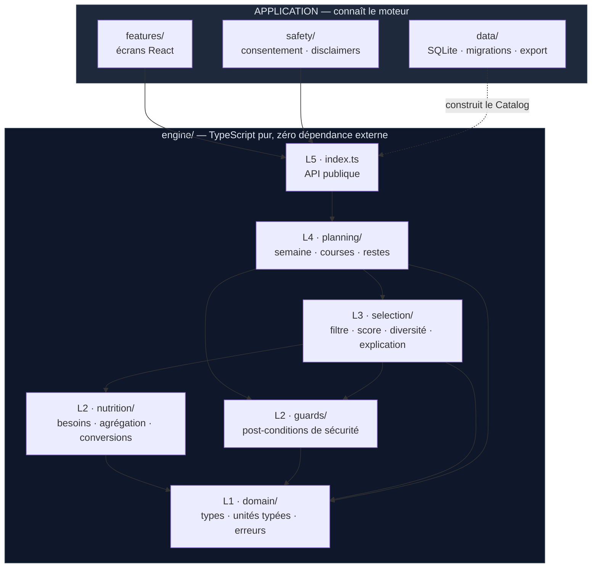
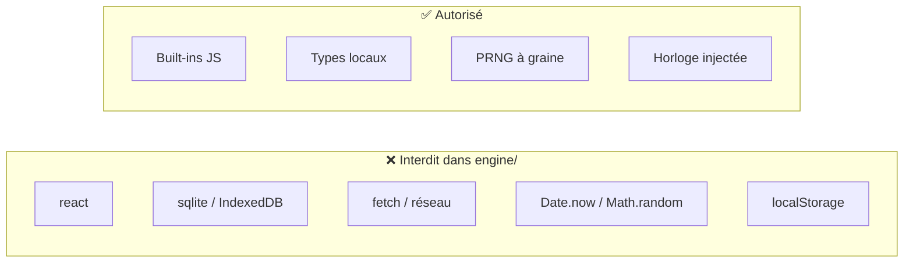
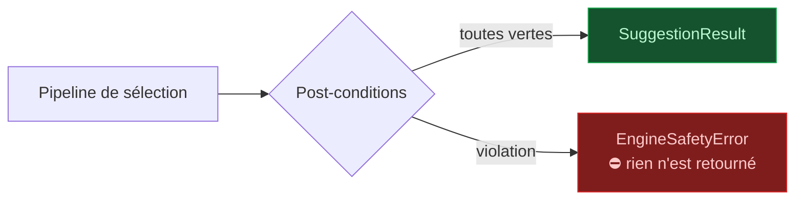
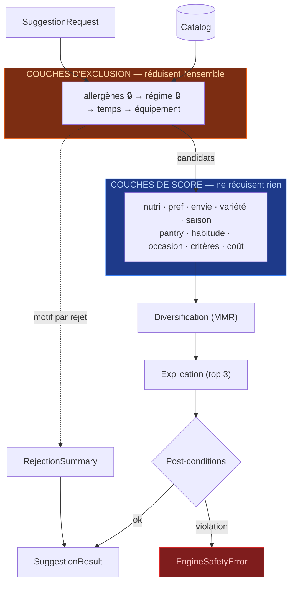
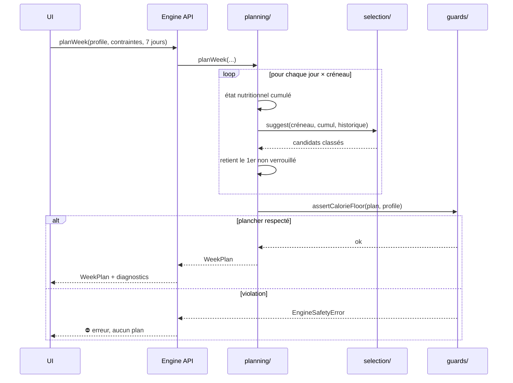
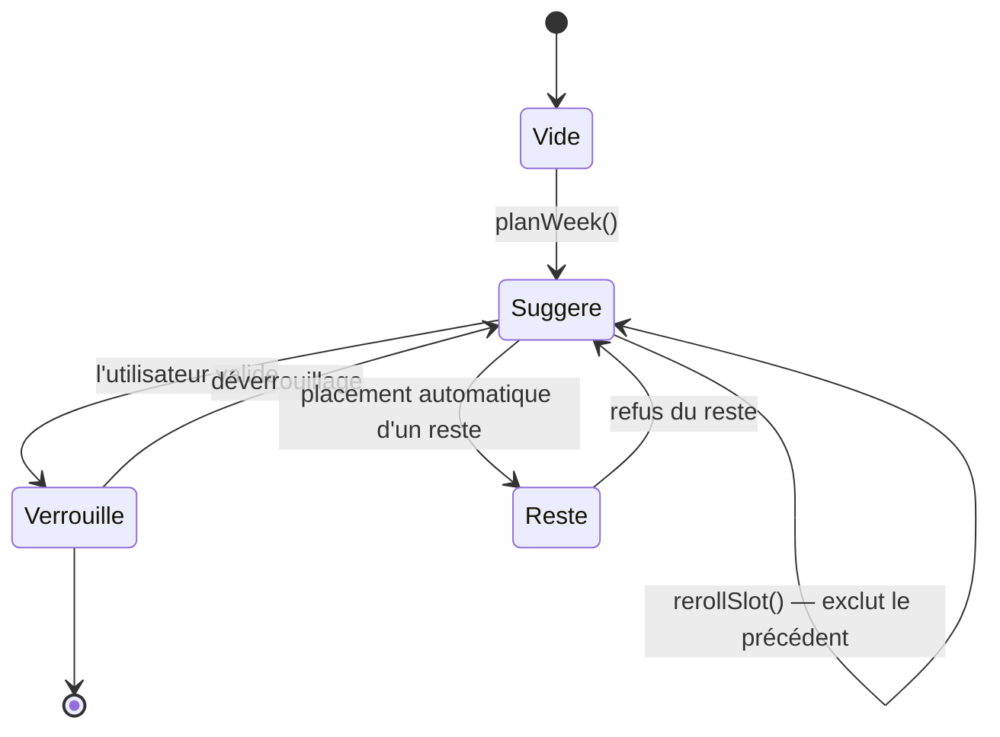
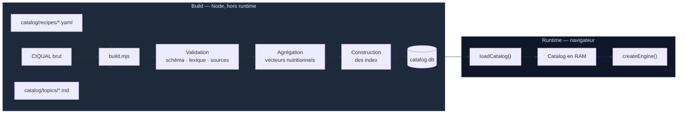
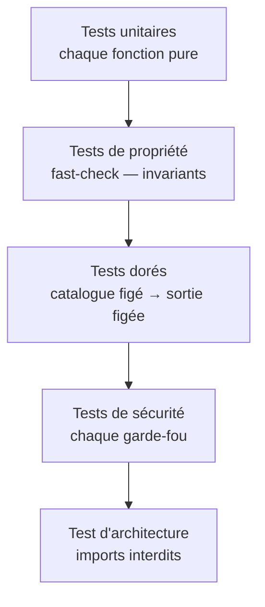
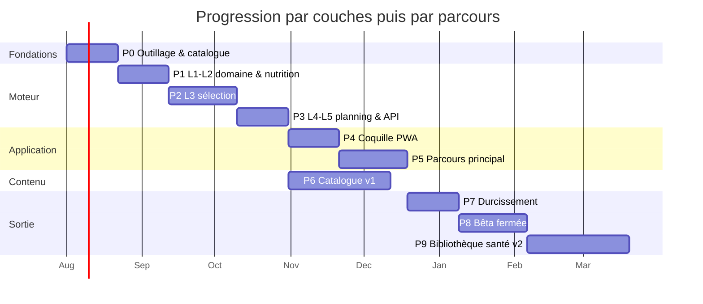
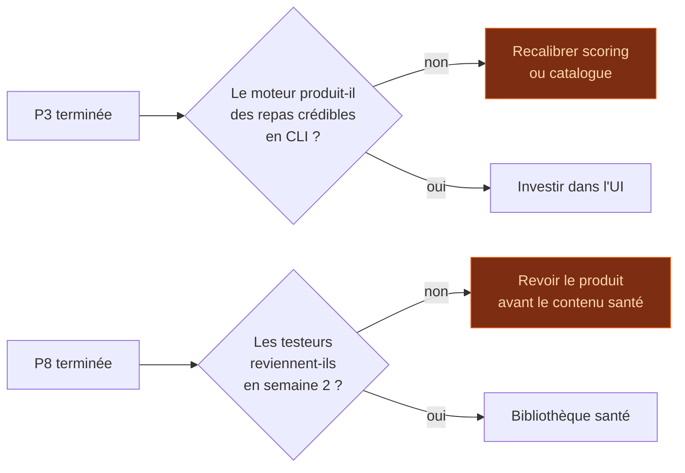

# Architecture du moteur

> Complément de [ARCHITECTURE.md](./ARCHITECTURE.md), qui reste la référence pour le périmètre,
> le modèle de données et le cadre réglementaire. Ce document ne traite que du moteur : couches,
> contrats, algorithmes, plan de construction.

**Statut** : spécification, à valider avant implémentation
**Date** : 2026-07-22

---

## Sommaire

1. [Décision fondatrice](#1-décision-fondatrice--le-moteur-est-une-fonction-pure)
2. [Vue en couches](#2-vue-en-couches)
3. [Règles de dépendance](#3-règles-de-dépendance)
4. [L1 — Domaine](#4-l1--domaine)
5. [L2 — Nutrition & garde-fous](#5-l2--nutrition--garde-fous)
6. [L3 — Sélection : le registre de couches](#6-l3--sélection)
7. [L4 — Planification](#7-l4--planification)
8. [L5 — API publique](#8-l5--api-publique)
9. [Le catalogue en mémoire](#9-le-catalogue-en-mémoire)
10. [Fonctionnalités](#10-fonctionnalités)
11. [Stratégie de test](#11-stratégie-de-test)
12. [Plan de lancement](#12-plan-de-lancement)
13. [Décisions à valider](#13-décisions-à-valider)

---

## 1. Décision fondatrice — le moteur est une fonction pure

Le moteur ne fait **aucun accès asynchrone**. Il reçoit un instantané du catalogue déjà chargé en
mémoire, et retourne un résultat de façon synchrone.

```ts
// ❌ Ce que le moteur ne fera JAMAIS
async function suggest(req) {
  const recipes = await db.query('SELECT * FROM recipe WHERE ...')
}

// ✅ Le contrat réel
function suggest(catalog: Catalog, req: SuggestionRequest): SuggestionResult
```

**Pourquoi c'est la bonne décision ici :**

| Bénéfice | Conséquence concrète |
|---|---|
| **Testable sans navigateur** | Vitest en Node pur, pas de mock SQLite, pas de WASM en test |
| **Déterministe** | Mêmes entrées → mêmes sorties, bit à bit. Exigence du principe 4. |
| **Auditable** | Une suggestion peut être rejouée à l'identique à partir de ses entrées |
| **Rapide** | Aucun aller-retour I/O dans la boucle de scoring |
| **Portable** | Si l'UI change un jour, le moteur ne bouge pas d'une ligne |

**Le coût — et pourquoi il est acceptable :** il faut tenir tout le catalogue en RAM.
Estimation : 3 200 aliments + 200 recettes + vecteurs nutritionnels pré-agrégés ≈ **6 à 10 Mo**.
Négligeable, y compris sur un téléphone d'entrée de gamme. Le jour où le catalogue dépasserait
100 Mo, cette décision serait à revoir — ce jour n'arrivera pas dans le périmètre défini.

**Corollaire sur l'aléatoire :** aucune suggestion n'utilise `Math.random()`. La diversification et
les égalités de score sont résolues par un **PRNG à graine explicite**, la graine étant stockée
avec le planning. Un planning est ainsi reproductible à l'identique — ce qui est nécessaire pour
déboguer, et suffisant pour ne pas proposer les mêmes trois plats chaque semaine.

---

## 2. Vue en couches



Chaque couche ne connaît que celles **en dessous** d'elle. Aucune remontée, aucun cycle.

| Couche | Rôle | Nature |
|---|---|---|
| **L1 domain** | Types, unités typées, erreurs métier | Données pures, zéro logique |
| **L2 nutrition** | Besoins énergétiques, agrégation, conversions | Fonctions pures, sans état |
| **L2 guards** | Post-conditions de sécurité (§6.5 d'ARCHITECTURE) | Assertions qui lèvent |
| **L3 selection** | Les 4 étapes du choix d'un repas | Pipeline pur |
| **L4 planning** | Semaine, restes, liste de courses | Orchestration |
| **L5 api** | Surface publique étroite | Façade |

---

## 3. Règles de dépendance



Ces règles sont **vérifiées automatiquement** par un test qui parcourt les imports de `engine/` et
échoue sur toute violation. Ce n'est pas une convention, c'est une barrière de build.

> **`Date.now()` interdit** : le moteur reçoit la date en paramètre (`context.date`). Sinon un test
> lancé le 31 décembre donne un autre résultat que le même test en juin — la saisonnalité dépend du
> mois. Injecter l'horloge rend les tests stables et le moteur rejouable.

---

## 4. L1 — Domaine

### 4.1 Unités typées

Le bug classique du code nutritionnel est la confusion mg / g / µg — le fer se compte en mg, les
vitamines en µg, les macros en g. Coût de la protection : dix lignes.

```ts
declare const brand: unique symbol
type Branded<T, B> = T & { readonly [brand]: B }

export type Grams      = Branded<number, 'g'>
export type Milligrams = Branded<number, 'mg'>
export type Micrograms = Branded<number, 'µg'>
export type Kcal       = Branded<number, 'kcal'>
export type Minutes    = Branded<number, 'min'>
export type Euros      = Branded<number, 'EUR'>

export const g   = (n: number): Grams => n as Grams
export const mg  = (n: number): Milligrams => n as Milligrams
export const kcal = (n: number): Kcal => n as Kcal
```

`recipe.tempsPrep + food.quantite` ne compile plus. Une conversion doit être explicite.

### 4.2 Identifiants typés

Même principe, contre l'inversion d'arguments :

```ts
export type FoodId    = Branded<string, 'FoodId'>
export type RecipeId  = Branded<string, 'RecipeId'>
export type TopicId   = Branded<string, 'TopicId'>
export type NutrientId = Branded<string, 'NutrientId'>
export type AllergenId = Branded<string, 'AllergenId'>
```

### 4.3 Entités principales

```ts
export interface Recipe {
  readonly id: RecipeId
  readonly nom: string
  readonly tempsPrep: Minutes
  readonly tempsCuisson: Minutes
  readonly difficulte: 1 | 2 | 3
  readonly portionsBase: number
  readonly ingredients: readonly RecipeIngredient[]
  readonly etapes: readonly string[]
  readonly typesRepas: readonly MealSlot[]
  readonly saisonMois: readonly Month[]
  readonly tags: readonly RecipeTag[]
  readonly axes: SensoryAxes
  readonly conservationJours: number      // pour la gestion des restes (§10.3)
  readonly imagePath: string | null
}

export interface SensoryAxes {
  readonly sucreSale: number        // -1 (salé) … +1 (sucré)
  readonly legerConsistant: number  // -1 (léger) … +1 (consistant)
  readonly chaudFroid: number       // -1 (froid) … +1 (chaud)
  readonly texture: Texture
}

export interface UserProfile {
  readonly trancheAge: AgeBracket
  readonly sexe: 'F' | 'M' | 'NP'
  readonly tailleCm: number | null
  readonly poidsKg: number | null
  readonly niveauActivite: ActivityLevel
  readonly facteurPortion: number    // 0.7 … 1.5 — « trop / pas assez » (§10.1)
}
```

### 4.4 Erreurs métier

```ts
export class EngineSafetyError extends Error {}    // post-condition violée — jamais rattrapée
export class NoViableRecipeError extends Error {}  // filtrage trop restrictif — rattrapée par l'UI
export class CatalogIntegrityError extends Error {} // catalogue corrompu — au chargement
```

`EngineSafetyError` ne doit **jamais** être capturée silencieusement par l'UI. Si elle survient,
c'est un bug de sécurité : l'écran affiche une erreur, il ne dégrade pas.

---

## 5. L2 — Nutrition & garde-fous

### 5.1 `nutrition/`

```ts
// Besoin énergétique — Mifflin-St Jeor + facteur d'activité
computeEnergyNeeds(profile: UserProfile): Kcal

// Apports de référence, par profil (VNR ANSES/EFSA)
resolveReferenceIntakes(profile: UserProfile, catalog: Catalog): NutrientVector

// Agrégation d'une recette → vecteur nutritionnel par portion
aggregateRecipe(recipe: Recipe, catalog: Catalog): NutrientVector

// Mise à l'échelle des portions
scaleRecipe(recipe: Recipe, portions: number): ScaledRecipe

// Écart entre apports cumulés et cible restante sur la période
computeGap(consumed: NutrientVector, target: NutrientVector): NutrientGap
```

`NutrientVector` est un `Float64Array` indexé par position de nutriment, **pas** un objet. Sur
200 recettes × 40 nutriments, la différence de performance et de pression mémoire est réelle, et
l'API reste lisible derrière un accesseur.

> **`aggregateRecipe` n'est pas appelé au runtime.** Les vecteurs sont pré-calculés à la
> construction du catalogue (§9) et livrés dans le `.db`. La fonction reste dans le moteur parce
> que c'est elle que le script de build utilise, et parce qu'elle est testable isolément.

### 5.2 `guards/` — la sécurité comme post-condition

Le point clé : **les garde-fous ne sont pas des recommandations d'UI, ce sont des assertions que le
moteur exécute sur sa propre sortie avant de la retourner.**

```ts
assertNoDeclaredAllergen(result: SuggestionResult, c: HardConstraints): void
assertCalorieFloor(plan: WeekPlan, profile: UserProfile): void
assertCriticalLayersRan(trace: PipelineTrace): void
assertScoringLayersNeverExclude(trace: PipelineTrace): void
assertNoTherapeuticClaim(explanations: readonly Explanation[]): void
```

| Garde-fou | Vérifie | Référence |
|---|---|---|
| `assertNoDeclaredAllergen` | Aucune suggestion ne contient un allergène déclaré | §5.2 ARCHI |
| `assertCalorieFloor` | Aucun jour < 1 200 kcal (F) / 1 500 (H) | §6.5 ARCHI |
| `assertCriticalLayersRan` | Les couches `critical` ont bien été exécutées | §6.3 |
| `assertScoringLayersNeverExclude` | **Aucune** couche de score n'a réduit l'ensemble | §6.1 ARCHI · §6.3 |
| `assertNoTherapeuticClaim` | Aucune explication ne contient le lexique banni | §6.2 ARCHI |



Un allergène qui passerait le filtre à cause d'un bug de scoring ne peut pas atteindre l'écran :
le moteur refuse de retourner le résultat. C'est la différence entre « on a écrit le filtre
correctement » et « il est structurellement impossible que ça sorte ».

---

## 6. L3 — Sélection

### 6.1 Deux natures de couches — la distinction qui structure tout

Le pipeline n'est pas du code figé : c'est un **registre ordonné de couches** partageant un contrat
commun. Mais elles se répartissent en deux natures qu'il ne faut jamais confondre.

| Nature | Effet sur l'ensemble | Composition | Exemples |
|---|---|---|---|
| **Exclusion** | **Retire** des candidats | Intersection | allergènes · régime · temps · équipement |
| **Score** | **Ne retire rien**, repondère | Somme pondérée | préférences · envies · santé · frigo · habitude… |

> **Le piège à éviter.** Si « préférences » était une couche d'exclusion, détester les champignons
> éliminerait toute recette en contenant — y compris celle où ils sont une garniture accessoire.
> Une préférence doit **déclasser, jamais supprimer.** Seules quatre choses suppriment : un
> allergène, un régime déclaré, un temps impossible, un équipement absent et indispensable.



### 6.2 Le contrat commun

```ts
export type LayerKind = 'exclusion' | 'scoring'

export interface SelectionLayer<Config = unknown> {
  readonly id: LayerId
  readonly kind: LayerKind
  readonly critical: boolean        // true → indésactivable, par aucun réglage
  readonly defaultWeight: number    // scoring uniquement

  /** Extrait du contexte ce dont la couche a besoin. Pure. */
  readonly configure: (req: SuggestionRequest, catalog: Catalog) => Config

  /** Exclusion → renvoie un sous-ensemble + motifs. Score → renvoie un score 0-1 par candidat. */
  readonly apply: (candidates: CandidateSet, config: Config) => LayerResult
}
```

Une couche ne connaît **ni les autres couches, ni le pipeline**. Elle reçoit un ensemble de
candidats et une configuration, elle retourne un résultat. C'est ce qui la rend utilisable seule
(§6.7) et testable isolément.

### 6.3 Le registre

```ts
export const LAYERS: readonly SelectionLayer[] = [
  // — exclusion, dans l'ordre de priorité de MOTIF —
  allergenLayer,     // 🔒 critical
  dietLayer,         // 🔒 critical
  timeLayer,
  equipmentLayer,    // seulement l'équipement `requis`

  // — score —
  nutriLayer,        // 0.25
  preferenceLayer,   // 0.25
  cravingLayer,      // 0.20
  varietyLayer,      // 0.15
  seasonLayer,       // 0.10
  pantryLayer,       // 0.05 — dominant en mode « vider le frigo »
  habitLayer,        // 0.00 → croît avec l'historique (§7.5)
  occasionLayer,     // 0.05 — nul hors période
  topicLayer,        // 0.00 — nul tant qu'aucune thématique active
  costLayer,         // 0.05 — v3
]
```

**Douze couches, mais cinq réellement actives au premier lancement** : `topic`, `cost` et `habit`
démarrent à 0, `occasion` est nul hors période. La complexité perçue n'augmente pas avec le nombre
de couches.

Les poids sont normalisés (`Σ = 1`) avant application. L'utilisateur les module via **quatre
préréglages nommés** — *équilibre · plaisir · rapidité · budget* — jamais douze curseurs.

#### Sur l'ordre des couches

| Nature | L'ordre compte-t-il ? |
|---|---|
| **Exclusion** | **Pas pour le résultat** — une intersection d'ensembles est commutative. **Oui pour le rapport** : on veut annoncer « écarté pour allergène » plutôt que « écarté pour temps » quand les deux s'appliquent. L'ordre encode la priorité de motif. |
| **Score** | **Jamais.** C'est une somme pondérée ; seuls les poids comptent. |

#### Deux invariants garantis par le registre

1. **`critical: true` est indésactivable.** Aucun réglage, aucun test, aucun futur développeur ne
   peut retirer la couche allergènes du pipeline. La sécurité devient structurelle plutôt que
   confiée à la vigilance.
2. **Aucune couche de score ne peut réduire l'ensemble des candidats.** Vérifié par
   `assertTopicsNeverExclude`, étendu à toutes les couches `kind: 'scoring'`.

### 6.4 Exécution du pipeline

```ts
function runPipeline(catalog: Catalog, req: SuggestionRequest): PipelineOutcome {
  const enabled = LAYERS.filter(l => l.critical || isEnabled(l.id, req))

  // ① exclusion — intersection successive, motif conservé
  let candidates = catalog.indexes.recipesBySlot.get(req.context.creneau)!
  const rejections: RejectionEntry[] = []
  for (const layer of enabled.filter(l => l.kind === 'exclusion')) {
    const r = layer.apply(candidates, layer.configure(req, catalog))
    rejections.push(...r.rejected)      // premier motif rencontré = motif retenu
    candidates = r.kept
  }

  // ② score — accumulation, aucune réduction
  const scores = new Map<RecipeId, ScoreBreakdown>()
  for (const layer of enabled.filter(l => l.kind === 'scoring')) {
    const r = layer.apply(candidates, layer.configure(req, catalog))
    accumulate(scores, layer.id, r.scores, weightOf(layer, req))
  }

  return { candidates, scores, rejections }
}
```

Ajouter une fonctionnalité, c'est **ajouter une entrée au registre** — le pipeline ne change pas.
« Vider le frigo », le budget, un futur critère d'empreinte carbone : une couche chacun.

### 6.5 Les couches de score en détail

| Couche | Calcul | Poids |
|---|---|---|
| `nutri` | 1 − distance normalisée entre l'apport de la recette et le déficit restant | 0.25 |
| `preference` | Moyenne des préférences sur ingrédients et facettes, saturée | 0.25 |
| `craving` | 1 − distance euclidienne sur les 3 axes sensoriels demandés | 0.20 |
| `variety` | Décroissance exponentielle selon l'ancienneté de la dernière occurrence | 0.15 |
| `season` | Proportion d'ingrédients de saison au mois du contexte | 0.10 |
| `pantry` | Taux de couverture des ingrédients par `user_pantry` | 0.05 † |
| `habit` | Quatre signaux statistiques locaux (§7.5) | 0.00 ‡ |
| `occasion` | Appartenance à une occasion active dans la fenêtre de dates | 0.05 § |
| `topic` | Écart aux critères des thématiques actives | **0.00** |
| `cost` | 1 − dépassement du budget par portion (v3) | 0.05 |

† `pantry` passe en **poids dominant** en mode « vider le frigo » (§10.2)
‡ `habit` croît avec le volume d'historique — démarrage à froid propre
§ `occasion` vaut 0 hors de la fenêtre d'une occasion activée

#### Poids dynamiques — `craving` et `occasion` prennent la tête quand c'est pertinent

Deux couches ont un **poids contextuel**, pas fixe :
- **`craving` passe n°1** (≈ 0.40 après renormalisation) **dès qu'une envie est exprimée** (pastilles
  Léger/Chaud/Salé…), et retombe à ≈ 0 sinon — sans envie, la distance à l'axe est neutre, un poids
  élevé permanent n'aurait aucun effet.
- **`occasion` passe n°2** pendant une occasion **activée et dans la fenêtre**, 0 hors période.

Conséquence assumée : quand l'utilisateur formule une envie, le moment prime sur l'équilibre
nutritionnel — `nutri` reste un score, jamais un garde-fou (le plancher calorique est une
post-condition séparée, §guards). Le reste du temps, `nutri`/`preference` mènent. Une carte occasion
« idée pour… » peut être remontée à l'ouverture (throttlée ~1×/3-4 j, occasions activées seulement,
écartable — §8.6 ARCHITECTURE).

**`topic` vaut 0 tant qu'aucune thématique n'est activée.** Le volet santé n'existe pas dans le
calcul par défaut — c'est ce qui rend l'invariant §6.1 d'ARCHITECTURE vérifiable, et non seulement
déclaratif.

#### La couche `equipment` — une nuance qui compte

L'équipement se déclare en deux niveaux dans le catalogue :

| Niveau | Effet | Exemple |
|---|---|---|
| `requis` | **Exclusion** — infaisable sans | Sorbetière pour une glace |
| `accelere` | **Score** — faisable à la main, plus long | Robot pour une pâte |
| `informatif` | **Aucun effet moteur** — ustensile du lexique matériel, jamais chargé en RAM | Fouet, fourchette, spatule |

Sans cette distinction, ne pas posséder de mixeur supprimerait la moitié du catalogue.

### 6.6 Diversification

Prendre les 5 meilleurs scores retourne souvent 5 variations du même plat. Correction par
**pertinence marginale maximale** simplifiée :

```
retenues = []
tant que |retenues| < limite :
    meilleure = argmax( score(r) − λ · similarité(r, retenues) )
    retenues += meilleure
```

`similarité` combine ingrédient principal, famille de cuisine et profil sensoriel.
`λ ≈ 0.4` par défaut, à calibrer sur le catalogue réel.

### 6.7 Explication

```ts
interface Explanation {
  readonly criterion: ScoreCriterion
  readonly contribution: number         // part du score final, 0 → 1
  readonly label: string                // phrase prête à afficher
  readonly authority?: string           // rempli uniquement pour la couche `topic`
  readonly evidenceSheetId?: EvidenceSheetId
}
```

Les trois plus fortes contributions sont converties en phrases via un gabarit par critère :

> « Proposé car : riche en fer · plat rapide comme demandé · légumes de saison »

Quand une thématique est active, l'explication **cite obligatoirement l'autorité** :

> « Correspond au critère *limiter les sucres rapides* — recommandations ANSES, diabète de type 2 »

`authority` et `evidenceSheetId` sont **non-nullables dès que `criterion === 'topic'`** —
contrainte vérifiée par `assertNoTherapeuticClaim`.

### 6.8 Utiliser une couche seule

Chaque couche étant autonome, elle s'expose individuellement dans l'API. C'est ce qui permet de
construire des écrans entiers **sans invoquer le moteur de suggestion**.

```ts
engine.layer('allergenes').apply(catalog.allRecipes, { allergies: ['arachide'] })
// → navigateur « recettes sûres pour moi », sans aucun scoring

engine.layer('pantry').apply(candidats, { pantry: [...] })
// → écran « avec ce que j'ai », taux de couverture et ingrédients manquants

engine.layer('occasion').apply(candidats, { date, occasionsActives })
// → carrousel « idées pour le Nouvel An chinois »
```

Trois bénéfices directs :

| Bénéfice | Détail |
|---|---|
| **Écrans autonomes** | Un navigateur de recettes filtré n'a pas besoin du pipeline complet |
| **Tests isolés** | Chaque couche a ses propres tests de propriété, sans monter le moteur |
| **Cheminement affichable** | L'UI peut montrer l'entonnoir — voir ci-dessous |

Le cheminement visible est un différenciateur : aucun concurrent ne le fait, parce qu'aucun n'a de
moteur explicable.

```
1 240 recettes
  → allergènes   − 89
  → régime       − 31
  → temps        − 22
  → équipement   −  6
  = 1 092 candidats, classés par 6 couches de score
```

---

## 7. L4 — Planification

### 7.1 Algorithme de planification

Glouton jour par jour, état nutritionnel cumulé réinjecté à chaque créneau.

**Fenêtre glissante de 2 à 14 jours**, démarrant à n'importe quelle date — pas de semaine
calendaire figée. Le minimum à 2 jours couvre le départ en week-end ; le maximum à 14 jours couvre
la planification anticipée. Conséquences sur le moteur :

| Élément | Adaptation |
|---|---|
| Cible nutritionnelle | Calculée sur la durée réelle de la fenêtre, pas sur 7 jours fixes |
| Fenêtre de variété | Reste à 21 jours glissants, indépendante de la fenêtre de planification |
| Liste de courses | Générée sur la fenêtre courante |



**Pourquoi glouton et pas optimisation globale :** l'optimisation d'un planning de 21 créneaux sous
contraintes multiples est NP-difficile, mais surtout **elle est incompréhensible pour
l'utilisateur** — modifier une préférence rebat toutes les cartes, y compris les repas qu'il
aimait. Le glouton produit un résultat stable, où chaque changement est local et explicable.

### 7.2 États d'un créneau



Un créneau **verrouillé** est invisible pour toute replanification ultérieure. C'est le mécanisme
qui rend le glouton acceptable : l'utilisateur fige ce qu'il veut et relance le reste.

### 7.3 Gestion des restes

Une recette de 4 portions cuisinée pour 2 personnes laisse 2 portions. Le planificateur les place
dans un créneau ultérieur compatible, dans la limite de `recipe.conservationJours`.

```ts
planLeftovers(plan: WeekPlan, catalog: Catalog): WeekPlan
```

Gain : moins de cuisine, moins de gaspillage, et un planning qui ressemble à la façon dont les gens
cuisinent réellement. C'est la fonctionnalité qui distingue le plus un vrai planificateur d'un
générateur de recettes.

### 7.4 Liste de courses

```ts
buildShoppingList(plan: WeekPlan, catalog: Catalog, opts: ShoppingOptions): ShoppingList
```

Quatre étapes : agrégation des ingrédients → conversion en unités d'achat → **arrondi aux
conditionnements courants** (on n'achète pas 43 g de beurre) → regroupement par rayon.

`opts.joursDeCourses` permet de scinder la liste : ce qui se conserve d'un côté, le frais à
racheter en milieu de semaine de l'autre.

### 7.5 Anticipation sans IA — la couche `habit`

« Anticiper ce que la personne veut » se réduit à **quatre statistiques locales**, toutes
explicables en une phrase.

```ts
computeHabitProfile(signals: readonly UserSignal[], catalog: Catalog): HabitProfile
```

| Signal | Ce qu'il capte | Explication produite |
|---|---|---|
| **Affinité jour de semaine** | Fréquence par créneau × jour | « tu choisis souvent des plats mijotés le dimanche » |
| **Affinité saisonnière** | Fréquence par mois | « tu reviens aux soupes en novembre » |
| **Co-occurrence d'ingrédients** | Ce qui revient dans les plats aimés | « tu aimes les plats au citron » |
| **Facettes pondérées par récence** | Cuisines et textures récentes | « beaucoup d'asiatique ces temps-ci » |

Aucun apprentissage, aucun modèle : des compteurs pondérés sur `user_signal`, recalculés à la
volée. La couche reste une fonction pure comme les onze autres.

**Trois propriétés qu'un modèle opaque ne peut pas offrir :**

1. **Démarrage à froid propre.** Sans historique, le poids vaut 0 et croît avec le volume de
   signaux — aucune suggestion absurde au premier lancement.
2. **Chaque suggestion reste justifiable en une phrase.** Un système de recommandation classique
   ne peut pas dire *pourquoi*. C'est notre différenciateur, rendu visible.
3. **Réversibilité totale.** Un bouton « oublier mes habitudes » vide `user_signal` et remet les
   compteurs à zéro. Impossible avec un modèle entraîné.

> ⚠️ Rappel §6.5 ARCHITECTURE : `user_signal` enregistre ce que l'utilisateur **a aimé ou voulu**,
> jamais ce qu'il a consommé. La couche `habit` ne doit jamais formuler un constat de consommation
> (« 4 fois des pâtes cette semaine ») — seulement une affinité (« tu sembles aimer les plats
> mijotés le dimanche »). La différence entre les deux est exactement le principe 6.

---

## 8. L5 — API publique

Surface volontairement étroite. Tout le reste est interne au module.

```ts
export function createEngine(catalog: Catalog): Engine

export interface Engine {
  readonly version: string
  readonly catalogVersion: string

  suggestMeals(req: SuggestionRequest): SuggestionResult
  planWeek(req: WeekPlanRequest): WeekPlan
  rerollSlot(plan: WeekPlan, slot: SlotRef, opts?: RerollOptions): WeekPlan
  planLeftovers(plan: WeekPlan): WeekPlan
  buildShoppingList(plan: WeekPlan, opts?: ShoppingOptions): ShoppingList
  analyzeWeek(plan: WeekPlan, profile: UserProfile): NutritionReport
  scaleRecipe(id: RecipeId, portions: number): ScaledRecipe
  suggestSubstitutions(id: RecipeId, missing: readonly FoodId[]): readonly Substitution[]

  /** Accès individuel à une couche — §6.8 */
  layer<C>(id: LayerId): SelectionLayer<C>
  readonly layers: readonly LayerDescriptor[]   // id · nature · critique · poids effectif
}
```

### 8.1 Requête

```ts
export interface SuggestionRequest {
  readonly profile: UserProfile
  readonly constraints: HardConstraints     // allergies · régime · exclusions
  readonly context: MealContext             // créneau · date · temps · envies · garde-manger
  readonly history: MealHistory             // N derniers jours, pour la variété
  readonly activeTopics: readonly TopicId[] // [] par défaut
  readonly weights?: Partial<ScoreWeights>
  readonly limit?: number                   // défaut 5
  readonly seed: number                     // reproductibilité
}
```

### 8.2 Réponse

```ts
export interface SuggestionResult {
  readonly suggestions: readonly ScoredSuggestion[]
  readonly rejected: RejectionSummary       // transparence : combien, et pourquoi
  readonly diagnostics: EngineDiagnostics
}

export interface ScoredSuggestion {
  readonly recipeId: RecipeId
  readonly score: number                    // 0 → 100
  readonly breakdown: ScoreBreakdown        // par critère
  readonly explanations: readonly Explanation[]
  readonly portions: number
  readonly nutrition: NutrientSummary
}

export interface EngineDiagnostics {
  readonly engineVersion: string
  readonly catalogVersion: string
  readonly weights: ScoreWeights            // effectivement appliqués
  readonly seed: number
  readonly candidatsInitiaux: number
  readonly candidatsApresFiltrage: number
  readonly dureeMs: number
}
```

> `diagnostics` porte tout ce qu'il faut pour **rejouer une suggestion à l'identique**. C'est
> l'auditabilité exigée par le principe 4 : face à une suggestion contestée, on rejoue exactement
> le même calcul. Affiché derrière un écran développeur, jamais dans le parcours normal.

### 8.3 Contrat d'erreur

| Erreur | Signification | Traitement UI |
|---|---|---|
| `NoViableRecipeError` | Contraintes trop restrictives, 0 candidat | Écran « assouplir un critère », avec le motif dominant issu de `RejectionSummary` |
| `EngineSafetyError` | Post-condition violée — bug | Écran d'erreur. **Jamais de dégradation silencieuse.** |
| `CatalogIntegrityError` | Catalogue corrompu ou version incompatible | Rechargement du catalogue livré |

---

## 9. Le catalogue en mémoire

### 9.1 Structure

```ts
export interface Catalog {
  readonly version: string
  readonly foods: ReadonlyMap<FoodId, Food>
  readonly recipes: ReadonlyMap<RecipeId, Recipe>
  readonly nutrients: readonly Nutrient[]        // ordre = index dans NutrientVector
  readonly allergens: ReadonlyMap<AllergenId, Allergen>
  readonly topics: ReadonlyMap<TopicId, HealthTopic>
  readonly substitutions: ReadonlyMap<FoodId, readonly Substitution[]>
  readonly indexes: CatalogIndexes
}

export interface CatalogIndexes {
  readonly recipesByAllergen: ReadonlyMap<AllergenId, ReadonlySet<RecipeId>>
  readonly recipesByDiet: ReadonlyMap<DietCode, ReadonlySet<RecipeId>>
  readonly recipesBySlot: ReadonlyMap<MealSlot, ReadonlySet<RecipeId>>
  readonly recipeNutrients: ReadonlyMap<RecipeId, NutrientVector>   // pré-agrégé
  readonly recipeMainIngredient: ReadonlyMap<RecipeId, FoodId>      // pour la diversification
}
```

### 9.2 Où se fait le travail



**Tout ce qui peut être calculé une fois l'est au build.** Agrégation nutritionnelle, index par
allergène, ingrédient principal, validation du lexique interdit. Le runtime ne fait que
désérialiser. Conséquences : démarrage rapide, et surtout les erreurs de contenu sont détectées
**à la construction**, pas chez l'utilisateur.

`build.mjs` échoue — et bloque le build — si : une recette référence un aliment inconnu, un
`topic_criterion` n'a pas de source, ou le lexique banni (§6.2 ARCHITECTURE) apparaît dans un
fichier de contenu.

---

## 10. Fonctionnalités

### 10.1 Demandées — couvertes

| Fonctionnalité | Où | Version |
|---|---|---|
| Suggestion multi-repas | `selection/` | v1 |
| Allergies & régime | couches `allergenes` 🔒 · `regime` 🔒 | v1 |
| Préférences culinaires | couche `preference` | v1 |
| Envies du moment | couche `craving` + axes sensoriels | v1 |
| Planning 7 jours | `planning/planWeek` | v1 |
| Liste de courses | `planning/shopping` | v1 |
| Ajustement des proportions | `facteurPortion` + `scaleRecipe` | v1 |
| Photos des plats | catalogue, `imagePath` | v1 |
| Tip du jour | rotation déterministe sur la date | v1 |
| **Vider le frigo** | couche `pantry` + mode dédié | v1 |
| **Anticipation des envies** | couche `habit` (§7.5) | v1 |
| **Repas d'occasion** | couche `occasion` (§8.6 ARCHI) | v1 |
| **Équipement disponible** | couche `equipment` | v1 |
| **Lexique de cuisine illustré** | catalogue, `lexicon_entry` | v1 |
| **Macros en option** | affichage, `false` par défaut (§6.5 ARCHI) | v1 |
| **Favoris** | `user_favorite` — marque-page, hors moteur | v1 |
| **Substitution d'ingrédient** | `suggestSubstitutions` + table `substitution` (secondaire, recalcul allergènes) | v1 |
| **Import / partage de recette** | fichier `.nutri-recipe`, P2P sans serveur (§8.7 ARCHI) | v1 |
| **Commentaires locaux** | `user_recipe_note`, exportables avec le partage | v1 |
| **Mode cuisine** | couche UI (timers par étape) — hors moteur (§5bis ARCHI) | v1/v1.5 |
| Fiches scientifiques | `topics/` + `evidence/` | v2 |
| Thématiques santé | couche `topic`, poids 0 | v2 |
| Coût des repas | couche `cost` | v3 |

### 10.2 Ajouts proposés — fort rapport valeur / coût

**① Mode « vider le frigo »** — l'utilisateur saisit ce qu'il a, le moteur classe par taux de
couverture des ingrédients.

> **Ce n'est pas un filtre.** Avec 4 ingrédients au frigo, aucune recette n'est intégralement
> couverte : un filtre renverrait zéro résultat. C'est une **couche de score sur le taux de
> couverture**, en deux modes :

| Mode | Poids `pantry` | Affichage |
|---|---|---|
| Normal | Bonus modéré (0.05) | « 6 ingrédients sur 8 déjà chez toi » |
| **Vider le frigo** | Dominant, écrase les autres | Trié par couverture + **« il te manque : crème, thym »** |

Afficher ce qui manque vaut mieux que masquer la recette — et se combine avec les substitutions
(« pas de crème ? yaourt grec »).

> ⚠️ Frigo Magic occupe ce terrain avec 4 800 recettes, gratuitement. Chez nous c'est **une couche
> parmi douze**, pas le produit. Ne pas positionner l'application là-dessus.

**② Substitutions d'ingrédients** — « pas de crème ? yaourt grec ». Table de substitution dans le
catalogue, avec impact nutritionnel affiché. *Coût : contenu (~200 paires) + une fonction.*
Transforme « je ne peux pas faire cette recette » en « je la fais quand même ».

**③ Retour post-repas** — un pouce haut / bas après un repas alimente automatiquement
`user_preference`. *Coût : quasi nul.* C'est le meilleur levier de qualité à long terme : le
moteur s'améliore par l'usage, **sans aucune IA** — juste des préférences accumulées.

**④ Temps disponible par créneau** — « 20 min en semaine, 1 h le week-end ». *Coût : un champ de
profil.* Sans ça, le planning propose des mijotés un mardi soir et devient inutilisable.

**⑤ Gestion des restes** — §7.3. *Coût : moyen.* Différenciant fort.

**⑥ Contrainte de course unique** — « je fais les courses le samedi » → le planificateur favorise
les recettes partageant des ingrédients et place le périssable en début de semaine. *Coût : un
critère + un champ `perissabiliteJours` sur les aliments.*

**⑦ Mode invités** — mise à l'échelle ponctuelle d'un repas pour N personnes, sans toucher au
profil. *Coût : quasi nul, `scaleRecipe` existe déjà.*

**⑧ Bilan hebdomadaire qualitatif** — pas un compteur de calories (interdit §6.5), mais une vue
« groupes d'aliments couverts cette semaine », formulée positivement : *« beaucoup de légumes verts,
peu de poisson »*. *Coût : faible, `analyzeWeek` existe dans l'API.*

**⑨ Export du planning** — image ou PDF pour la porte du frigo. *Coût : faible.*

### 10.3 Écartés

| Idée | Raison |
|---|---|
| Score nutritionnel global type note A-E | Réducteur, culpabilisant, et prête à contestation |
| Objectif de poids / suivi de courbe | §6.5 ARCHITECTURE — risque TCA |
| Partage social / communauté | Exige un backend → viole le principe 2 |
| Import de recettes par URL | Scraping, qualité non maîtrisée, droit d'auteur |

---

## 11. Stratégie de test

Couverture visée sur `engine/` : **≥ 90 %**, et 100 % sur `guards/`.



### 11.1 Tests de propriété — le cœur du dispositif

Un test unitaire vérifie un cas. Un test de propriété vérifie un **invariant sur des milliers
d'entrées générées** — exactement ce qu'il faut pour un filtre de sécurité.

```ts
test.prop([arbProfile, arbAllergies, arbContext])(
  'aucune suggestion ne contient jamais un allergène déclaré',
  (profile, allergies, ctx) => {
    const r = engine.suggestMeals({ profile, constraints: { allergies }, context: ctx, ... })
    for (const s of r.suggestions) {
      expect(allergensOf(s.recipeId)).not.toIntersect(allergies)
    }
  }
)
```

Invariants à couvrir de cette façon :
- Aucun allergène déclaré dans une suggestion — **jamais**
- **Aucune couche `kind: 'scoring'` ne réduit l'ensemble des candidats** — vérifié couche par couche
- **Aucune couche `critical` ne peut être retirée du registre**, quel que soit le réglage
- Le score reste dans [0, 100] quelles que soient les pondérations
- `planWeek` respecte toujours le plancher calorique ou lève
- Deux appels de même graine et mêmes entrées produisent une sortie identique

### 11.2 Tests dorés

Un catalogue de test figé (~20 recettes) + un jeu de requêtes → sorties enregistrées en snapshot.
Toute modification du scoring fait apparaître le diff exact. C'est le filet de sécurité contre les
régressions silencieuses de pondération.

### 11.3 Banc d'essai en ligne de commande

```bash
npm run engine:try -- --slot diner --temps 30 --envie "leger,chaud" --seed 42
```

Affiche les suggestions, le détail du score et les motifs de rejet — **sans navigateur ni UI**.
Cet outil permet de valider et calibrer tout le produit avant d'écrire le premier composant React.
À construire en phase 1, il servira jusqu'à la fin du projet.

---

## 12. Plan de lancement



> Durées indicatives pour un développeur seul à temps partiel. **P6 (contenu) est parallélisable**
> avec le développement applicatif — c'est le chemin critique réel du projet, pas le code.

### Phases et critères de sortie

| Phase | Contenu | Critère de sortie — vérifiable |
|---|---|---|
| **P0** Fondations | Repo, Vite, TS strict, Vitest, `build.mjs`, import CIQUAL | `catalog.db` généré depuis 10 recettes de test ; le build échoue sur une recette invalide |
| **P1** Domaine & nutrition | L1 + L2 + guards | Besoins énergétiques conformes à Mifflin-St Jeor sur 20 cas de référence ; 4 garde-fous couverts à 100 % |
| **P2** Sélection | Registre de 12 couches + banc CLI | `engine:try` retourne 5 suggestions expliquées et diversifiées ; chaque couche s'exécute et se teste seule ; les tests de propriété passent |
| **P3** Planning & API | L4 + L5 + restes + courses | Un planning 7 jours cohérent et une liste de courses agrégée, produits **entièrement en CLI** |
| **P4** Coquille PWA | React, routage, SQLite/OPFS, consentement, sauvegarde | Installation sur iPhone et PC ; données conservées après 8 jours sans ouverture |
| **P5** Parcours principal | Onboarding, suggestions, planning, courses, tips | Un utilisateur non accompagné planifie sa semaine et obtient sa liste |
| **P6** Contenu v1 | 150-200 recettes, photos, ~60 tips | Bundle < 15 Mo ; 7 jours planifiables sans répétition ; `CREDITS.md` complet |
| **P7** Durcissement | Hors-ligne, export/import, garde-fous TCA, lint de contenu | Zéro requête réseau après chargement (test automatisé) ; restauration d'une sauvegarde vérifiée |
| **P8** Bêta fermée | 15-25 testeurs, collecte manuelle des retours | Aucun bug bloquant ; ≥ 60 % des testeurs planifient une 2ᵉ semaine |
| **P9** Bibliothèque santé | 8-10 chapitres, fiches, filtre optionnel | Relecture externe des chapitres ; revue juridique ; `assertTopicsNeverExclude` verte |

### Points de non-retour



**Ne pas écrire d'interface avant P3.** Si le moteur ne produit pas des repas crédibles en ligne de
commande, aucune interface ne le sauvera — et une interface déjà écrite rend douloureux le fait de
remettre en cause le moteur. C'est le principal piège de ce type de projet.

**Ne pas rédiger les chapitres santé avant P8.** Ce sont les artefacts les plus coûteux et les plus
exposés juridiquement. Les écrire avant d'avoir confirmé que le produit est utilisé serait investir
le plus cher dans le plus incertain.

---

## 13. Décisions à valider

### Tranchées

| # | Décision | Retenu |
|---|---|---|
| 1 | Pipeline en dur ou registre de couches ? | **Registre de 12 couches** à contrat commun (§6.2) |
| 2 | « Vider le frigo » : filtre ou score ? | **Score**, avec un mode où son poids devient dominant |
| 3 | Suivi des préférences | **Signaux uniquement**, jamais un journal alimentaire (§6.5 ARCHI) |
| 4 | Média du lexique | **WebP animée**, boucle muette ~3 s, ~80 Ko (§8.5 ARCHI) |
| 5 | Fêtes mobiles | **Table figée sur 10 ans**, pas de calcul lunaire (§8.6 ARCHI) |
| 6 | Macros affichés | **Optionnel, `false` par défaut**, sans compteur de reste |
| 7 | Équipement | **Deux niveaux** : `requis` exclut, `accelere` déclasse |
| 8 | « Carnivore » | **Préférence, pas régime** — aucune autorité de santé derrière |
| 9 | Fenêtre de planification | **2 à 14 jours glissants**, à partir de n'importe quel jour |
| 10 | Mode sportif | **Affichage descriptif seul** — aucun objectif, aucun compteur de reste |
| 11 | Poids et nutrition sportive | **Chapitres d'information**, jamais objectifs pilotant le moteur |
| 12 | Gestes tactiles | **Accélérateurs uniquement**, toujours doublés d'un contrôle visible |
| 13 | Humeur / fatigue | Traduite en **envie sensorielle**, jamais en carence supposée |

### Ouvertes

| # | Question | Recommandation |
|---|---|---|
| 1 | `NutrientVector` en `Float64Array` ou objet ? | **Float64Array** — l'API reste lisible derrière des accesseurs |
| 2 | Nombre de nutriments suivis | **~40** (macros, fibres, 12 minéraux, 13 vitamines, AG saturés/insaturés) |
| 3 | Historique de variété | **21 jours** glissants |
| 4 | Réglage des poids exposé ? | **Non** — 4 préréglages nommés, pas 12 curseurs |
| 5 | Restes en v1 ou v2 ? | **v1** — structurant pour le planificateur, coûteux à ajouter après |
| 6 | Substitutions en v1 ou v1.5 ? | **v1.5** — coût de contenu, pas de code |
| 7 | Volume du lexique | **30-40 gestes**, dérivés automatiquement des étapes de recette |
