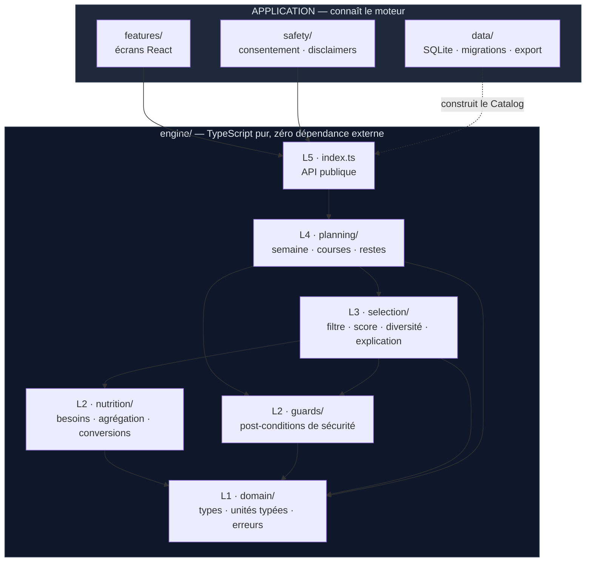
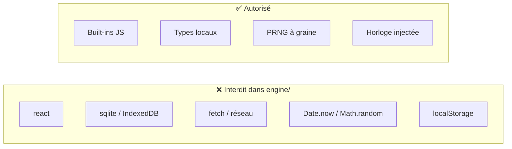
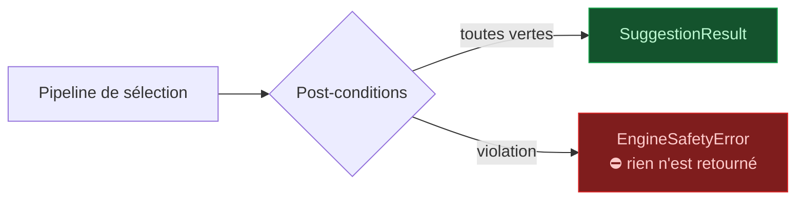
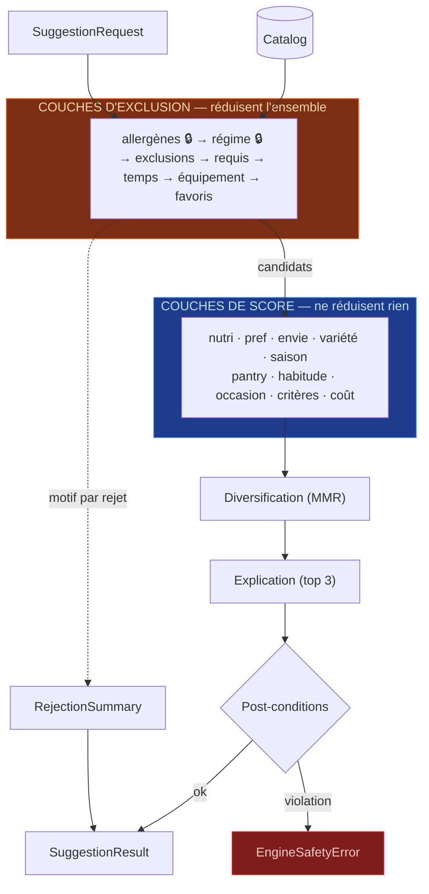
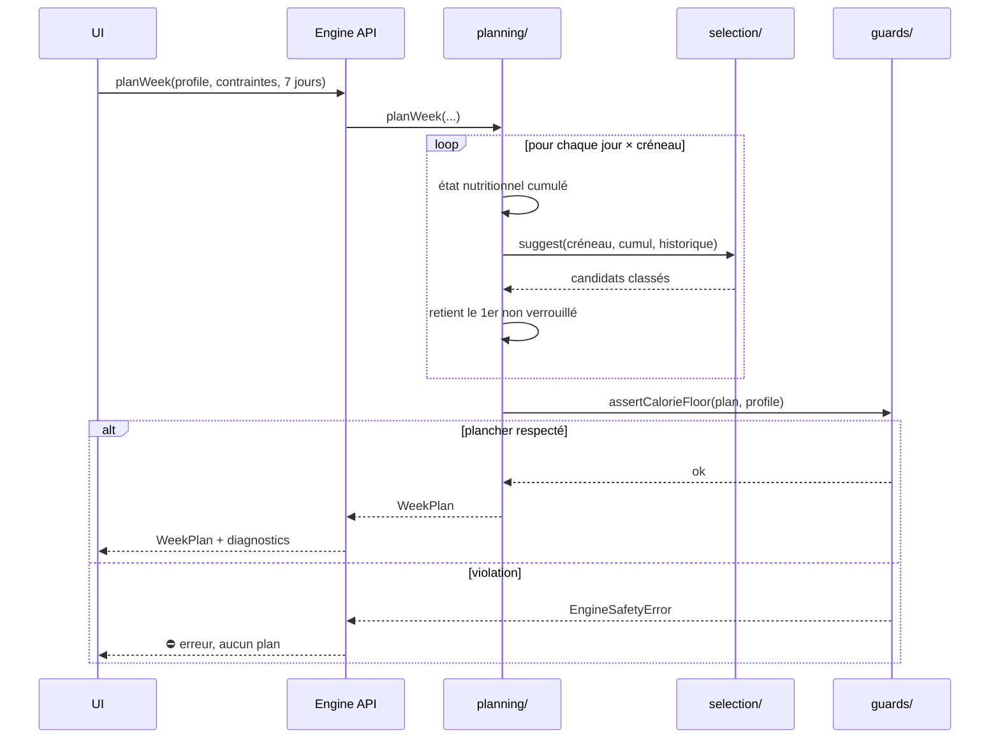
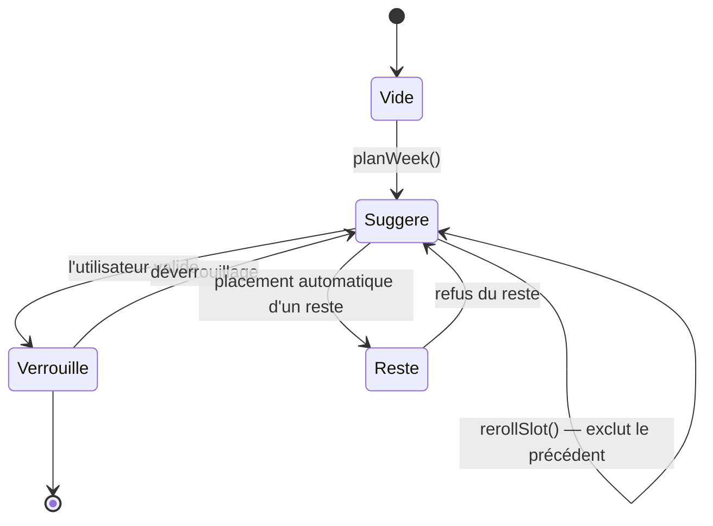
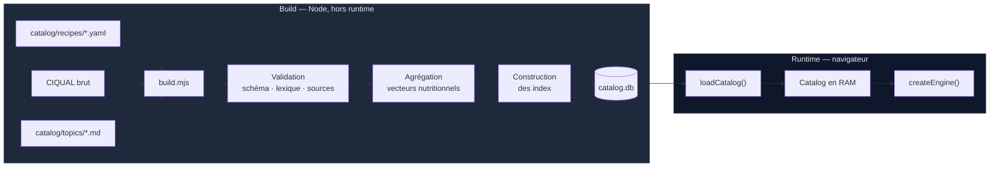
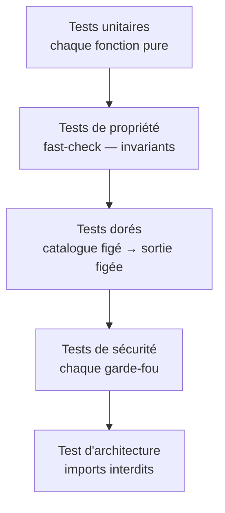
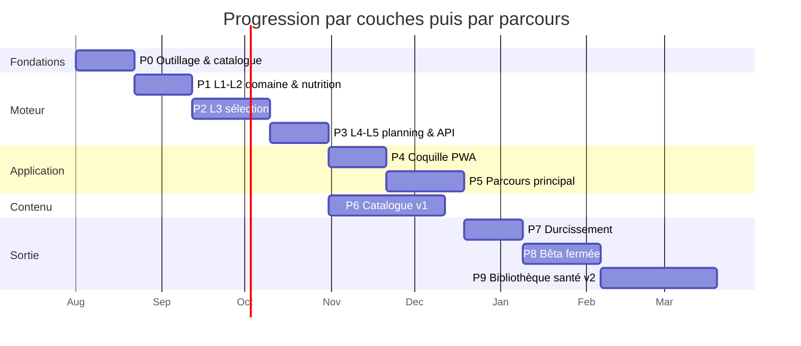
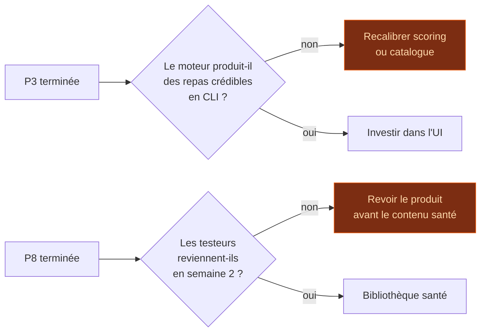

# Architecture du moteur

> Complément de [ARCHITECTURE.md](./ARCHITECTURE.md), qui reste la référence pour le périmètre,
> le modèle de données et le cadre réglementaire. Ce document ne traite que du moteur : couches,
> contrats, algorithmes, plan de construction.

**Statut** : spécification, à valider avant implémentation
**Date** : 2026-07-22

---

## Sommaire

1. [Décision fondatrice](#1-décision-fondatrice--le-moteur-est-une-fonction-pure)
2. [Vue en couches](#2-vue-en-couches)
3. [Règles de dépendance](#3-règles-de-dépendance)
4. [L1 — Domaine](#4-l1--domaine)
5. [L2 — Nutrition & garde-fous](#5-l2--nutrition--garde-fous)
6. [L3 — Sélection : le registre de couches](#6-l3--sélection)
7. [L4 — Planification](#7-l4--planification)
8. [L5 — API publique](#8-l5--api-publique)
9. [Le catalogue en mémoire](#9-le-catalogue-en-mémoire)
10. [Fonctionnalités](#10-fonctionnalités)
11. [Stratégie de test](#11-stratégie-de-test)
12. [Plan de lancement](#12-plan-de-lancement)
13. [Décisions à valider](#13-décisions-à-valider)

---

## 1. Décision fondatrice — le moteur est une fonction pure

Le moteur ne fait **aucun accès asynchrone**. Il reçoit un instantané du catalogue déjà chargé en
mémoire, et retourne un résultat de façon synchrone.

```ts
// ❌ Ce que le moteur ne fera JAMAIS
async function suggest(req) {
  const recipes = await db.query('SELECT * FROM recipe WHERE ...')
}

// ✅ Le contrat réel
function suggest(catalog: Catalog, req: SuggestionRequest): SuggestionResult
```

**Pourquoi c'est la bonne décision ici :**

| Bénéfice | Conséquence concrète |
|---|---|
| **Testable sans navigateur** | Vitest en Node pur, pas de mock SQLite, pas de WASM en test |
| **Déterministe** | Mêmes entrées → mêmes sorties, bit à bit. Exigence du principe 4. |
| **Auditable** | Une suggestion peut être rejouée à l'identique à partir de ses entrées |
| **Rapide** | Aucun aller-retour I/O dans la boucle de scoring |
| **Portable** | Si l'UI change un jour, le moteur ne bouge pas d'une ligne |

**Le coût — et pourquoi il est acceptable :** il faut tenir tout le catalogue en RAM.
Estimation : 3 200 aliments + 200 recettes + vecteurs nutritionnels pré-agrégés ≈ **6 à 10 Mo**.
Négligeable, y compris sur un téléphone d'entrée de gamme. Le jour où le catalogue dépasserait
100 Mo, cette décision serait à revoir — ce jour n'arrivera pas dans le périmètre défini.

**Corollaire sur l'aléatoire :** aucune suggestion n'utilise `Math.random()`. La diversification et
les égalités de score sont résolues par un **PRNG à graine explicite**, la graine étant stockée
avec le planning. Un planning est ainsi reproductible à l'identique — ce qui est nécessaire pour
déboguer, et suffisant pour ne pas proposer les mêmes trois plats chaque semaine.

---

## 2. Vue en couches


```mermaid
graph TB
    subgraph APP["APPLICATION — connaît le moteur"]
        UI["features/<br/>écrans React"]
        DATA["data/<br/>SQLite · migrations · export"]
        SAFE["safety/<br/>consentement · disclaimers"]
    end

    subgraph ENG["engine/ — TypeScript pur, zéro dépendance externe"]
        API["L5 · index.ts<br/>API publique"]
        PLAN["L4 · planning/<br/>semaine · courses · restes"]
        SEL["L3 · selection/<br/>filtre · score · diversité · explication"]
        NUT["L2 · nutrition/<br/>besoins · agrégation · conversions"]
        GUARD["L2 · guards/<br/>post-conditions de sécurité"]
        DOM["L1 · domain/<br/>types · unités typées · erreurs"]
    end

    UI --> API
    SAFE --> API
    DATA -.->|construit le Catalog| API
    API --> PLAN
    PLAN --> SEL
    PLAN --> GUARD
    SEL --> NUT
    SEL --> GUARD
    NUT --> DOM
    GUARD --> DOM
    SEL --> DOM
    PLAN --> DOM

    style ENG fill:#0f172a,stroke:#334155,color:#e2e8f0
    style APP fill:#1e293b,stroke:#334155,color:#e2e8f0
```

Chaque couche ne connaît que celles **en dessous** d'elle. Aucune remontée, aucun cycle.

| Couche | Rôle | Nature |
|---|---|---|
| **L1 domain** | Types, unités typées, erreurs métier | Données pures, zéro logique |
| **L2 nutrition** | Besoins énergétiques, agrégation, conversions | Fonctions pures, sans état |
| **L2 guards** | Post-conditions de sécurité (§6.5 d'ARCHITECTURE) | Assertions qui lèvent |
| **L3 selection** | Les 4 étapes du choix d'un repas | Pipeline pur |
| **L4 planning** | Semaine, restes, liste de courses | Orchestration |
| **L5 api** | Surface publique étroite | Façade |

---

## 3. Règles de dépendance


```mermaid
graph LR
    subgraph INTERDIT["❌ Interdit dans engine/"]
        X1["react"]
        X2["sqlite / IndexedDB"]
        X3["fetch / réseau"]
        X4["Date.now / Math.random"]
        X5["localStorage"]
    end
    subgraph AUTORISE["✅ Autorisé"]
        Y1["Built-ins JS"]
        Y2["Types locaux"]
        Y3["PRNG à graine"]
        Y4["Horloge injectée"]
    end
```

Ces règles sont **vérifiées automatiquement** par un test qui parcourt les imports de `engine/` et
échoue sur toute violation. Ce n'est pas une convention, c'est une barrière de build.

> **`Date.now()` interdit** : le moteur reçoit la date en paramètre (`context.date`). Sinon un test
> lancé le 31 décembre donne un autre résultat que le même test en juin — la saisonnalité dépend du
> mois. Injecter l'horloge rend les tests stables et le moteur rejouable.

---

## 4. L1 — Domaine

### 4.1 Unités typées

Le bug classique du code nutritionnel est la confusion mg / g / µg — le fer se compte en mg, les
vitamines en µg, les macros en g. Coût de la protection : dix lignes.

```ts
declare const brand: unique symbol
type Branded<T, B> = T & { readonly [brand]: B }

export type Grams      = Branded<number, 'g'>
export type Milligrams = Branded<number, 'mg'>
export type Micrograms = Branded<number, 'µg'>
export type Kcal       = Branded<number, 'kcal'>
export type Minutes    = Branded<number, 'min'>
export type Euros      = Branded<number, 'EUR'>

export const g   = (n: number): Grams => n as Grams
export const mg  = (n: number): Milligrams => n as Milligrams
export const kcal = (n: number): Kcal => n as Kcal
```

`recipe.tempsPrep + food.quantite` ne compile plus. Une conversion doit être explicite.

### 4.2 Identifiants typés

Même principe, contre l'inversion d'arguments :

```ts
export type FoodId    = Branded<string, 'FoodId'>
export type RecipeId  = Branded<string, 'RecipeId'>
export type TopicId   = Branded<string, 'TopicId'>
export type NutrientId = Branded<string, 'NutrientId'>
export type AllergenId = Branded<string, 'AllergenId'>
```

### 4.3 Entités principales

```ts
export interface Recipe {
  readonly id: RecipeId
  readonly nom: string
  readonly tempsPrep: Minutes
  readonly tempsCuisson: Minutes
  readonly difficulte: 1 | 2 | 3
  readonly portionsBase: number
  readonly ingredients: readonly RecipeIngredient[]
  readonly etapes: readonly string[]
  readonly typesRepas: readonly MealSlot[]
  readonly saisonMois: readonly Month[]
  readonly tags: readonly RecipeTag[]
  readonly axes: SensoryAxes
  readonly conservationJours: number      // pour la gestion des restes (§10.3)
  readonly imagePath: string | null
}

export interface SensoryAxes {
  readonly sucreSale: number        // -1 (salé) … +1 (sucré)
  readonly legerConsistant: number  // -1 (léger) … +1 (consistant)
  readonly chaudFroid: number       // -1 (froid) … +1 (chaud)
  readonly texture: Texture
}

export interface UserProfile {
  readonly trancheAge: AgeBracket
  readonly sexe: 'F' | 'M' | 'NP'
  readonly tailleCm: number | null
  readonly poidsKg: number | null
  readonly niveauActivite: ActivityLevel
  readonly facteurPortion: number    // 0.7 … 1.5 — « trop / pas assez » (§10.1)
}
```

### 4.4 Erreurs métier

```ts
export class EngineSafetyError extends Error {}    // post-condition violée — jamais rattrapée
export class NoViableRecipeError extends Error {}  // filtrage trop restrictif — rattrapée par l'UI
export class CatalogIntegrityError extends Error {} // catalogue corrompu — au chargement
```

`EngineSafetyError` ne doit **jamais** être capturée silencieusement par l'UI. Si elle survient,
c'est un bug de sécurité : l'écran affiche une erreur, il ne dégrade pas.

---

## 5. L2 — Nutrition & garde-fous

### 5.1 `nutrition/`

```ts
// Besoin énergétique — Mifflin-St Jeor + facteur d'activité. CODÉ (P1b-2).
computeEnergyNeeds(profile: UserProfile): Kcal | null

// Apports de référence, par profil (VNR ANSES/EFSA). CODÉ (P1b-2), deux modes — voir note ci-dessous.
resolveReferenceIntakes(profile: UserProfile, catalog: Catalog): NutrientVector

// Agrégation d'une recette → vecteur nutritionnel par portion
aggregateRecipe(recipe: Recipe, catalog: Catalog): NutrientVector

// Mise à l'échelle des portions
scaleRecipe(recipe: Recipe, portions: number): ScaledRecipe

// Écart entre apports cumulés et cible restante sur la période
computeGap(consumed: NutrientVector, target: NutrientVector): NutrientGap
```

> **`computeEnergyNeeds` (CODÉ, `engine/nutrition/energy-needs.ts`)** : BMR de Mifflin-St Jeor ×
> facteur d'activité (PAL). Constante de sexe **+5** (M) / **−161** (F) / **−78** pour `'NP'` — la
> MOYENNE des deux, seule valeur qui ne range pas d'office dans une case quelqu'un qui a refusé de
> répondre. Âge = milieu de la tranche (`AgeBracket`, union fermée désormais : `18_29`→24,
> `30_49`→40, `50_64`→57, `65_plus`→72) ; PAL fixé par `ActivityLevel` (union fermée : `sedentaire`
> 1.2 · `peu_actif` 1.375 · `actif` 1.55 · `tres_actif` 1.725 — pas de palier « athlète », aucune
> tranche mineure : la VNR du catalogue est une VNR ADULTE). `tailleCm`/`poidsKg` à `null` →
> retourne **`null`** : on ne devine jamais un gabarit corporel. N'applique NI le plancher
> calorique (post-condition séparée, §5.2) NI `facteurPortion` (ajuste une portion SERVIE, pas un
> besoin journalier) — deux règles qui migrent facilement par accident vers le premier endroit qui
> parle de calories.
>
> **`resolveReferenceIntakes` (CODÉ, `engine/nutrition/reference-intakes.ts`), deux modes** : **VNR
> à plat** par défaut — chaque nutriment prend directement son `vnrAdulte` — retenu dès que
> `computeEnergyNeeds` retourne `null`. **Ré-échelonné** quand l'énergie personnalisée est
> disponible : `ratio = besoin / vnrAdulte(énergie)` appliqué **aux seuls nutriments
> `categorie === 'macronutriment'`** — minéraux et vitamines gardent leur VNR à plat, ce sont des
> besoins ABSOLUS (fer, calcium, vitamine C…), pas des proportions caloriques ; manger davantage ne
> demande pas plus de fer.

`NutrientVector` est un `Float64Array` indexé par position de nutriment, **pas** un objet. Sur
200 recettes × 40 nutriments, la différence de performance et de pression mémoire est réelle, et
l'API reste lisible derrière un accesseur.

> **`aggregateRecipe` n'est pas appelé au runtime.** Les vecteurs sont pré-calculés à la
> construction du catalogue (§9) et livrés dans le `.db`. La fonction reste dans le moteur parce
> que c'est elle que le script de build utilise, et parce qu'elle est testable isolément.

### 5.2 `guards/` — la sécurité comme post-condition

Le point clé : **les garde-fous ne sont pas des recommandations d'UI, ce sont des assertions que le
moteur exécute sur sa propre sortie avant de la retourner.**

```ts
assertNoDeclaredAllergen(result: SuggestionResult, c: HardConstraints): void
assertCalorieFloor(plan: WeekPlan, profile: UserProfile): void
assertCriticalLayersRan(trace: PipelineTrace): void
assertScoringLayersNeverExclude(trace: PipelineTrace): void
assertNoTherapeuticClaim(explanations: readonly Explanation[]): void
```

| Garde-fou | Vérifie | Référence | État |
|---|---|---|---|
| `assertNoDeclaredAllergen` | Aucune suggestion ne contient un allergène déclaré | §5.2 ARCHI | **CODÉ** (P1a) — signature adaptée, voir note |
| `assertCalorieFloor` | Aucun jour < 1 200 kcal (F) / 1 500 (H) | §6.5 ARCHI | signature seule (P2/P3, attend `planWeek`) |
| `assertCriticalLayersRan` | Les couches `critical` ont bien été exécutées | §6.3 | **CODÉ** (P1c) |
| `assertScoringLayersNeverExclude` | **Aucune** couche de score n'a réduit l'ensemble | §6.1 ARCHI · §6.3 | **CODÉ** (P1b-2) |
| `assertNoTherapeuticClaim` | Aucune explication ne contient le lexique banni | §6.2 ARCHI | **CODÉ** (P1c) |

**4 garde-fous codés sur 5** — seul `assertCalorieFloor` reste une signature seule, en attente de
`planWeek` (planning/, non câblé).

> **Écart assumé pour `assertNoDeclaredAllergen` (P1a)** : implémenté aujourd'hui sur
> `(candidates: ReadonlySet<RecipeId>, catalog: Catalog, constraints: HardConstraints): void`
> plutôt que sur la signature littérale ci-dessus (`SuggestionResult` n'existe pas encore comme
> valeur PRODUITE — `suggestMeals` n'est pas câblé, §8). Se réaligne sur la signature ci-dessus dès
> que `suggestMeals` sera câblé (P1c) ; seul l'appelant change, pas le garde-fou.
>
> **`assertScoringLayersNeverExclude` (CODÉ, `engine/guards/index.ts`) et l'extension de
> `PipelineTrace` qu'il a rendue nécessaire.** Avant cette couche, `PipelineTrace` ne typait
> `excludedCandidateCounts` que par `ExclusionLayerId` : une couche de SCORE ne pouvait
> STRUCTURELLEMENT pas y figurer, donc ce garde-fou était incapable d'observer la violation qu'il
> est censé attraper. Deux champs ont été ajoutés à `PipelineTrace` (`domain/result.ts`) :
> `scoringCandidateCount` (nombre de candidats soumis à la passe de score) et
> `scoringLayerCounts` (nombre de scores RENDUS, par couche de score exécutée — une couche non
> exécutée, poids ≤ 0, n'y apparaît pas). Le garde-fou compare chaque entrée de la seconde au
> premier : un écart, dans un sens ou l'autre, signale qu'une couche de score a réduit (ou
> « halluciné ») l'ensemble des candidats.

> **`assertCriticalLayersRan` (CODÉ, `engine/guards/index.ts`) — implémenté P1c.** Compare
> `trace.criticalLayerIds` (le sous-ensemble `critical: true` attendu, figé, du registre) à
> `trace.layersRun` (ce qui a RÉELLEMENT tourné) : toute couche critique absente de la trace
> déclenche l'erreur — l'invariant §6.3 « `critical: true` est indésactivable » cesse d'être une
> intention pour devenir une propriété vérifiée sur l'exécution réelle. Premier consommateur réel :
> `engine/api/index.ts`, `runSuggestMeals` (§8), vérifié juste après la passe de score.
>
> **`assertNoTherapeuticClaim` (CODÉ, `engine/guards/index.ts`) — implémenté P1c.** Vérifie que
> `label` de chaque `Explanation` (seul champ affiché en texte libre — `criterion` est un id fermé,
> `authority`/`evidenceSheetId` sont hors périmètre tant que `topic` n'est pas implémenté) ne
> contient aucun terme du lexique banni (§6.2 ARCHITECTURE). Premier consommateur réel :
> `selection/explain.ts` (§6.7), appelé par `suggestMeals` sur l'ensemble des explications
> produites, juste avant de retourner. Le lexique est **dupliqué** depuis `catalog/build.mjs` dans
> `engine/guards/banned-terms.ts` — `engine/` ne peut pas importer `catalog/build.mjs` (§3 ENGINE) —
> et la non-divergence des deux copies est garantie par `tests/banned-terms-consistency.test.mjs`
> (détail complet : `docs/ARCHITECTURE.md` §6.2).


```mermaid
flowchart LR
    P["Pipeline de sélection"] --> G{"Post-conditions"}
    G -->|toutes vertes| OK["SuggestionResult"]
    G -->|violation| E["EngineSafetyError<br/>⛔ rien n'est retourné"]
    style E fill:#7f1d1d,stroke:#dc2626,color:#fecaca
    style OK fill:#14532d,stroke:#16a34a,color:#bbf7d0
```

Un allergène qui passerait le filtre à cause d'un bug de scoring ne peut pas atteindre l'écran :
le moteur refuse de retourner le résultat. C'est la différence entre « on a écrit le filtre
correctement » et « il est structurellement impossible que ça sorte ».

---

## 6. L3 — Sélection

### 6.1 Deux natures de couches — la distinction qui structure tout

Le pipeline n'est pas du code figé : c'est un **registre ordonné de couches** partageant un contrat
commun. Mais elles se répartissent en deux natures qu'il ne faut jamais confondre.

| Nature | Effet sur l'ensemble | Composition | Exemples |
|---|---|---|---|
| **Exclusion** | **Retire** des candidats | Intersection | allergènes · régime · exclusions perso · requis · temps · équipement |
| **Score** | **Ne retire rien**, repondère | Somme pondérée | préférences · envies · santé · frigo · habitude… |

> **Le piège à éviter.** Si « préférences » était une couche d'exclusion, détester les champignons
> éliminerait toute recette en contenant — y compris celle où ils sont une garniture accessoire.
> Une préférence doit **déclasser, jamais supprimer.** Seules quatre choses suppriment : un
> allergène, un régime déclaré, un temps impossible, un équipement absent et indispensable.


```mermaid
flowchart TB
    CAT[("Catalog")] --> EX
    IN["SuggestionRequest"] --> EX

    subgraph EXC["COUCHES D'EXCLUSION — réduisent l'ensemble"]
        EX["allergènes 🔒 → régime 🔒 → exclusions → requis → temps → équipement → favoris"]
    end

    EX -->|candidats| SC
    EX -.->|motif par rejet| RJ["RejectionSummary"]

    subgraph SCO["COUCHES DE SCORE — ne réduisent rien"]
        SC["nutri · pref · envie · variété · saison<br/>pantry · habitude · occasion · critères · coût"]
    end

    SC --> D["Diversification (MMR)"]
    D --> E["Explication (top 3)"]
    E --> G{"Post-conditions"}
    G -->|ok| OUT["SuggestionResult"]
    G -->|violation| ERR["EngineSafetyError"]
    RJ --> OUT

    style EXC fill:#7c2d12,stroke:#ea580c,color:#fed7aa
    style SCO fill:#1e3a8a,stroke:#3b82f6,color:#bfdbfe
    style ERR fill:#7f1d1d,stroke:#dc2626,color:#fecaca
```

### 6.2 Le contrat commun

```ts
export type LayerKind = 'exclusion' | 'scoring'

export interface SelectionLayer<Config = unknown> {
  readonly id: LayerId
  readonly kind: LayerKind
  readonly critical: boolean        // true → indésactivable, par aucun réglage
  readonly defaultWeight: number    // scoring uniquement

  /** Extrait du contexte ce dont la couche a besoin. Pure. */
  readonly configure: (req: SuggestionRequest, catalog: Catalog) => Config

  /** Exclusion → renvoie un sous-ensemble + motifs. Score → renvoie un score 0-1 par candidat. */
  readonly apply: (candidates: CandidateSet, config: Config) => LayerResult
}
```

Une couche ne connaît **ni les autres couches, ni le pipeline**. Elle reçoit un ensemble de
candidats et une configuration, elle retourne un résultat. C'est ce qui la rend utilisable seule
(§6.7) et testable isolément.

### 6.3 Le registre

```ts
export const LAYERS: readonly SelectionLayer[] = [
  // — exclusion, dans l'ordre de priorité de MOTIF —
  allergenLayer,          // 🔒 critical
  dietLayer,              // 🔒 critical
  personalExclusionLayer, // exclusions personnelles (HardConstraints.excludedFoodIds)
  requiredFoodLayer,      // miroir dur — MealContext.requiredFoodIds, contexte Aujourd'hui seulement
  timeLayer,
  equipmentLayer,    // seulement l'équipement `requis`
  favoriteLayer,     // inerte hors `onlyFavorites` — motif le moins informatif, donc en DERNIER

  // — score —
  nutriLayer,        // 0.25
  preferenceLayer,   // 0.25
  cravingLayer,      // 0.20
  varietyLayer,      // 0.15
  seasonLayer,       // 0.10
  pantryLayer,       // 0.05 — dominant en mode « vider le frigo »
  habitLayer,        // 0.00 → croît avec l'historique (§7.5)
  occasionLayer,     // 0.05 — nul hors période
  speedLayer,        // 0.00 → relevée par l'archétype « Rapide » (§6.3 bis)
  topicLayer,        // 0.00 — nul tant qu'aucune thématique active
  costLayer,         // 0.05 — v3
]
```

**18 couches au registre (7 exclusion + 11 score), dont `topic` (v2) et `cost` (v3) en réserve à
poids nul — mais six couches de score réellement actives au premier lancement** : `topic`,
`cost`, `habit` et `speed` démarrent à 0, `occasion` est nul hors période. La complexité perçue
n'augmente pas avec le nombre de couches.

> Correction de comptage (session du 2026-07-24) : la prose de ce document et d'ETAT.md disait
> longtemps « registre de 12 couches », alors que la liste ci-dessus en énumère 14 (4 exclusion +
> 10 score) depuis le début. Le code (`app/src/engine/domain/layer-ids.ts`) implémente les 14 et
> le signale déjà en commentaire. **Le code fait foi** ; toute occurrence de « 12 couches » dans
> ce document et dans ETAT.md est une coquille corrigée par cette note, pas une décision qui change.
> Mise à jour (session 2) : une 5ᵉ couche d'exclusion `exclusions` (rejet personnel,
> `excludedFoodIds`) a été ajoutée — le registre est désormais à **15** (5 exclusion + 10 score).
> Le code fait foi.
> Mise à jour (session du 2026-07-25) : une 6ᵉ couche d'exclusion `requis` (miroir dur, lit
> `MealContext.requiredFoodIds`) a été ajoutée — le registre est passé à **16** (6 exclusion +
> 10 score). Le code fait foi.
> Mise à jour (session du 2026-07-25, suite) : `speed` a rejoint le registre comme couche de score
> à part entière — le registre est désormais à **17** (6 exclusion + 11 score). Voir §6.5, note ¶
> révisée : la précédente affirmation « `speed` n'est pas une 17ᵉ couche du registre » est fausse
> depuis cette décision. Le code (`app/src/engine/domain/layer-ids.ts`,
> `app/src/engine/selection/index.ts`) fait foi.
> Mise à jour (session du 2026-07-26, P1c lot 4) : une 7ᵉ couche d'exclusion `favoris` (lit
> `SuggestionRequest.onlyFavorites` + `favoriteRecipeIds`) a été ajoutée — le registre est
> désormais à **18** (7 exclusion + 11 score). Le flag §8.1 aurait pu rester un pré-filtre du set
> initial : en faire une couche fait tomber son motif de rejet dans `RejectionSummary`, donc dans
> l'entonnoir du banc d'essai. Couche INERTE tant qu'`onlyFavorites` n'est pas explicitement levé
> — les favoris restent un marque-page, conformément à §10.1. Le code fait foi.

#### 6.3 ter — Chaîne d'inclusion des régimes (couche `regime` 🔒) — **CODÉ (2026-07-26)**

```
vegetalien  ⊂  vegetarien  ⊂  pescetarien  ⊂  omnivore
```

Une recette est compatible avec le régime demandé si elle porte **ce régime, ou un régime plus
restrictif** dans la chaîne ci-dessus (`DIET_CHAIN`, `app/src/engine/selection/regime.ts`).

**Ce que ça remplace.** P1a imposait une **égalité stricte de chaîne**, sans hiérarchie. Le défaut
n'était pas théorique — mesuré sur le catalogue réel de 34 recettes, AVANT correction :

| Régime déclaré | Recettes visibles avant | Après |
|---|---|---|
| `vegetalien` | 5 | 5 |
| `vegetarien` | 11 | **16** |
| `pescetarien` | 11 | **27** |
| `omnivore` | **7** | **34** |

Le cas le plus grave n'était pas le pescétarien mais l'**omnivore** — le réglage le plus courant :
il ne voyait que les 7 recettes littéralement étiquetées `omnivore`, c'est-à-dire uniquement les
plats de viande. Ni poisson, ni pâtes, ni soupe.

**Deux propriétés qui font que c'est sûr dans une couche 🔒 critique :**

1. **La chaîne n'élargit JAMAIS vers la droite.** Demander `vegetarien` ne fait jamais entrer une
   recette `omnivore` : un plat de viande reste structurellement inatteignable pour qui a déclaré
   végétarien. Un test dédié verrouille les six directions interdites.
2. **Un régime hors chaîne retombe sur l'égalité stricte.** `sans_gluten`, `halal`, `casher`,
   `sans_lactose` ne s'emboîtent dans rien — ils ne sont pas dans `DIET_CHAIN` et ne bénéficient
   d'aucune inclusion, ni dans un sens ni dans l'autre. `DietCode` étant un `string` ouvert
   (aucune contrainte CHECK en base), la chaîne est du **vocabulaire connu**, pas une union fermée.

**L'alternative écartée** était d'étiqueter chaque recette avec tous les régimes qu'elle respecte
(le taboulé porterait 4 facettes). Rejetée pour son mode de défaillance : une étiquette oubliée sur
une recette parmi cent la fait disparaître pour une partie des utilisateurs, **sans erreur, sans
trace, sans que personne ne le remarque**. La chaîne s'écrit une fois et ne s'oublie pas.

> Conséquence pour le contenu : une recette déclare **le régime le plus restrictif qu'elle
> respecte**, un seul. Un plat végétalien déclare `vegetalien`, pas la liste des quatre.

Les poids sont normalisés (`Σ = 1`) avant application. L'utilisateur les module via un petit jeu
d'**archétypes nommés** — voir §6.3 bis ci-dessous, qui généralise l'idée initiale de « quatre
préréglages » (*équilibre · plaisir · rapidité · budget*) sans changer le principe : peu de
préréglages nommés, **jamais douze curseurs**.

#### Sur l'ordre des couches

| Nature | L'ordre compte-t-il ? |
|---|---|
| **Exclusion** | **Pas pour le résultat** — une intersection d'ensembles est commutative. **Oui pour le rapport** : on veut annoncer « écarté pour allergène » plutôt que « écarté pour temps » quand les deux s'appliquent. L'ordre encode la priorité de motif. |
| **Score** | **Jamais.** C'est une somme pondérée ; seuls les poids comptent. |

#### Deux invariants garantis par le registre

1. **`critical: true` est indésactivable.** Aucun réglage, aucun test, aucun futur développeur ne
   peut retirer la couche allergènes du pipeline. La sécurité devient structurelle plutôt que
   confiée à la vigilance.
2. **Aucune couche de score ne peut réduire l'ensemble des candidats.** Vérifié par
   `assertTopicsNeverExclude`, étendu à toutes les couches `kind: 'scoring'`.

### 6.3 bis — Archétypes *(CODÉ, P1b-2 — mécanique moteur ; sélecteur UI reste P3)*

> Généralise et remplace l'idée initiale de « quatre préréglages nommés » (§6.3, §13). Le principe
> ne change pas : peu de choix nommés, jamais un tableau de bord de curseurs. Décision de
> conception de la session du 2026-07-24 (`docs/RECAP_SESSION.md`), **codée et noms validés par
> l'utilisateur en session du 2026-07-25** (`app/src/engine/selection/archetypes.ts`,
> `ArchetypeId` dans `app/src/engine/domain/archetype-ids.ts` — placé en `domain/`, pas
> `selection/`, pour que `SuggestionRequest.archetype` puisse le référencer sans faire dépendre
> `domain/` de `selection/`, §2/§3).

Un **archétype = un vecteur de poids nommé** appliqué aux couches de **score** uniquement. Un
archétype ne touche **jamais** les couches critiques (`allergenes` 🔒, `regime` 🔒) — elles restent
actives et non pondérables, quel que soit l'archétype choisi (invariant §6.3) ; la table des
surcharges (`ARCHETYPE_WEIGHT_OVERRIDES`) est typée pour n'accepter qu'un `ScoringLayerId` en clé,
ce qui rend une surcharge d'une couche d'exclusion une erreur de compilation plutôt qu'un cas à
intercepter au runtime.

**Jeu CODÉ, 6 archétypes, noms validés, table des surcharges appliquées telles quelles** :

| Archétype | `ArchetypeId` | Surcharge (`ARCHETYPE_WEIGHT_OVERRIDES`) | Effet dominant |
|---|---|---|---|
| **Équilibre** *(défaut)* | `equilibre` | `{}` — aucune surcharge | Poids de référence du §6.5, aucune couche mise en avant |
| **Envie** | `envie` | `{ craving: 0.40 }` | `craving` ↑ |
| **Découverte** | `decouverte` | `{ variety: 0.35 }` | `variety` ↑ |
| **De saison** | `de_saison` | `{ season: 0.30 }` | `season` ↑ |
| **Mes goûts** | `mes_gouts` | `{ preference: 0.40 }` | `preference` ↑ |
| **Rapide** | `rapide` | `{ speed: 0.30 }` | `speed` ↑ (§6.5) |

Pas d'archétype « budget » en v1 — `cost` reste une couche de réserve pour v3 (§6.3). La
normalisation Σ = 1 déjà en place dans `runScoringPass` (§6.4) fait le reste : relever une couche
abaisse mécaniquement la part des autres, sans recalcul manuel des overrides.

**Cycle de vie** : choisi par l'utilisateur à la **première utilisation** (onboarding) et
modifiable ensuite dans les **Paramètres** — les deux volets UI sont **P3**, hors périmètre P1b.
Le moteur n'expose qu'un vecteur de poids nommé ; l'écran qui le pilote est une couche
d'application au-dessus, comme pour toute autre couche (§6.8).

### 6.4 Exécution du pipeline

```ts
function runPipeline(catalog: Catalog, req: SuggestionRequest): PipelineOutcome {
  const enabled = LAYERS.filter(l => l.critical || isEnabled(l.id, req))

  // ① exclusion — intersection successive, motif conservé
  let candidates = catalog.indexes.recipesBySlot.get(req.context.creneau)!
  const rejections: RejectionEntry[] = []
  for (const layer of enabled.filter(l => l.kind === 'exclusion')) {
    const r = layer.apply(candidates, layer.configure(req, catalog))
    rejections.push(...r.rejected)      // premier motif rencontré = motif retenu
    candidates = r.kept
  }

  // ② score — accumulation, aucune réduction
  const scores = new Map<RecipeId, ScoreBreakdown>()
  for (const layer of enabled.filter(l => l.kind === 'scoring')) {
    const r = layer.apply(candidates, layer.configure(req, catalog))
    accumulate(scores, layer.id, r.scores, weightOf(layer, req))
  }

  return { candidates, scores, rejections }
}
```

Ajouter une fonctionnalité, c'est **ajouter une entrée au registre** — le pipeline ne change pas.
« Vider le frigo », le budget, un futur critère d'empreinte carbone : une couche chacun.

### 6.5 Les couches de score en détail

> **Statut : conception figée cette session (2026-07-24), implémentation P1b-1/P1b-2, pas encore
> codée.** Ce qui suit précise et complète les couches déjà décrites en §6.3 ; `speed` est un
> signal nouveau, `topic`/`cost` restent en réserve à poids nul (v2/v3). Récit complet :
> `docs/RECAP_SESSION.md`.

| Couche | Calcul | Poids |
|---|---|---|
| `nutri` | 1 − distance normalisée entre l'apport de la recette et **la cible** (jamais la consommation, voir précision 1) | 0.25 |
| `preference` | Moyenne des préférences sur ingrédients et facettes, **pondérée par la quantité** et saturée (précision 4) | 0.25 |
| `craving` | 1 − distance euclidienne sur les **axes sensoriels demandés uniquement** ; poids **contextuel** (précision 2) | 0.20 |
| `variety` | Décroissance exponentielle selon l'ancienneté de la dernière occurrence, **adaptative** (précision 5) | 0.15 |
| `season` | Moyenne **pondérée par quantité** des crédits de saison des ingrédients (1 en saison · 0,5 dispo toute l'année hors saison · 0 sinon) — précision 3 | 0.10 |
| `pantry` | Taux de couverture des ingrédients par `user_pantry` | 0.05 † |
| `habit` | Quatre signaux statistiques locaux (§7.5), module aussi `variety` (précision 5) | 0.00 ‡ |
| `occasion` | Appartenance à une occasion active dans la fenêtre de dates | 0.05 § |
| `speed` | 1 − durée normalisée dans la fenêtre de temps demandée — plus court fait un peu mieux | **0.00** ¶ |
| `topic` | Écart aux critères des thématiques actives | **0.00** |
| `cost` | 1 − dépassement du budget par portion (v3) | 0.05 |

† `pantry` passe en **poids dominant** en mode « vider le frigo » (§10.2)
‡ `habit` croît avec le volume d'historique — démarrage à froid propre
§ `occasion` vaut 0 hors de la fenêtre d'une occasion activée
¶ **Tranché et CODÉ (session du 2026-07-25) : `speed` EST une couche du registre à part entière**
(la 11ᵉ et dernière couche de SCORE implémentée — `LAYER_DESCRIPTORS`,
`app/src/engine/selection/index.ts` ; l'ordinal absolu n'est plus cité, il a changé à chaque
ajout de couche d'exclusion — le registre est à 18 entrées depuis `favoris`, P1c lot 4 ;
implémentation `app/src/engine/selection/scoring/speed.ts`), distincte du filtre dur `temps` (§6.3,
exclusion) ; poids nul par défaut, **activée par l'archétype « Rapide »** (§6.3 bis, poids brut
0.30). La précédente affirmation « `speed` n'est pas une 17ᵉ couche du registre » est **fausse** et
retirée par cette mise à jour.

#### Huit précisions de calcul (session du 2026-07-24)

1. **`nutri` compare au profil-cible, jamais à la consommation, et pénalise selon le SENS du
   nutriment (CODÉ, P1b-2).** Il n'y a pas de journal alimentaire (§6.5 ARCHI) : la cible est soit
   l'accumulateur du plan en cours dans `planWeek` (l'état nutritionnel cumulé de §7.1, non câblé
   à ce stade), soit — pour une suggestion isolée hors plan, cas CODÉ — la référence journalière
   (`resolveReferenceIntakes`, §5.1) multipliée par la **part du créneau**, une table FIXE codée
   (`MEAL_SLOT_SHARE`, `engine/selection/scoring/nutri.ts` — décision nouvelle, absente de la
   conception initiale, qui remplace l'idée d'un partage égal entre créneaux) :
   `petit_dejeuner` 0,25 · `dejeuner` 0,35 · `diner` 0,30 · `gouter` 0,10 (Σ = 1). L'écart lui-même
   n'est plus symétrique comme dans une première version : la colonne `nutrient.sens`
   (`NutrientSense` ∈ {`cible`, `plancher`, `plafond`}, union fermée — §4.2 ARCHITECTURE) dit à
   `scoreNutri` quel côté de l'écart pénalise réellement — `cible` pénalise les deux sens (énergie,
   macronutriments), `plancher` ne pénalise que le manque (fibres, fer, calcium, vitamine C — un
   excès n'est jamais pire), `plafond` ne pénalise que le dépassement (sodium — être en dessous
   n'est jamais pire). Un écart symétrique sur un plancher/plafond punirait un plat riche en fer
   pour sa richesse, ce qui est absurde — c'est le défaut que `sens` corrige. `nutri` reste un
   **signal d'équilibre du plan**, jamais un compteur de ce qui a été mangé.

2. **`craving` est CONTEXTUEL, pas seulement pondéré.** Il passe n°1 **uniquement dans le contexte
   « Aujourd'hui »** — une suggestion ponctuelle avec une envie posée (pastilles) — et **reste à
   son socle bas dans `planWeek`** : il n'y a pas de « moment T » sensoriel à anticiper pour un jour
   futur. D'où la symétrie à documenter partout où elle s'applique :
   **Aujourd'hui = piloté par l'envie (`craving`) · Semaine = piloté par l'équilibre (`nutri`).**
   Par ailleurs la distance ne porte que sur les **axes effectivement demandés** dans la requête
   (pas les 3 axes systématiquement) ; la **texture** est **catégorielle** (match / pas-match), pas
   un axe numérique — elle est traitée hors du calcul euclidien, puis recombinée.

3. **`season` combine deux dimensions indépendantes en crédits, pondérés par la quantité.**
   `toute_annee` (disponibilité : rayon, conservation) et `saison_mois` (pleine saison : production
   locale) ne sont PAS exclusifs — un légume de garde porte les deux (carotte : dispo toute l'année
   ET de pleine saison sept.–avril). Chaque ingrédient dont `saison_mois` est renseignée rapporte un
   **crédit** : **1** en pleine saison ce mois-ci, **0,5** hors saison mais `toute_annee`, **0** hors
   saison sans disponibilité. Les ingrédients sans `saison_mois` (sel, huile, pâtes…) sont **exclus
   du calcul**. Le score est la **moyenne des crédits pondérée par la quantité** (même motif que
   `preference`, précision 4) — 5 g de persil ne pèsent pas autant que 400 g de courgettes. Aucun
   ingrédient à saison renseignée → `season` **neutre** (0,5), pas un score nul punitif. Le
   demi-crédit distingue « disponible mais pas à son meilleur » de « hors saison pour de bon ».

4. **`preference` est pondérée par la quantité.** L'**ingrédient principal** d'une recette est
   défini comme **le non-optionnel de plus forte quantité** (`recipe_ingredient.optionnel = false`,
   `quantite_g` maximal ; égalité → tie-break déterministe par `food_id`). Un aliment détesté en
   garniture baisse peu le score, en principal il baisse beaucoup — sans cas particulier codé,
   c'est une conséquence directe de la pondération. L'agrégat est **saturé (clamp)** : un seul
   ingrédient à +2 ne suffit pas à sauver un plat par ailleurs mal noté.

5. **`variety` est ADAPTATIVE, pas une règle fixe.** Un socle léger de décroissance (tel que déjà
   décrit) est **modulé par la couche `habit`** — la tendance apprise familiarité↔nouveauté du
   profil (§7.5) — au point de **s'inverser en bonus de familiarité** pour un profil « habitudes »
   marqué. Un **override explicite par requête** (« Surprends-moi » / « Mes classiques ») prime sur
   la modulation automatique. Dans tous les cas, la récence porte sur **la recette ET son
   ingrédient principal** (précision 4), pas seulement l'identifiant de recette. Rappel §6.5 ARCHI :
   `habit` reste une **affinité apprise**, jamais un constat de consommation.

6. **`speed` est un nouveau signal doux**, voir table ci-dessus et note ¶.

7. **Déterminisme du classement.** Tri par score décroissant, **tie-break stable par id de
   recette** en cas d'égalité stricte. Tout aléa (diversification, sélection parmi égalités) passe
   par le PRNG à graine (date + créneau, §1) — jamais `Math.random`.

8. **Les index dérivés sont calculés à l'init du moteur, pas au build.** `recipeNutrients` et
   `recipeMainIngredient` (§9.1) sont des fonctions **pures de `engine/nutrition/`** exécutées une
   fois à `createEngine(catalog)`, pas par `catalog/build.mjs` — pour ne pas coupler le script de
   build au moteur. Aujourd'hui ces deux index sont des `Map` **vides**, laissées telles quelles
   par `catalog-loader.ts` (voir son en-tête) ; les peupler est un livrable de **P1b-1**. Voir la
   note dans §9.2 qui corrige la description antérieure de cette responsabilité.

#### Poids dynamiques — `craving` et `occasion` prennent la tête quand c'est pertinent

Deux couches ont un **poids contextuel**, pas fixe :
- **`craving` passe n°1 — CODÉ (P1b-2, `runScoringPass`, `engine/selection/scoring-pass.ts`)**
  (poids brut `CRAVING_DYNAMIC_WEIGHT = 0.50`, ≈ 0.40 après renormalisation avec les couches de
  référence actives — la valeur *exacte* dépend des couches réellement actives, seul le fait que
  `craving` devienne le poids le plus élevé est garanti et testé) **dès qu'une envie est
  RÉELLEMENT exprimée dans le contexte « Aujourd'hui »** — l'objet `envie` non nul ET au moins un
  de ses trois axes non nul (pastilles Léger/Chaud/Salé…), pas un objet d'envie vide — et retombe
  à son socle bas sinon — y compris pour tous les créneaux de `planWeek`, qui n'a pas de « moment
  T » (précision 2 ci-dessus). La garantie « contexte Aujourd'hui seulement » est obtenue
  STRUCTURELLEMENT : `planWeek` (non câblé, P1c) ne remplira pas `envie` pour un jour futur, sans
  qu'aucun drapeau explicite de contexte n'existe ni ne soit nécessaire — même principe que
  `MealContext.requiredFoodIds` (§6.5 ter). Sans envie, la distance à l'axe est neutre : un poids
  élevé permanent n'aurait aucun effet.
- **`occasion` doit aussi passer n°2** pendant une occasion **activée et dans la fenêtre**, 0 hors
  période — mais **la couche `occasion` n'est PAS implémentée** (absente de `SCORING_LAYERS`,
  `scoring-pass.ts` ; reste une entrée de réserve dans `LAYER_DESCRIPTORS`, P2) : aucune bascule
  n'est câblée pour elle à ce stade.

Conséquence assumée : quand l'utilisateur formule une envie **dans « Aujourd'hui »**, le moment
prime sur l'équilibre nutritionnel — `nutri` reste un score, jamais un garde-fou (le plancher
calorique est une post-condition séparée, §guards). En `planWeek`, `nutri`/`preference` mènent
tout le temps. Une carte occasion « idée pour… » peut être remontée à l'ouverture (throttlée
~1×/3-4 j, occasions activées seulement, écartable — §8.6 ARCHITECTURE).

**`topic` vaut 0 tant qu'aucune thématique n'est activée.** Le volet santé n'existe pas dans le
calcul par défaut — c'est ce qui rend l'invariant §6.1 d'ARCHITECTURE vérifiable, et non seulement
déclaratif.

#### La couche `equipment` — une nuance qui compte

L'équipement se déclare en deux niveaux dans le catalogue :

| Niveau | Effet | Exemple |
|---|---|---|
| `requis` | **Exclusion** — infaisable sans | Sorbetière pour une glace |
| `accelere` | **Score** — faisable à la main, plus long | Robot pour une pâte |
| `informatif` | **Aucun effet moteur** — ustensile du lexique matériel, jamais chargé en RAM | Fouet, fourchette, spatule |

Sans cette distinction, ne pas posséder de mixeur supprimerait la moitié du catalogue.

### 6.5 ter — Décisions de conception (session 2, 2026-07-24 — partiellement codées)

Tranchées ; une partie est désormais implémentée (détail par point ci-dessous). Récit :
`docs/RECAP_SESSION_2.md`.

- **`variety` — trois réglages séparés.**
  (1) *Vitesse d'oubli* : TAU réglable à trois crans 3 / 7 / 14 jours (défaut 7) — **CODÉ**
  (`ScoreVarietyArgs.tauDays`, type `VarietyTau`, `engine/selection/scoring/variety.ts`). Valeurs
  vérifiées par test : un plat vu il y a 7 jours vaut en nouveauté **0,903** (TAU=3) · **0,632**
  (TAU=7) · **0,393** (TAU=14).
  (2) *Rythme du changement* : bascule explicite (« Surprends-moi » / « Mes classiques »)
  **brusque** (dès le repas suivant) — **déjà assurée par l'override existant** (`VarietyOverride`,
  force `familiarity` à 0 ou 1) ; dérive apprise **graduelle** (~4 repas) reste **repoussée** avec
  la refonte de `habit`, mode par défaut stable.
  (3) *Restes* : chaque entrée d'historique porte une **origine** `choisi` / `reste` — **CODÉ**
  (`MealHistoryEntry.origine`, champ obligatoire) ; `variety` lit tout (un reste mangé lasse),
  `habit` ne compte que les `choisi` (un reste n'est pas une préférence) — asymétrie volontaire.
- **Rejet absolu codé, miroir désormais codé aussi.** La couche `exclusions` lit `excludedFoodIds`
  (exclusion dure, un aliment exclu en ingrédient optionnel n'exclut pas la recette). Son miroir
  **`requiredFoodIds`** (« je veux ça ») est **CODÉ** — couche `requis`
  (`app/src/engine/selection/requis.ts`), sémantique CONJONCTIVE (tous les aliments demandés
  doivent être présents ; un ingrédient optionnel SATISFAIT l'exigence) : filtre **dur en contexte
  « Aujourd'hui » seulement**. Le champ vit dans `MealContext`, pas dans `HardConstraints` : comme
  `WeekPlanRequest` n'a pas de `MealContext`, l'exigence devient **structurellement inexprimable**
  pour un plan de semaine, plutôt que de compter sur la discipline de l'appelant — asymétrie
  volontaire avec `excludedFoodIds` (réglage durable → `HardConstraints`).
- **Roue des goûts (radar).** Lecture visuelle des 3 axes sensoriels dépliés en 6 pôles
  (Salé↔Sucré · Léger↔Consistant · Chaud↔Froid), par plat et — moyennée — par profil ; même affinité
  que `habit` apprend, pas un second calcul. Rayons cuisine/saveur = v2. Partage via carte Canvas
  (§8.7 ARCHITECTURE).
- **Conseils vin & modes recette/repas** — chantier de conception B, en file. Conseil vin =
  métadonnée éditoriale (jamais dans le score, jamais nutritionnelle, masquable). Mode *recette*
  (plat unique) vs *repas* (entrée+plat+dessert avec accords).

### 6.6 Diversification — CODÉ (P1c, `engine/selection/{similarity,diversify}.ts`)

Prendre les 5 meilleurs scores retourne souvent 5 variations du même plat. Correction par
**pertinence marginale maximale (MMR)**, boucle gloutonne :

```
retenues = []
tant que |retenues| < limite :
    meilleure = argmax( score(r) − λ · simMax(r, retenues) )
    retenues += meilleure
```

`simMax(r, retenues)` est le **MAXIMUM** de similarité entre `r` et les recettes déjà retenues —
**jamais une moyenne** : une moyenne diluerait un doublon flagrant dès que suffisamment d'autres
retenues « diluent » la proximité, alors que c'est justement ce doublon-là que la diversification
doit repousser. Sur un ensemble retenu vide (premier tour), `simMax = 0` par convention : le
meilleur score gagne naturellement, sans cas particulier codé — et `λ = 0` fait dégénérer la boucle
en un simple classement par score, non-régression vérifiée par test.

`similarity(a, b) ∈ [0, 1]` (`engine/selection/similarity.ts`) combine trois signaux pondérés en
constantes nommées (Σ = 1) :

| Signal | Constante | Poids | Nature |
|---|---|---|---|
| Ingrédient principal identique | `SIMILARITY_WEIGHT_MAIN_INGREDIENT` | 0.5 | catégoriel (match / pas-match) |
| Profil sensoriel proche | `SIMILARITY_WEIGHT_SENSORY` | 0.3 | distance euclidienne (3 axes numériques) + `texture` |
| Famille de cuisine identique | `SIMILARITY_WEIGHT_CUISINE` | 0.2 | catégoriel (match / pas-match) |

La **texture** reste, comme dans `craving` (§6.5 précision 2), un axe **catégoriel** — match ou
pas-match — jamais une distance numérique : elle est recombinée avec la distance euclidienne des
trois axes numériques, pas fondue dedans.

> ⚠️ **Piège documenté — absence ≠ égalité.** Deux recettes dont l'ingrédient principal est
> **inconnu** des deux côtés ne sont **pas** réputées similaires sur ce signal : la composante vaut
> 0, pas 1. Un ingrédient principal inconnu ne veut rien dire de comparable ; le traiter comme un
> match gonflerait artificiellement la similarité de recettes dont on ne sait justement rien. Même
> règle pour la facette `cuisine` : deux recettes sans cuisine renseignée ne sont pas « de la même
> famille ».

`DEFAULT_MMR_LAMBDA = 0.4` (`engine/selection/diversify.ts`) — valeur de référence issue d'une
intuition de conception, **pas d'une mesure sur le catalogue réel**, **à calibrer**. Cette
calibration reste hors de portée sur le catalogue de test actuel (10 recettes,
`catalog/recipes/`) : un jeu de recettes composées à la main pour couvrir des cas de test n'a pas
la distribution d'un catalogue de production (~150-200 recettes, §2 ARCHITECTURE) — trop petit et
non représentatif pour tirer une valeur de λ statistiquement défendable. `λ` reste donc au défaut
de conception tant qu'un catalogue plus proche de la taille de production n'est pas disponible.

### 6.7 Explication — CODÉ (P1c, `engine/selection/explain.ts`)

```ts
interface Explanation {
  readonly criterion: ScoreCriterion
  readonly contribution: number         // part du score final, 0 → 1
  readonly label: string                // phrase prête à afficher
  readonly authority?: string           // rempli uniquement pour la couche `topic`
  readonly evidenceSheetId?: EvidenceSheetId
}
```

`explainSuggestion(recipeId, breakdowns)` reçoit l'**ENSEMBLE** des breakdowns de la passe de score
(`ScoringPassResult.breakdowns`, pas seulement le candidat affiché) — c'est la seule façon de savoir
ce qui discrimine réellement entre les candidats ; une fonction qui ne verrait qu'une recette
isolée ne pourrait structurellement pas faire la différence entre « ce plat est vraiment un bon
match » et « cette couche dit la même chose à tout le monde en ce moment ».

> ⚠️ **Règle centrale, qui ÉTEND la spécification « top 3 par contribution » ci-dessous** : une
> couche dont la contribution est **identique sur l'ensemble des candidats scorés** n'est **jamais
> citée**, quelle que soit sa contribution — même si elle est numériquement la plus forte. Sur un
> profil neuf (aucune préférence enregistrée, aucune envie exprimée, historique vide), les couches
> `preference`, `craving` et `variety` rendent le même score neutre (`NEUTRAL_SCORE`) à tout le
> monde : elles ne discriminent rien, et les citer reviendrait à annoncer « proche de vos goûts » à
> quelqu'un dont l'application ne sait rien — faux, et contraire au principe 6 (§1 ARCHITECTURE,
> « informer, jamais juger »). La comparaison se fait à `CONTRIBUTION_EPSILON` (1e-9) près, pour
> ignorer le bruit d'arrondi flottant sans jamais masquer un écart réel.
>
> Conséquence : moins de trois couches discriminantes → moins de trois phrases, **jamais de
> remplissage** ; aucune couche discriminante → liste **vide**, plutôt qu'une explication
> mensongère.

Gabarits de phrase, un par couche de score **implémentée** (ton neutre et descriptif, §6.2
ARCHITECTURE — l'application décrit, elle ne juge ni ne félicite) :

| Couche | Phrase |
|---|---|
| `nutri` | « apports équilibrés pour ce repas » |
| `preference` | « proche de vos goûts » |
| `craving` | « correspond à l'envie exprimée » |
| `season` | « ingrédients de saison » |
| `variety` | « change de vos derniers repas » |
| `habit` | « dans vos habitudes » |
| `speed` | « rapide à préparer » |

Les 3 plus fortes contributions **parmi les couches discriminantes** sont converties en phrases via
ces gabarits :

> « Proposé car : riche en fer · plat rapide comme demandé · légumes de saison »

Quand une thématique est active, l'explication **cite obligatoirement l'autorité** :

> « Correspond au critère *limiter les sucres rapides* — recommandations ANSES, diabète de type 2 »

`authority` et `evidenceSheetId` restent **réservés à la couche `topic`** (non implémentée, poids
nul par défaut — §6.5) : `explain.ts` ne les renseigne jamais pour une autre couche, ce serait
fabriquer une source qui n'existe pas. `authority` et `evidenceSheetId` sont **non-nullables dès que
`criterion === 'topic'`** — règle de conception **non vérifiée à ce jour** : `assertNoTherapeuticClaim`
(§5.2) n'inspecte que `label`, comme le dit sa note ci-dessus. La vérification est à écrire **en même
temps que la couche `topic`**, seule couche capable de produire ce cas.

### 6.8 Utiliser une couche seule

Chaque couche étant autonome, elle s'expose individuellement dans l'API. C'est ce qui permet de
construire des écrans entiers **sans invoquer le moteur de suggestion**.

```ts
engine.layer('allergenes').apply(catalog.allRecipes, { allergies: ['arachide'] })
// → navigateur « recettes sûres pour moi », sans aucun scoring

engine.layer('pantry').apply(candidats, { pantry: [...] })
// → écran « avec ce que j'ai », taux de couverture et ingrédients manquants

engine.layer('occasion').apply(candidats, { date, occasionsActives })
// → carrousel « idées pour le Nouvel An chinois »
```

Trois bénéfices directs :

| Bénéfice | Détail |
|---|---|
| **Écrans autonomes** | Un navigateur de recettes filtré n'a pas besoin du pipeline complet |
| **Tests isolés** | Chaque couche a ses propres tests de propriété, sans monter le moteur |
| **Cheminement affichable** | L'UI peut montrer l'entonnoir — voir ci-dessous |

Le cheminement visible est un différenciateur : aucun concurrent ne le fait, parce qu'aucun n'a de
moteur explicable.

```
1 240 recettes
  → allergènes   − 89
  → régime       − 31
  → temps        − 22
  → équipement   −  6
  = 1 092 candidats, classés par 6 couches de score
```

---

## 7. L4 — Planification

### 7.1 Algorithme de planification

Glouton jour par jour, état nutritionnel cumulé réinjecté à chaque créneau.

**Fenêtre glissante de 2 à 14 jours**, démarrant à n'importe quelle date — pas de semaine
calendaire figée. Le minimum à 2 jours couvre le départ en week-end ; le maximum à 14 jours couvre
la planification anticipée. Conséquences sur le moteur :

| Élément | Adaptation |
|---|---|
| Cible nutritionnelle | Calculée sur la durée réelle de la fenêtre, pas sur 7 jours fixes |
| Fenêtre de variété | Reste à 21 jours glissants, indépendante de la fenêtre de planification |
| Liste de courses | Générée sur la fenêtre courante |


```mermaid
sequenceDiagram
    participant UI
    participant API as Engine API
    participant P as planning/
    participant S as selection/
    participant G as guards/

    UI->>API: planWeek(profile, contraintes, 7 jours)
    API->>P: planWeek(...)
    loop pour chaque jour × créneau
        P->>P: état nutritionnel cumulé
        P->>S: suggest(créneau, cumul, historique)
        S-->>P: candidats classés
        P->>P: retient le 1er non verrouillé
    end
    P->>G: assertCalorieFloor(plan, profile)
    alt plancher respecté
        G-->>P: ok
        P-->>API: WeekPlan
        API-->>UI: WeekPlan + diagnostics
    else violation
        G-->>API: EngineSafetyError
        API-->>UI: ⛔ erreur, aucun plan
    end
```

**Pourquoi glouton et pas optimisation globale :** l'optimisation d'un planning de 21 créneaux sous
contraintes multiples est NP-difficile, mais surtout **elle est incompréhensible pour
l'utilisateur** — modifier une préférence rebat toutes les cartes, y compris les repas qu'il
aimait. Le glouton produit un résultat stable, où chaque changement est local et explicable.

### 7.2 États d'un créneau


```mermaid
stateDiagram-v2
    [*] --> Vide
    Vide --> Suggere: planWeek()
    Suggere --> Verrouille: l'utilisateur valide
    Suggere --> Suggere: rerollSlot() — exclut le précédent
    Verrouille --> Suggere: déverrouillage
    Suggere --> Reste: placement automatique d'un reste
    Reste --> Suggere: refus du reste
    Verrouille --> [*]
```

Un créneau **verrouillé** est invisible pour toute replanification ultérieure. C'est le mécanisme
qui rend le glouton acceptable : l'utilisateur fige ce qu'il veut et relance le reste.

### 7.3 Gestion des restes

Une recette de 4 portions cuisinée pour 2 personnes laisse 2 portions. Le planificateur les place
dans un créneau ultérieur compatible, dans la limite de `recipe.conservationJours`.

```ts
planLeftovers(plan: WeekPlan, catalog: Catalog): WeekPlan
```

Gain : moins de cuisine, moins de gaspillage, et un planning qui ressemble à la façon dont les gens
cuisinent réellement. C'est la fonctionnalité qui distingue le plus un vrai planificateur d'un
générateur de recettes.

### 7.4 Liste de courses

```ts
buildShoppingList(plan: WeekPlan, catalog: Catalog, opts: ShoppingOptions): ShoppingList
```

Quatre étapes : agrégation des ingrédients → conversion en unités d'achat → **arrondi aux
conditionnements courants** (on n'achète pas 43 g de beurre) → regroupement par rayon.

`opts.joursDeCourses` permet de scinder la liste : ce qui se conserve d'un côté, le frais à
racheter en milieu de semaine de l'autre.

### 7.5 Anticipation sans IA — la couche `habit`

« Anticiper ce que la personne veut » se réduit à **quatre statistiques locales**, toutes
explicables en une phrase.

```ts
computeHabitProfile(signals: readonly UserSignal[], catalog: Catalog): HabitProfile
```

| Signal | Ce qu'il capte | Explication produite |
|---|---|---|
| **Affinité jour de semaine** | Fréquence par créneau × jour | « tu choisis souvent des plats mijotés le dimanche » |
| **Affinité saisonnière** | Fréquence par mois | « tu reviens aux soupes en novembre » |
| **Co-occurrence d'ingrédients** | Ce qui revient dans les plats aimés | « tu aimes les plats au citron » |
| **Facettes pondérées par récence** | Cuisines et textures récentes | « beaucoup d'asiatique ces temps-ci » |

Aucun apprentissage, aucun modèle : des compteurs pondérés sur `user_signal`, recalculés à la
volée. La couche reste une fonction pure comme les treize autres.

**Trois propriétés qu'un modèle opaque ne peut pas offrir :**

1. **Démarrage à froid propre.** Sans historique, le poids vaut 0 et croît avec le volume de
   signaux — aucune suggestion absurde au premier lancement.
2. **Chaque suggestion reste justifiable en une phrase.** Un système de recommandation classique
   ne peut pas dire *pourquoi*. C'est notre différenciateur, rendu visible.
3. **Réversibilité totale.** Un bouton « oublier mes habitudes » vide `user_signal` et remet les
   compteurs à zéro. Impossible avec un modèle entraîné.

> ⚠️ Rappel §6.5 ARCHITECTURE : `user_signal` enregistre ce que l'utilisateur **a aimé ou voulu**,
> jamais ce qu'il a consommé. La couche `habit` ne doit jamais formuler un constat de consommation
> (« 4 fois des pâtes cette semaine ») — seulement une affinité (« tu sembles aimer les plats
> mijotés le dimanche »). La différence entre les deux est exactement le principe 6.

---

## 8. L5 — API publique

Surface volontairement étroite. Tout le reste est interne au module.

```ts
export function createEngine(catalog: Catalog, opts?: CreateEngineOptions): Engine

export interface CreateEngineOptions {
  readonly now?: () => number   // horloge injectée, pour EngineDiagnostics.dureeMs — jamais Date.now()
}

export interface Engine {
  readonly version: string
  readonly catalogVersion: string

  suggestMeals(req: SuggestionRequest): SuggestionResult
  planWeek(req: WeekPlanRequest): WeekPlan
  rerollSlot(plan: WeekPlan, slot: SlotRef, opts?: RerollOptions): WeekPlan
  planLeftovers(plan: WeekPlan): WeekPlan
  buildShoppingList(plan: WeekPlan, opts?: ShoppingOptions): ShoppingList
  analyzeWeek(plan: WeekPlan, profile: UserProfile): NutritionReport
  scaleRecipe(id: RecipeId, portions: number): ScaledRecipe
  suggestSubstitutions(id: RecipeId, missing: readonly FoodId[]): readonly Substitution[]

  /**
   * P1c/P2, PROPOSÉ — pas encore implémenté (session 2026-07-24, voir docs/RECAP_SESSION.md).
   * « Pâtes sans ail / autre sauce » : trois mécanismes combinés, dans cet ordre de préférence —
   * (1) retirer l'ingrédient marqué `optionnel`, (2) piocher dans la table `substitution`,
   * (3) proposer un plat frère via le regroupement de la diversification (§6.6). Le socle
   * (respect de `optionnel`, table `substitution` chargée) se prépare en P1b.
   */
  suggestAlternatives(recipeId: RecipeId, dislikedFoodId: FoodId): readonly AlternativeSuggestion[]

  /** Accès individuel à une couche — §6.8 */
  layer<C>(id: LayerId): SelectionLayer<C>
  readonly layers: readonly LayerDescriptor[]   // id · nature · critique · poids effectif
}
```

> **`createEngine` est désormais RÉEL (CODÉ, P1b-2), dans la limite de ce qui est implémentable à
> ce stade.** À l'appel, il enrichit le catalogue reçu (`attachDerivedIndexes`, §6.5 précision 8 —
> `recipeNutrients`/`recipeMainIngredient` peuplés) et expose `version` (constante
> `ENGINE_VERSION`, voir note ci-dessous), `catalogVersion`, `layers` (`LAYER_DESCRIPTORS`) et
> `layer(id)` — ce dernier distingue deux échecs : un id **déclaré** au registre mais pas encore
> implémenté (P2 : `pantry`/`occasion`/`topic`/`cost`) vs un id **inconnu** (absent de
> `LAYER_DESCRIPTORS`). Accepte désormais un second paramètre optionnel, `CreateEngineOptions.now`
> (CODÉ, P1c) — une **horloge injectée**, pour `EngineDiagnostics.dureeMs` uniquement ; absente,
> `dureeMs` vaut 0. Jamais `Date.now()` en interne (§3 ENGINE), y compris pour cette mesure.
>
> **`suggestMeals` est désormais RÉEL (CODÉ, P1c)** — assemblage bout-en-bout : exclusion →
> `assertNoDeclaredAllergen` → 0 candidat → `NoViableRecipeError` → score → classement +
> diversification (§6.6) → explication (§6.7) → `assertCriticalLayersRan` puis
> `assertNoTherapeuticClaim` (§5.2), voir `runSuggestMeals` (`engine/api/index.ts`). **Il ne reste
> que 7 méthodes non implémentées sur les 8 de l'interface `Engine`** : `planWeek`, `rerollSlot`,
> `planLeftovers`, `buildShoppingList`, `analyzeWeek`, `scaleRecipe`, `suggestSubstitutions` lèvent
> chacune explicitement « non implémenté (P1c) » — leur câblage (`planning/`) reste un lot ultérieur.
>
> **Limite d'API levée (P1c).** Le point précédemment ouvert ci-dessous ne s'applique plus à
> l'usage réel constaté : `createEngine` garde toujours le catalogue enrichi dans sa fermeture sans
> l'exposer directement (`Engine` ne rend que `version`/`catalogVersion`/`layers`/`layer()` en plus
> de `suggestMeals`), mais plus aucun appelant n'a besoin de le recontourner — le banc CLI
> `engine:try` (§11.3) passe désormais entièrement par `engine.suggestMeals(request)` et ne rappelle
> plus `attachDerivedIndexes`, ni `runExclusionPass`/`runScoringPass` à la main. Le coût dupliqué
> précédemment documenté (ancienne version de ce paragraphe) a disparu avec lui.
>
> `ENGINE_VERSION` (constante `'0.1.0'`, `engine/api/index.ts`) est codée en dur, faute de
> mécanisme d'injection depuis `package.json` — peut diverger silencieusement du numéro de version
> réel du dépôt si l'un est mis à jour sans l'autre (dette connue, voir `docs/FICHE_REPRISE.md`).

### 8.1 Requête

```ts
export interface SuggestionRequest {
  readonly profile: UserProfile
  readonly constraints: HardConstraints     // allergies · régime · exclusions
  readonly context: MealContext             // créneau · date · temps · envies · garde-manger
  readonly history: MealHistory             // N derniers jours, pour la variété
  readonly preferences: ReadonlyMap<FoodId, number> // -2…+2, couche `preference` — CODÉ, OBLIGATOIRE, voir note
  readonly activeTopics: readonly TopicId[] // [] par défaut
  readonly weights?: Partial<ScoreWeights>
  readonly archetype?: ArchetypeId          // §6.3 bis — CODÉ ; défaut = 'equilibre' ; sélecteur UI = P3
  readonly favoriteRecipeIds: ReadonlySet<RecipeId> // CODÉ, OBLIGATOIRE — source de données d'`onlyFavorites`, voir note
  readonly onlyFavorites?: boolean          // P1c — CODÉ ; couche d'exclusion `favoris`, restreint les candidats avant scoring
  readonly varietyMode?: 'auto' | 'surprise' | 'classiques' // P1c — CODÉ ; override explicite de `variety` (précision 5, §6.5)
  readonly limit?: number                   // défaut 5
  readonly seed: number                     // reproductibilité
  readonly mmrLambda?: number                // §6.6 — CODÉ ; poids de la pénalité MMR ; défaut DEFAULT_MMR_LAMBDA (0.4)
  readonly skipDiversification?: boolean     // §6.6 — CODÉ ; désactive MMR, classement brut tronqué à `limit` ; défaut false
}
```

> **`preferences` (CODÉ, OBLIGATOIRE — §6.5 précision 4).** `ReadonlyMap<FoodId, number>`, échelle
> **−2 (déteste) … +2 (adore)**, lignes `user_preference` de `cible_type = 'food'` (§4.3
> ARCHITECTURE). Ce champ manquait ENTIÈREMENT de la conception initiale : la couche `preference`
> pesait 0,25 sans aucune source de données avant son ajout. Une Map **vide** est le cas légitime
> « aucune préférence connue » : la couche rend alors `NEUTRAL_SCORE` pour tout candidat, plutôt
> que de traiter l'absence comme un cas particulier côté couche.
>
> **`onlyFavorites` et `varietyMode` sont CODÉS (P1c lot 4).** `onlyFavorites` restreint l'ensemble
> de candidats à `user_favorite` **avant** le passage des couches de score — cohérent avec
> « favori = marque-page, n'influence pas le moteur par défaut » (§10.1 : c'est un opt-in
> explicite, pas un poids ajouté en continu). Implémenté comme la 7ᵉ couche d'EXCLUSION `favoris`
> (`selection/favoris.ts`), placée **en dernier** dans `EXCLUSION_LAYERS` : « hors favoris » est le
> motif de rejet le moins informatif du registre, il ne doit en masquer aucun autre.
>
> **`favoriteRecipeIds` est un ajout à la conception initiale**, du même ordre que `preferences`
> ci-dessus : §8.1 ne spécifiait qu'un booléen `onlyFavorites`, sans jamais dire d'où venait la
> liste des favoris. Un flag sans source de données ne filtre rien. Le champ est donc
> **OBLIGATOIRE** (Set vide = aucun favori) pour que l'oubli soit une erreur de compilation plutôt
> qu'un `NoViableRecipeError` incompréhensible à l'exécution. Conséquence assumée :
> `onlyFavorites: true` avec un Set vide ne conserve **rien** et lève — un filtre dur qui vide le
> panier le dit, il ne se désactive pas tout seul (même règle que `requis`, §6.5 ter).
>
> `varietyMode` est converti en `VarietyOverride` par `varietyLayer.configure` : la position
> `'auto'` et l'absence du champ donnent toutes deux `null` (aucun override). `VarietyOverride`
> disait `'classics'` (anglais) jusqu'à ce lot — aligné sur `'classiques'` pour éviter une table de
> traduction, et par cohérence avec les autres unions fermées du domaine (`MealOrigin`,
> `NutrientSense`, `ArchetypeId`), toutes en français.
>
> `archetype`, lui, est **CODÉ** (`domain/request.ts`) — voir §6.3 bis pour la table des surcharges
> et `selection/archetypes.ts` pour la résolution ; seul le SÉLECTEUR UI (onboarding/Paramètres)
> reste P3.

> `MealContext.requiredFoodIds` (couche `requis`, **CODÉ**) vit dans `context`, pas dans
> `constraints` (`HardConstraints`), alors que son miroir `excludedFoodIds` y est : `WeekPlanRequest`
> n'a pas de `MealContext`, donc ce placement rend le filtre dur structurellement hors d'atteinte de
> `planWeek` plutôt que de compter sur la discipline de l'appelant (§6.5 ter).

> `mmrLambda` et `skipDiversification` (CODÉS, P1c) pilotent la diversification MMR (§6.6) depuis la
> requête ; `mmrLambda` est sans effet si `skipDiversification` est vrai (MMR alors totalement
> court-circuitée, classement brut tronqué à `limit`). Ajoutés pour que le banc CLI (`--lambda`,
> `--no-mmr`, §11.3) pilote la diversification sans avoir à rappeler `diversify` lui-même en dehors
> de `suggestMeals`.

### 8.2 Réponse

```ts
export interface SuggestionResult {
  readonly suggestions: readonly ScoredSuggestion[]
  readonly rejected: RejectionSummary       // transparence : combien, et pourquoi
  readonly diagnostics: EngineDiagnostics
}

export interface ScoredSuggestion {
  readonly recipeId: RecipeId
  readonly score: number                    // 0 → 100
  readonly breakdown: ScoreBreakdown        // contribution PONDÉRÉE par couche, voir note ci-dessous
  readonly explanations: readonly Explanation[]
  readonly portions: number
  readonly nutrition: NutrientSummary
}

export interface EngineDiagnostics {
  readonly engineVersion: string
  readonly catalogVersion: string
  readonly weights: ScoreWeights            // effectivement appliqués
  readonly seed: number
  readonly candidatsInitiaux: number
  readonly candidatsApresFiltrage: number
  readonly dureeMs: number
}
```

> `diagnostics` porte tout ce qu'il faut pour **rejouer une suggestion à l'identique**. C'est
> l'auditabilité exigée par le principe 4 : face à une suggestion contestée, on rejoue exactement
> le même calcul. Affiché derrière un écran développeur, jamais dans le parcours normal.

> **`ScoreBreakdown` stocke la CONTRIBUTION PONDÉRÉE de chaque couche (CODÉ, `runScoringPass`,
> `engine/selection/scoring-pass.ts`)** — poids normalisé × score brut de la couche —, **pas** son
> score brut. Avantage direct : la somme des entrées du breakdown est EXACTEMENT le score final,
> donc « part du score final, 0 → 1 » (§6.7) se lit DIRECTEMENT depuis le breakdown, sans recalcul
> ni accès aux poids. Conséquence assumée : le score BRUT d'une couche n'est plus récupérable
> depuis le breakdown seul (contribution / poids le retrouve, mais ce n'est pas ce que la structure
> stocke) — un besoin futur de score brut (debug, tests) doit le lire ailleurs.

> **`EngineDiagnostics.weights` est désormais un `ScoreWeights` COMPLET (CODÉ, P1c).**
> `runScoringPass` ne rend que les couches de score ACTIVES (poids > 0, sparsité assumée et
> documentée dans `scoring-pass.ts`) ; `runSuggestMeals` (`engine/api/index.ts`) complète ce
> résultat partiel à zéro pour les 4 couches de score déclarées mais non implémentées
> (`pantry`/`occasion`/`topic`/`cost`) avant de le placer dans `diagnostics.weights` — la complétion
> est explicitement la responsabilité de l'appelant, pas de la passe de score elle-même.

### 8.3 Contrat d'erreur

| Erreur | Signification | Traitement UI |
|---|---|---|
| `NoViableRecipeError` | Contraintes trop restrictives, 0 candidat | Écran « assouplir un critère », avec le motif dominant issu de `RejectionSummary` |
| `EngineSafetyError` | Post-condition violée — bug | Écran d'erreur. **Jamais de dégradation silencieuse.** |
| `CatalogIntegrityError` | Catalogue corrompu ou version incompatible | Rechargement du catalogue livré |

> **`NoViableRecipeError` porte désormais le `RejectionSummary` COMPLET (CODÉ, P1c,
> `engine/domain/errors.ts`)** — une propriété `rejected: RejectionSummary`, pas seulement un
> message texte. §8.3 disait déjà que le motif dominant vient de `RejectionSummary` ; l'attacher à
> l'erreur elle-même évite à l'appelant (banc CLI, future UI) de rejouer `runExclusionPass` pour
> retrouver l'entonnoir complet derrière le message — `describeNoViableRecipe` (`engine/api/index.ts`)
> l'utilise pour construire un message qui cite le motif dominant en toutes lettres.

---

## 9. Le catalogue en mémoire

### 9.1 Structure

```ts
export interface Catalog {
  readonly version: string
  readonly foods: ReadonlyMap<FoodId, Food>
  readonly recipes: ReadonlyMap<RecipeId, Recipe>
  readonly nutrients: readonly Nutrient[]        // ordre = index dans NutrientVector
  readonly allergens: ReadonlyMap<AllergenId, Allergen>
  readonly topics: ReadonlyMap<TopicId, HealthTopic>
  readonly substitutions: ReadonlyMap<FoodId, readonly Substitution[]>
  readonly indexes: CatalogIndexes
}

export interface CatalogIndexes {
  readonly recipesByAllergen: ReadonlyMap<AllergenId, ReadonlySet<RecipeId>>
  readonly recipesByDiet: ReadonlyMap<DietCode, ReadonlySet<RecipeId>>
  readonly recipesBySlot: ReadonlyMap<MealSlot, ReadonlySet<RecipeId>>
  readonly recipeNutrients: ReadonlyMap<RecipeId, NutrientVector>   // pré-agrégé
  readonly recipeMainIngredient: ReadonlyMap<RecipeId, FoodId>      // pour la diversification
}
```

> **Précision P1b (session 2026-07-24) sur `recipeNutrients` et `recipeMainIngredient`** : ces
> deux index sont calculés **à l'init du moteur** (`createEngine(catalog)`, fonctions pures de
> `engine/nutrition/`), pas par `catalog/build.mjs` — pour ne pas coupler le script de build au
> moteur (§6.5 précision 8). Aujourd'hui ce sont des `Map` vides, laissées telles quelles par
> `data/catalog-loader.ts` ; à peupler en **P1b-1**. Voir aussi la note de §9.2.

### 9.2 Où se fait le travail


```mermaid
flowchart LR
    subgraph BUILD["Build — Node, hors runtime"]
        Y["catalog/recipes/*.yaml"] --> B["build.mjs"]
        C["CIQUAL brut"] --> B
        M["catalog/topics/*.md"] --> B
        B --> V["Validation<br/>schéma · lexique · sources"]
        V --> AGG["Agrégation<br/>vecteurs nutritionnels"]
        AGG --> IDX["Construction<br/>des index"]
        IDX --> DB[("catalog.db")]
    end
    subgraph RUN["Runtime — navigateur"]
        DB --> L["loadCatalog()"]
        L --> CAT["Catalog en RAM"]
        CAT --> ENG["createEngine()"]
    end
    style BUILD fill:#1e293b,stroke:#475569,color:#e2e8f0
    style RUN fill:#0f172a,stroke:#475569,color:#e2e8f0
```

**Tout ce qui peut être calculé une fois l'est au build**, à l'exception assumée de l'agrégation
nutritionnelle et de l'ingrédient principal (voir la note ci-dessus, §9.1) : index par allergène,
validation du lexique interdit. Le runtime ne fait que désérialiser pour ceux-ci. Conséquences :
démarrage rapide, et surtout les erreurs de contenu sont détectées **à la construction**, pas chez
l'utilisateur.

`build.mjs` échoue — et bloque le build — si : une recette référence un aliment inconnu, un
`topic_criterion` n'a pas de source, ou le lexique banni (§6.2 ARCHITECTURE) apparaît dans un
fichier de contenu.

---

## 10. Fonctionnalités

### 10.1 Demandées — couvertes

| Fonctionnalité | Où | Version |
|---|---|---|
| Suggestion multi-repas | `selection/` | v1 |
| Allergies & régime | couches `allergenes` 🔒 · `regime` 🔒 (avec chaîne d'inclusion `vegetalien ⊂ vegetarien ⊂ pescetarien ⊂ omnivore`, §6.3 ter) | v1 |
| Préférences culinaires | couche `preference` | v1 |
| Envies du moment | couche `craving` + axes sensoriels | v1 |
| Planning 7 jours | `planning/planWeek` | v1 |
| Liste de courses | `planning/shopping` | v1 |
| Ajustement des proportions | `facteurPortion` + `scaleRecipe` | v1 |
| Photos des plats | catalogue, `imagePath` | v1 |
| Tip du jour | rotation déterministe sur la date | v1 |
| **Vider le frigo** | couche `pantry` + mode dédié | v1 |
| **Anticipation des envies** | couche `habit` (§7.5) | v1 |
| **Repas d'occasion** | couche `occasion` (§8.6 ARCHI) | v1 |
| **Équipement disponible** | couche `equipment` | v1 |
| **Lexique de cuisine illustré** | catalogue, `lexicon_entry` | v1 |
| **Macros en option** | affichage, `false` par défaut (§6.5 ARCHI) | v1 |
| **Favoris** | `user_favorite` — marque-page, hors moteur ; flag `onlyFavorites` **CODÉ** (P1c, §8.1) → couche d'exclusion `favoris` | v1 |
| **Mode variété** | `varietyMode` **CODÉ** (P1c, §8.1) — override explicite de la couche `variety` | v1 |
| **Substitution d'ingrédient** | `suggestSubstitutions` + table `substitution` (secondaire, recalcul allergènes) | v1 |
| **Alternatives d'une recette** | `suggestAlternatives` PROPOSÉ (§8, socle en P1b, feature P1c/P2) | v1 |
| **Import / partage de recette** | fichier `.nutri-recipe`, P2P sans serveur (§8.7 ARCHI) | v1 |
| **Commentaires locaux** | `user_recipe_note`, exportables avec le partage | v1 |
| **Mode cuisine** | couche UI (timers par étape) — hors moteur (§5bis ARCHI) | v1/v1.5 |
| Fiches scientifiques | `topics/` + `evidence/` | v2 |
| Thématiques santé | couche `topic`, poids 0 | v2 |
| Coût des repas | couche `cost` | v3 |

### 10.2 Ajouts proposés — fort rapport valeur / coût

**① Mode « vider le frigo »** — l'utilisateur saisit ce qu'il a, le moteur classe par taux de
couverture des ingrédients.

> **Ce n'est pas un filtre.** Avec 4 ingrédients au frigo, aucune recette n'est intégralement
> couverte : un filtre renverrait zéro résultat. C'est une **couche de score sur le taux de
> couverture**, en deux modes :

| Mode | Poids `pantry` | Affichage |
|---|---|---|
| Normal | Bonus modéré (0.05) | « 6 ingrédients sur 8 déjà chez toi » |
| **Vider le frigo** | Dominant, écrase les autres | Trié par couverture + **« il te manque : crème, thym »** |

Afficher ce qui manque vaut mieux que masquer la recette — et se combine avec les substitutions
(« pas de crème ? yaourt grec »).

> ⚠️ Frigo Magic occupe ce terrain avec 4 800 recettes, gratuitement. Chez nous c'est **une couche
> parmi douze**, pas le produit. Ne pas positionner l'application là-dessus.

**② Substitutions d'ingrédients** — « pas de crème ? yaourt grec ». Table de substitution dans le
catalogue, avec impact nutritionnel affiché. *Coût : contenu (~200 paires) + une fonction.*
Transforme « je ne peux pas faire cette recette » en « je la fais quand même ».

**③ Retour post-repas** — un pouce haut / bas après un repas alimente automatiquement
`user_preference`. *Coût : quasi nul.* C'est le meilleur levier de qualité à long terme : le
moteur s'améliore par l'usage, **sans aucune IA** — juste des préférences accumulées.

**④ Temps disponible par créneau** — « 20 min en semaine, 1 h le week-end ». *Coût : un champ de
profil.* Sans ça, le planning propose des mijotés un mardi soir et devient inutilisable.

**⑤ Gestion des restes** — §7.3. *Coût : moyen.* Différenciant fort.

**⑥ Contrainte de course unique** — « je fais les courses le samedi » → le planificateur favorise
les recettes partageant des ingrédients et place le périssable en début de semaine. *Coût : un
critère + un champ `perissabiliteJours` sur les aliments.*

**⑦ Mode invités** — mise à l'échelle ponctuelle d'un repas pour N personnes, sans toucher au
profil. *Coût : quasi nul, `scaleRecipe` existe déjà.*

**⑧ Bilan hebdomadaire qualitatif** — pas un compteur de calories (interdit §6.5), mais une vue
« groupes d'aliments couverts cette semaine », formulée positivement : *« beaucoup de légumes verts,
peu de poisson »*. *Coût : faible, `analyzeWeek` existe dans l'API.*

**⑨ Export du planning** — image ou PDF pour la porte du frigo. *Coût : faible.*

### 10.3 Écartés

| Idée | Raison |
|---|---|
| Score nutritionnel global type note A-E | Réducteur, culpabilisant, et prête à contestation |
| Objectif de poids / suivi de courbe | §6.5 ARCHITECTURE — risque TCA |
| Partage social / communauté | Exige un backend → viole le principe 2 |
| Import de recettes par URL | Scraping, qualité non maîtrisée, droit d'auteur |

---

## 11. Stratégie de test

Couverture visée sur `engine/` : **≥ 90 %**, et 100 % sur `guards/`.


```mermaid
graph TB
    U["Tests unitaires<br/>chaque fonction pure"] --> P
    P["Tests de propriété<br/>fast-check — invariants"] --> G
    G["Tests dorés<br/>catalogue figé → sortie figée"] --> S
    S["Tests de sécurité<br/>chaque garde-fou"] --> A
    A["Test d'architecture<br/>imports interdits"]
```

### 11.1 Tests de propriété — le cœur du dispositif

Un test unitaire vérifie un cas. Un test de propriété vérifie un **invariant sur des milliers
d'entrées générées** — exactement ce qu'il faut pour un filtre de sécurité.

```ts
test.prop([arbProfile, arbAllergies, arbContext])(
  'aucune suggestion ne contient jamais un allergène déclaré',
  (profile, allergies, ctx) => {
    const r = engine.suggestMeals({ profile, constraints: { allergies }, context: ctx, ... })
    for (const s of r.suggestions) {
      expect(allergensOf(s.recipeId)).not.toIntersect(allergies)
    }
  }
)
```

Invariants à couvrir de cette façon :
- Aucun allergène déclaré dans une suggestion — **jamais**
- **Aucune couche `kind: 'scoring'` ne réduit l'ensemble des candidats** — vérifié couche par couche
- **Aucune couche `critical` ne peut être retirée du registre**, quel que soit le réglage
- Le score reste dans [0, 100] quelles que soient les pondérations
- `planWeek` respecte toujours le plancher calorique ou lève
- Deux appels de même graine et mêmes entrées produisent une sortie identique

### 11.2 Tests dorés

Un catalogue de test figé (~20 recettes) + un jeu de requêtes → sorties enregistrées en snapshot.
Toute modification du scoring fait apparaître le diff exact. C'est le filet de sécurité contre les
régressions silencieuses de pondération.

### 11.3 Banc d'essai en ligne de commande — **CODÉ** (`app/src/cli/try-engine.ts`, script npm `engine:try`)

```bash
npm run engine:try -- --slot diner --temps 30 --envie "leger,chaud" --seed 42
```

Affiche, dans l'ordre, l'en-tête de contexte effectif (avec une commande « à rejouer » où tous les
défauts implicites sont rendus explicites), l'**entonnoir d'exclusion** (§6.8), les **poids
appliqués** (après archétype, bascule d'envie, normalisation), puis le **classement diversifié**
(MMR, §6.6) avec la contribution de chaque couche et l'**explication** (§6.7) par candidat — ou le
**motif de rejet dominant** si 0 candidat après exclusion — **sans navigateur ni UI**. Options :
`--slot --date --temps --envie --archetype --allergies --regime --exclus --requis --pref --favoris
--only-favoris --variete --limit --seed --lambda --no-mmr`.

> `--lambda` (§6.6, CODÉ) fixe `mmrLambda` sur la requête ; `--no-mmr` (drapeau booléen, CODÉ)
> positionne `skipDiversification` et affiche alors le classement brut par score, pour comparaison
> directe avec le classement diversifié.
>
> `--favoris id1,id2` (§8.1, CODÉ) peuple `favoriteRecipeIds` ; `--only-favoris` (drapeau booléen)
> lève `onlyFavorites`. Les deux sont indépendants : `--favoris` seul ne filtre rien (les favoris
> sont un marque-page), `--only-favoris` seul ne conserve rien et lève `NoViableRecipeError`.
> `--variete auto|surprise|classiques` (§8.1, CODÉ) fixe `varietyMode`.
>
> ⚠️ **Sur le catalogue de test, `--variete` déplace les SCORES sans changer l'ORDRE** : l'historique
> du banc est vide (§7.5, démarrage à froid), donc les 10 recettes ont exactement la même récence et
> la même familiarité — l'override les décale toutes du même montant. Mesuré : `auto` 57,6 ·
> `surprise` 65,5 · `classiques` 49,7 pour la même tête de classement. L'effet sur le CLASSEMENT ne
> sera observable qu'avec un historique réel, au même titre que la calibration de λ (§6.6).

**Le banc passe désormais entièrement par `engine.suggestMeals(request)` (CODÉ, P1c)** — c'est le
changement de structure du lot : il n'appelle plus `runExclusionPass`/`runScoringPass`/`diversify`/
`explainSuggestion` à la main, et ne re-dérive plus son propre catalogue enrichi via
`attachDerivedIndexes` (§8). Entonnoir, poids, classement et explications viennent tous du
`SuggestionResult` retourné par `suggestMeals` ; la « limite d'API » précédemment documentée en §8
est levée par ce même changement. Une information affichée par l'ancienne version n'a pas survécu à
ce changement : la similarité maximale de chaque recette retenue avec les précédentes
(`DiversifiedCandidate.maxSimilarityToRetained`, `engine/selection/diversify.ts`) — `ScoredSuggestion`
(§8.2) n'a pas de champ de diagnostic MMR, et élargir ce contrat public pour ce seul besoin de
diagnostic n'a pas été retenu ; à rétablir le jour où `λ` sera calibré (§6.6). Date par défaut
**fixe en dur** (`2026-06-15`), jamais l'horloge système, pour rester reproductible d'un run à
l'autre (§1) — notamment vis-à-vis de la couche `season`, sensible au mois.

Cet outil permet de valider et calibrer tout le produit avant d'écrire le premier composant React.
Construit en phase 1, il servira jusqu'à la fin du projet.

---

## 12. Plan de lancement


```mermaid
gantt
    title Progression par couches puis par parcours
    dateFormat YYYY-MM-DD
    axisFormat %b

    section Fondations
    P0 Outillage & catalogue     :p0, 2026-08-01, 3w
    section Moteur
    P1 L1-L2 domaine & nutrition :p1, after p0, 3w
    P2 L3 sélection              :p2, after p1, 4w
    P3 L4-L5 planning & API      :p3, after p2, 3w
    section Application
    P4 Coquille PWA              :p4, after p3, 3w
    P5 Parcours principal        :p5, after p4, 4w
    section Contenu
    P6 Catalogue v1              :p6, after p3, 6w
    section Sortie
    P7 Durcissement              :p7, after p5, 3w
    P8 Bêta fermée               :p8, after p7, 4w
    P9 Bibliothèque santé v2     :p9, after p8, 6w
```

> Durées indicatives pour un développeur seul à temps partiel. **P6 (contenu) est parallélisable**
> avec le développement applicatif — c'est le chemin critique réel du projet, pas le code.

### Phases et critères de sortie

| Phase | Contenu | Critère de sortie — vérifiable |
|---|---|---|
| **P0** Fondations | Repo, Vite, TS strict, Vitest, `build.mjs`, import CIQUAL | `catalog.db` généré depuis 10 recettes de test ; le build échoue sur une recette invalide |
| **P1** Domaine & nutrition | L1 + L2 + guards | Besoins énergétiques conformes à Mifflin-St Jeor sur 20 cas de référence ; 4 garde-fous couverts à 100 % |
| **P2** Sélection | Registre de **18** couches + banc CLI | Banc CLI **outillé** (`engine:try`, CODÉ — §11.3), qui passe désormais par `suggestMeals` (§8). Diversification (§6.6) et explication (§6.7) sont **CODÉES et câblées bout-en-bout** (P1c) : le pipeline produit mécaniquement des suggestions diversifiées et expliquées, démontré par le banc CLI et par les tests (380 tests verts, 34 fichiers). Le critère littéral (« 5 suggestions expliquées et diversifiées ») est donc rempli sur le plan mécanique — **ce que le catalogue de test ne permet toujours pas**, c'est de calibrer `DEFAULT_MMR_LAMBDA` (§6.6) : 10 recettes composées à la main n'ont pas la distribution d'un catalogue de production (~150-200 recettes, §2 ARCHITECTURE), donc cette calibration reste non atteinte ; chaque couche s'exécute et se teste seule ; les tests de propriété passent |
| **P3** Planning & API | L4 + L5 + restes + courses | Un planning 7 jours cohérent et une liste de courses agrégée, produits **entièrement en CLI** |
| **P4** Coquille PWA | React, routage, SQLite/OPFS, consentement, sauvegarde | Installation sur iPhone et PC ; données conservées après 8 jours sans ouverture |
| **P5** Parcours principal | Onboarding, suggestions, planning, courses, tips | Un utilisateur non accompagné planifie sa semaine et obtient sa liste |
| **P6** Contenu v1 | 150-200 recettes, photos, ~60 tips | Bundle < 15 Mo ; 7 jours planifiables sans répétition ; `CREDITS.md` complet |
| **P7** Durcissement | Hors-ligne, export/import, garde-fous TCA, lint de contenu | Zéro requête réseau après chargement (test automatisé) ; restauration d'une sauvegarde vérifiée |
| **P8** Bêta fermée | 15-25 testeurs, collecte manuelle des retours | Aucun bug bloquant ; ≥ 60 % des testeurs planifient une 2ᵉ semaine |
| **P9** Bibliothèque santé | 8-10 chapitres, fiches, filtre optionnel | Relecture externe des chapitres ; revue juridique ; `assertTopicsNeverExclude` verte |

### Points de non-retour


```mermaid
flowchart LR
    P3["P3 terminée"] --> Q1{"Le moteur produit-il<br/>des repas crédibles<br/>en CLI ?"}
    Q1 -->|non| FIX["Recalibrer scoring<br/>ou catalogue"]
    Q1 -->|oui| P4["Investir dans l'UI"]
    P8["P8 terminée"] --> Q2{"Les testeurs<br/>reviennent-ils<br/>en semaine 2 ?"}
    Q2 -->|non| PIVOT["Revoir le produit<br/>avant le contenu santé"]
    Q2 -->|oui| P9["Bibliothèque santé"]
    style FIX fill:#7c2d12,stroke:#ea580c,color:#fed7aa
    style PIVOT fill:#7c2d12,stroke:#ea580c,color:#fed7aa
```

**Ne pas écrire d'interface avant P3.** Si le moteur ne produit pas des repas crédibles en ligne de
commande, aucune interface ne le sauvera — et une interface déjà écrite rend douloureux le fait de
remettre en cause le moteur. C'est le principal piège de ce type de projet.

**Ne pas rédiger les chapitres santé avant P8.** Ce sont les artefacts les plus coûteux et les plus
exposés juridiquement. Les écrire avant d'avoir confirmé que le produit est utilisé serait investir
le plus cher dans le plus incertain.

---

## 13. Décisions à valider

### Tranchées

| # | Décision | Retenu |
|---|---|---|
| 1 | Pipeline en dur ou registre de couches ? | **Registre de 18 couches** à contrat commun (§6.2) |
| 2 | « Vider le frigo » : filtre ou score ? | **Score**, avec un mode où son poids devient dominant |
| 3 | Suivi des préférences | **Signaux uniquement**, jamais un journal alimentaire (§6.5 ARCHI) |
| 4 | Média du lexique | **WebP animée**, boucle muette ~3 s, ~80 Ko (§8.5 ARCHI) |
| 5 | Fêtes mobiles | **Table figée sur 10 ans**, pas de calcul lunaire (§8.6 ARCHI) |
| 6 | Macros affichés | **Optionnel, `false` par défaut**, sans compteur de reste |
| 7 | Équipement | **Deux niveaux** : `requis` exclut, `accelere` déclasse |
| 8 | « Carnivore » | **Préférence, pas régime** — aucune autorité de santé derrière |
| 9 | Fenêtre de planification | **2 à 14 jours glissants**, à partir de n'importe quel jour |
| 10 | Mode sportif | **Affichage descriptif seul** — aucun objectif, aucun compteur de reste |
| 11 | Poids et nutrition sportive | **Chapitres d'information**, jamais objectifs pilotant le moteur |
| 12 | Gestes tactiles | **Accélérateurs uniquement**, toujours doublés d'un contrôle visible |
| 13 | Humeur / fatigue | Traduite en **envie sensorielle**, jamais en carence supposée |

### Ouvertes

| # | Question | Recommandation |
|---|---|---|
| 1 | `NutrientVector` en `Float64Array` ou objet ? | **Float64Array** — l'API reste lisible derrière des accesseurs |
| 2 | Nombre de nutriments suivis | **~40** (macros, fibres, 12 minéraux, 13 vitamines, AG saturés/insaturés) |
| 3 | Historique de variété | **21 jours** glissants |
| 4 | Réglage des poids exposé ? | **Non** — un petit jeu d'**archétypes nommés** (§6.3 bis, généralise les « 4 préréglages » initiaux). **Tranché et CODÉ** : 6 archétypes, noms validés. Jamais un curseur par couche |
| 5 | Restes en v1 ou v2 ? | **v1** — structurant pour le planificateur, coûteux à ajouter après |
| 6 | Substitutions en v1 ou v1.5 ? | **v1.5** — coût de contenu, pas de code |
| 7 | Volume du lexique | **30-40 gestes**, dérivés automatiquement des étapes de recette |
