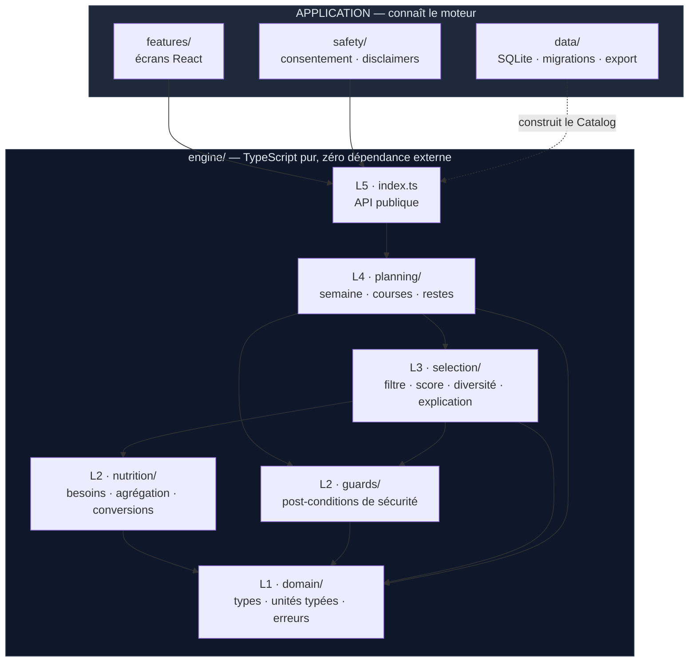
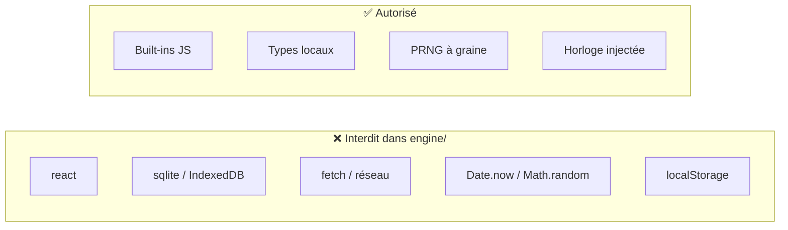

# Moteur — Socle — décision fondatrice, couches, dépendances

> Partie de la spécification du moteur. Index et ordre de lecture : [`../ENGINE.md`](../ENGINE.md).
> **La numérotation des sections (§4, §6.6 bis…) est celle du document d'origine et n'a pas bougé** —
> toute référence `ENGINE §x.y` faite ailleurs reste valide.

---

## 1. Décision fondatrice — le moteur est une fonction pure

Le moteur ne fait **aucun accès asynchrone**. Il reçoit un instantané du catalogue déjà chargé en
mémoire, et retourne un résultat de façon synchrone.

```ts
// ❌ Ce que le moteur ne fera JAMAIS
async function suggest(req) {
  const recipes = await db.query('SELECT * FROM recipe WHERE ...')
}

// ✅ Le contrat réel
function suggest(catalog: Catalog, req: SuggestionRequest): SuggestionResult
```

**Pourquoi c'est la bonne décision ici :**

| Bénéfice | Conséquence concrète |
|---|---|
| **Testable sans navigateur** | Vitest en Node pur, pas de mock SQLite, pas de WASM en test |
| **Déterministe** | Mêmes entrées → mêmes sorties, bit à bit. Exigence du principe 4. |
| **Auditable** | Une suggestion peut être rejouée à l'identique à partir de ses entrées |
| **Rapide** | Aucun aller-retour I/O dans la boucle de scoring |
| **Portable** | Si l'UI change un jour, le moteur ne bouge pas d'une ligne |

**Le coût — et pourquoi il est acceptable :** il faut tenir tout le catalogue en RAM.
Estimation : 3 200 aliments + 200 recettes + vecteurs nutritionnels pré-agrégés ≈ **6 à 10 Mo**.
Négligeable, y compris sur un téléphone d'entrée de gamme. Le jour où le catalogue dépasserait
100 Mo, cette décision serait à revoir — ce jour n'arrivera pas dans le périmètre défini.

**Corollaire sur l'aléatoire :** aucune suggestion n'utilise `Math.random()`. La diversification et
les égalités de score sont résolues par un **PRNG à graine explicite**, la graine étant stockée
avec le planning. Un planning est ainsi reproductible à l'identique — ce qui est nécessaire pour
déboguer, et suffisant pour ne pas proposer les mêmes trois plats chaque semaine.

---

## 2. Vue en couches



Chaque couche ne connaît que celles **en dessous** d'elle. Aucune remontée, aucun cycle.

| Couche | Rôle | Nature |
|---|---|---|
| **L1 domain** | Types, unités typées, erreurs métier | Données pures, zéro logique |
| **L2 nutrition** | Besoins énergétiques, agrégation, conversions | Fonctions pures, sans état |
| **L2 guards** | Post-conditions de sécurité (§6.5 d'ARCHITECTURE) | Assertions qui lèvent |
| **L3 selection** | Les 4 étapes du choix d'un repas | Pipeline pur |
| **L4 planning** | Semaine, restes, liste de courses | Orchestration |
| **L5 api** | Surface publique étroite | Façade |

---

## 3. Règles de dépendance



Ces règles sont **vérifiées automatiquement** par un test qui parcourt les imports de `engine/` et
échoue sur toute violation. Ce n'est pas une convention, c'est une barrière de build.

> **`Date.now()` interdit** : le moteur reçoit la date en paramètre (`context.date`). Sinon un test
> lancé le 31 décembre donne un autre résultat que le même test en juin — la saisonnalité dépend du
> mois. Injecter l'horloge rend les tests stables et le moteur rejouable.

---
