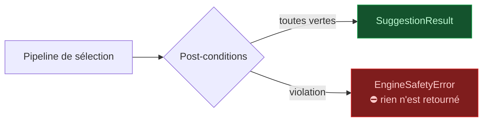
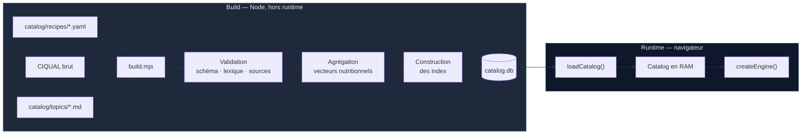

# Moteur — L1 Domaine · L2 Nutrition & garde-fous · le catalogue en mémoire

> Partie de la spécification du moteur. Index et ordre de lecture : [`../ENGINE.md`](../ENGINE.md).
> **La numérotation des sections (§4, §6.6 bis…) est celle du document d'origine et n'a pas bougé** —
> toute référence `ENGINE §x.y` faite ailleurs reste valide.

---

## 4. L1 — Domaine

### 4.1 Unités typées

Le bug classique du code nutritionnel est la confusion mg / g / µg — le fer se compte en mg, les
vitamines en µg, les macros en g. Coût de la protection : dix lignes.

```ts
declare const brand: unique symbol
type Branded<T, B> = T & { readonly [brand]: B }

export type Grams      = Branded<number, 'g'>
export type Milligrams = Branded<number, 'mg'>
export type Micrograms = Branded<number, 'µg'>
export type Kcal       = Branded<number, 'kcal'>
export type Minutes    = Branded<number, 'min'>
export type Euros      = Branded<number, 'EUR'>

export const g   = (n: number): Grams => n as Grams
export const mg  = (n: number): Milligrams => n as Milligrams
export const kcal = (n: number): Kcal => n as Kcal
```

`recipe.tempsPrep + food.quantite` ne compile plus. Une conversion doit être explicite.

### 4.2 Identifiants typés

Même principe, contre l'inversion d'arguments :

```ts
export type FoodId    = Branded<string, 'FoodId'>
export type RecipeId  = Branded<string, 'RecipeId'>
export type TopicId   = Branded<string, 'TopicId'>
export type NutrientId = Branded<string, 'NutrientId'>
export type AllergenId = Branded<string, 'AllergenId'>
```

### 4.3 Entités principales

```ts
export interface Recipe {
  readonly id: RecipeId
  readonly nom: string
  readonly tempsPrep: Minutes
  readonly tempsCuisson: Minutes
  readonly difficulte: 1 | 2 | 3
  readonly portionsBase: number
  readonly ingredients: readonly RecipeIngredient[]
  readonly etapes: readonly string[]
  readonly typesRepas: readonly MealSlot[]
  readonly saisonMois: readonly Month[]
  readonly tags: readonly RecipeTag[]
  readonly axes: SensoryAxes
  readonly conservationJours: number      // pour la gestion des restes (§10.3)
  readonly imagePath: string | null
}

export interface SensoryAxes {
  readonly sucreSale: number        // -1 (salé) … +1 (sucré)
  readonly legerConsistant: number  // -1 (léger) … +1 (consistant)
  readonly chaudFroid: number       // -1 (froid) … +1 (chaud)
  readonly texture: Texture
}

export interface UserProfile {
  readonly trancheAge: AgeBracket
  readonly sexe: 'F' | 'M' | 'NP'
  readonly tailleCm: number | null
  readonly poidsKg: number | null
  readonly niveauActivite: ActivityLevel
  readonly facteurPortion: number    // 0.7 … 1.5 — « trop / pas assez » (§10.1)
}
```

### 4.4 Erreurs métier

```ts
export class EngineSafetyError extends Error {}    // post-condition violée — jamais rattrapée
export class NoViableRecipeError extends Error {}  // filtrage trop restrictif — rattrapée par l'UI
export class CatalogIntegrityError extends Error {} // catalogue corrompu — au chargement
```

`EngineSafetyError` ne doit **jamais** être capturée silencieusement par l'UI. Si elle survient,
c'est un bug de sécurité : l'écran affiche une erreur, il ne dégrade pas.

---

## 5. L2 — Nutrition & garde-fous

### 5.1 `nutrition/`

```ts
// Besoin énergétique — Mifflin-St Jeor + facteur d'activité. CODÉ (P1b-2).
computeEnergyNeeds(profile: UserProfile): Kcal | null

// Apports de référence, par profil (VNR ANSES/EFSA). CODÉ (P1b-2), deux modes — voir note ci-dessous.
resolveReferenceIntakes(profile: UserProfile, catalog: Catalog): NutrientVector

// Agrégation d'une recette → vecteur nutritionnel par portion
aggregateRecipe(recipe: Recipe, catalog: Catalog): NutrientVector

// Mise à l'échelle des portions
scaleRecipe(recipe: Recipe, portions: number): ScaledRecipe

// Écart entre apports cumulés et cible restante sur la période
computeGap(consumed: NutrientVector, target: NutrientVector): NutrientGap
```

> **`computeEnergyNeeds` (CODÉ, `engine/nutrition/energy-needs.ts`)** : BMR de Mifflin-St Jeor ×
> facteur d'activité (PAL). Constante de sexe **+5** (M) / **−161** (F) / **−78** pour `'NP'` — la
> MOYENNE des deux, seule valeur qui ne range pas d'office dans une case quelqu'un qui a refusé de
> répondre. Âge = milieu de la tranche (`AgeBracket`, union fermée désormais : `18_29`→24,
> `30_49`→40, `50_64`→57, `65_plus`→72) ; PAL fixé par `ActivityLevel` (union fermée : `sedentaire`
> 1.2 · `peu_actif` 1.375 · `actif` 1.55 · `tres_actif` 1.725 — pas de palier « athlète », aucune
> tranche mineure : la VNR du catalogue est une VNR ADULTE). `tailleCm`/`poidsKg` à `null` →
> retourne **`null`** : on ne devine jamais un gabarit corporel. N'applique NI le plancher
> calorique (post-condition séparée, §5.2) NI `facteurPortion` (ajuste une portion SERVIE, pas un
> besoin journalier) — deux règles qui migrent facilement par accident vers le premier endroit qui
> parle de calories.
>
> **`resolveReferenceIntakes` (CODÉ, `engine/nutrition/reference-intakes.ts`), deux modes** : **VNR
> à plat** par défaut — chaque nutriment prend directement son `vnrAdulte` — retenu dès que
> `computeEnergyNeeds` retourne `null`. **Ré-échelonné** quand l'énergie personnalisée est
> disponible : `ratio = besoin / vnrAdulte(énergie)` appliqué **aux seuls nutriments
> `categorie === 'macronutriment'`** — minéraux et vitamines gardent leur VNR à plat, ce sont des
> besoins ABSOLUS (fer, calcium, vitamine C…), pas des proportions caloriques ; manger davantage ne
> demande pas plus de fer.

`NutrientVector` est un `Float64Array` indexé par position de nutriment, **pas** un objet. Sur
200 recettes × 40 nutriments, la différence de performance et de pression mémoire est réelle, et
l'API reste lisible derrière un accesseur.

> **`aggregateRecipe` n'est pas appelé au runtime.** Les vecteurs sont pré-calculés à la
> construction du catalogue (§9) et livrés dans le `.db`. La fonction reste dans le moteur parce
> que c'est elle que le script de build utilise, et parce qu'elle est testable isolément.

#### 5.1 bis — COUVERTURE nutritionnelle (2026-07-27), décision 29 TRANCHÉE et CODÉE

CIQUAL ne renseigne pas tout : pour certains aliments, une case est vide parce que l'ANSES n'a pas
mesuré ce nutriment. `aggregateRecipe` lit une case vide et **compte 0**, ce qui confond « on ne
sait pas » et « il n'y en a pas ».

Le défaut n'est pas d'affichage : `scoreNutri` **classe** la recette sur ce chiffre, et le sens de
l'erreur dépend du `NutrientSense` — donc ce n'est même pas un biais dans une direction, c'est du
**bruit** :

| Sens | Trou compté 0 | Effet | Cas réel mesuré |
|---|---|---|---|
| `plancher` (vitamine C, fer, calcium) | la recette paraît **pauvre** | **pénalisée à tort** | « Truite aux amandes », 76 % de la masse sans valeur |
| `plafond` (sodium) | la recette paraît **inoffensive** | **récompensée à tort** | « Gratin de blettes à la brousse », 64 % sans valeur |

**Le mécanisme.** `computeNutrientCoverage` (`engine/nutrition/nutrient-coverage.ts`) produit, par
nutriment, la **part de la masse dont la valeur est connue** ∈ [0, 1] — index
`CatalogIndexes.recipeNutrientCoverage`. Il ne corrige ni n'invente aucune valeur.

`scoreNutri` **s'abstient** de noter un nutriment dont la couverture est sous `NUTRI_MIN_COVERAGE` :
il le saute, et `count` se renormalise sur les nutriments restants. Aucun nutriment notable →
`NEUTRAL_SCORE`, comme avant.

> ⚠️ **Même périmètre d'ingrédients que `aggregateRecipe`, optionnels INCLUS.** La couverture
> qualifie l'agrégat ; si l'une inclut les optionnels et pas l'autre, elle décrit un autre plat.
> Un `foodId` absent du catalogue ne compte **ni** au numérateur **ni** au dénominateur — il est
> déjà ignoré par l'agrégation, l'inclure déclencherait une abstention à cause d'un fantôme.

> ⚠️ **`NUTRI_MIN_COVERAGE = 0,7` est un seuil de JUGEMENT, pas de mesure** — contrairement à ceux
> de `variety`, il n'existe pas de jeu de cas jugés pour « ce nutriment est-il notable ». Il sépare
> les situations réelles, qui se répartissent sous 30 % d'inconnu ou au-dessus de 39 %, sans rien
> entre les deux. Effet sur le catalogue : **13 recettes sur 212** perdent un nutriment (12 la
> vitamine C, 1 le sodium), **aucune ne les perd tous**.

**L'import ne refuse plus** un aliment sans énergie (`catalog/import-ciqual.mjs`) — c'était l'état
sûr provisoire, mais il **façonnait le catalogue sur ce que l'ANSES a documenté** plutôt que sur la
cuisine : la ricotta a dû être remplacée à l'écriture des recettes. Désormais un avertissement.

`NutrientSummary.coverage` remonte l'information jusqu'à l'appelant, pour un futur libellé honnête.
Ce champ ne protège **pas** le classement — c'est l'abstention de `scoreNutri` qui le fait ; il ne
fait que rendre la chose lisible.

> **Reste interdit** : inventer une valeur, ou la recalculer depuis les macros (4/4/9), et l'écrire
> dans le même champ que les chiffres ANSES — un chiffre maison indistinguable d'un chiffre sourcé
> est exactement ce que le badge de preuve existe pour empêcher. Une seconde source (USDA, CoFID)
> reste possible **à condition d'être tracée par valeur** ; le vecteur de couverture est justement
> ce qui rendra ça faisable. Avant d'y aller, chercher d'abord une entrée voisine **dans CIQUAL**.

### 5.2 `guards/` — la sécurité comme post-condition

Le point clé : **les garde-fous ne sont pas des recommandations d'UI, ce sont des assertions que le
moteur exécute sur sa propre sortie avant de la retourner.**

```ts
assertNoDeclaredAllergen(result: SuggestionResult, c: HardConstraints): void
assertCalorieFloor(plan: WeekPlan, profile: UserProfile): void
assertCriticalLayersRan(trace: PipelineTrace): void
assertScoringLayersNeverExclude(trace: PipelineTrace): void
assertNoTherapeuticClaim(explanations: readonly Explanation[]): void
```

| Garde-fou | Vérifie | Référence | État |
|---|---|---|---|
| `assertNoDeclaredAllergen` | Aucune suggestion ne contient un allergène déclaré | §5.2 ARCHI | **CODÉ** (P1a) — signature adaptée, voir note |
| `checkCalorieFloor` | Aucun jour < 1 200 kcal (F) / 1 500 (H) | §6.5 ARCHI | **CODÉ** (2026-07-28) — ⚠️ **AVERTIT, ne lève pas** : rapporte dans `WeekPlan.warnings`. Signature `(plan, profile, catalog)` |
| `assertCriticalLayersRan` | Les couches `critical` ont bien été exécutées | §6.3 | **CODÉ** (P1c) |
| `assertScoringLayersNeverExclude` | **Aucune** couche de score n'a réduit l'ensemble | §6.1 ARCHI · §6.3 | **CODÉ** (P1b-2) |
| `assertNoTherapeuticClaim` | Aucune explication ne contient le lexique banni | §6.2 ARCHI | **CODÉ** (P1c) |

**Les 5 garde-fous sont codés** depuis le 2026-07-28.

> ⚠️ **Le cinquième n'est pas de même nature, et il ne faut pas l'aligner sur les autres.** Quatre
> garde-fous LÈVENT `EngineSafetyError` et annulent la sortie ; `checkCalorieFloor` RAPPORTE. §6.5
> ARCHITECTURE écrit « sans écran d'avertissement explicite » — il demande un avertissement, pas un
> refus. D'où le nom : ce n'est plus un `assert*`, puisqu'il n'assère rien.
>
> Première version : il jetait, et un planning de 7 jours était intégralement refusé dès qu'UNE
> journée passait sous le seuil. L'utilisateur perdait les six autres pour un repas un peu léger.

> ⚠️ `assertCalorieFloor` n'évalue QUE les jours où `dejeuner` ET `diner` sont remplis. Un
> utilisateur qui ne planifie que ses dîners mange par ailleurs : lui opposer un plancher journalier
> serait un faux positif systématique. Et un jour dont un repas principal n'a pas pu être rempli
> n'est pas « un plan qui affame » mais un plan INCOMPLET — déjà visible dans `entries`. Confondre
> les deux rendrait le vrai signal inaudible.

> **Écart assumé pour `assertNoDeclaredAllergen` (P1a)** : implémenté aujourd'hui sur
> `(candidates: ReadonlySet<RecipeId>, catalog: Catalog, constraints: HardConstraints): void`
> plutôt que sur la signature littérale ci-dessus (`SuggestionResult` n'existe pas encore comme
> valeur PRODUITE — `suggestMeals` n'est pas câblé, §8). Se réaligne sur la signature ci-dessus dès
> que `suggestMeals` sera câblé (P1c) ; seul l'appelant change, pas le garde-fou.
>
> **`assertScoringLayersNeverExclude` (CODÉ, `engine/guards/index.ts`) et l'extension de
> `PipelineTrace` qu'il a rendue nécessaire.** Avant cette couche, `PipelineTrace` ne typait
> `excludedCandidateCounts` que par `ExclusionLayerId` : une couche de SCORE ne pouvait
> STRUCTURELLEMENT pas y figurer, donc ce garde-fou était incapable d'observer la violation qu'il
> est censé attraper. Deux champs ont été ajoutés à `PipelineTrace` (`domain/result.ts`) :
> `scoringCandidateCount` (nombre de candidats soumis à la passe de score) et
> `scoringLayerCounts` (nombre de scores RENDUS, par couche de score exécutée — une couche non
> exécutée, poids ≤ 0, n'y apparaît pas). Le garde-fou compare chaque entrée de la seconde au
> premier : un écart, dans un sens ou l'autre, signale qu'une couche de score a réduit (ou
> « halluciné ») l'ensemble des candidats.

> **`assertCriticalLayersRan` (CODÉ, `engine/guards/index.ts`) — implémenté P1c.** Compare
> `trace.criticalLayerIds` (le sous-ensemble `critical: true` attendu, figé, du registre) à
> `trace.layersRun` (ce qui a RÉELLEMENT tourné) : toute couche critique absente de la trace
> déclenche l'erreur — l'invariant §6.3 « `critical: true` est indésactivable » cesse d'être une
> intention pour devenir une propriété vérifiée sur l'exécution réelle. Premier consommateur réel :
> `engine/api/index.ts`, `runSuggestMeals` (§8), vérifié juste après la passe de score.
>
> **`assertNoTherapeuticClaim` (CODÉ, `engine/guards/index.ts`) — implémenté P1c.** Vérifie que
> `label` de chaque `Explanation` (seul champ affiché en texte libre — `criterion` est un id fermé,
> `authority`/`evidenceSheetId` sont hors périmètre tant que `topic` n'est pas implémenté) ne
> contient aucun terme du lexique banni (§6.2 ARCHITECTURE). Premier consommateur réel :
> `selection/explain.ts` (§6.7), appelé par `suggestMeals` sur l'ensemble des explications
> produites, juste avant de retourner. Le lexique est **dupliqué** depuis `catalog/build.mjs` dans
> `engine/guards/banned-terms.ts` — `engine/` ne peut pas importer `catalog/build.mjs` (§3 ENGINE) —
> et la non-divergence des deux copies est garantie par `tests/banned-terms-consistency.test.mjs`
> (détail complet : `docs/ARCHITECTURE.md` §6.2).



Un allergène qui passerait le filtre à cause d'un bug de scoring ne peut pas atteindre l'écran :
le moteur refuse de retourner le résultat. C'est la différence entre « on a écrit le filtre
correctement » et « il est structurellement impossible que ça sorte ».

---

## 9. Le catalogue en mémoire

### 9.1 Structure

```ts
export interface Catalog {
  readonly version: string
  readonly foods: ReadonlyMap<FoodId, Food>
  readonly recipes: ReadonlyMap<RecipeId, Recipe>
  readonly nutrients: readonly Nutrient[]        // ordre = index dans NutrientVector
  readonly allergens: ReadonlyMap<AllergenId, Allergen>
  readonly topics: ReadonlyMap<TopicId, HealthTopic>
  readonly substitutions: ReadonlyMap<FoodId, readonly Substitution[]>
  readonly indexes: CatalogIndexes
}

export interface CatalogIndexes {
  readonly recipesByAllergen: ReadonlyMap<AllergenId, ReadonlySet<RecipeId>>
  readonly recipesByDiet: ReadonlyMap<DietCode, ReadonlySet<RecipeId>>
  readonly recipesBySlot: ReadonlyMap<MealSlot, ReadonlySet<RecipeId>>
  readonly recipeNutrients: ReadonlyMap<RecipeId, NutrientVector>   // pré-agrégé, PAR PORTION
  readonly recipeNutrientCoverage: ReadonlyMap<RecipeId, NutrientVector> // part CONNUE — §5.1 bis
  readonly recipeMainIngredient: ReadonlyMap<RecipeId, FoodId>      // ⚠️ MORT — lu par aucune couche
  readonly recipeSignature: ReadonlyMap<RecipeId, RecipeSignature>  // similarité — §6.6 bis
  readonly recipeFamilySignature: ReadonlyMap<RecipeId, RecipeFamilySignature> // récence — §6.6 quater
  readonly declaredFamilies: ReadonlySet<string>                    // sous-familles réelles — §6.6 quinquies
}
```

> **Tous les index dérivés sont calculés à l'init du moteur** (`createEngine(catalog)` →
> `attachDerivedIndexes`, fonctions pures de `engine/nutrition/`), jamais par `catalog/build.mjs` —
> pour ne pas coupler le script de build au moteur (§6.5 précision 8). `data/catalog-loader.ts` les
> retourne vides ; ils sont peuplés depuis P1b-1. Voir aussi la note de §9.2.
>
> ⚠️ **Deux espaces de signature, à ne pas fusionner.** `recipeSignature` (clés = `FoodId`) sert la
> SIMILARITÉ, qui doit encore distinguer un blanc de poulet rôti d'un tajine de cuisses.
> `recipeFamilySignature` (clés = nom de sous-famille OU `foodId`) sert la RÉCENCE, qui se moque du
> morceau. La pondération de la similarité a été mesurée sur le brut : les fusionner invaliderait
> cette mesure — §6.6 quater.
>
> ⚠️ `recipeMainIngredient` n'est lu par **aucune couche** depuis §6.6 bis. Il survit pour les bancs
> de comparaison, qui documentent pourquoi il a été abandonné. C'est de la dette, pas un index actif.

### 9.2 Où se fait le travail



**Tout ce qui peut être calculé une fois l'est au build**, à l'exception assumée de l'agrégation
nutritionnelle et de l'ingrédient principal (voir la note ci-dessus, §9.1) : index par allergène,
validation du lexique interdit. Le runtime ne fait que désérialiser pour ceux-ci. Conséquences :
démarrage rapide, et surtout les erreurs de contenu sont détectées **à la construction**, pas chez
l'utilisateur.

`build.mjs` échoue — et bloque le build — si : une recette référence un aliment inconnu, un
`topic_criterion` n'a pas de source, ou le lexique banni (§6.2 ARCHITECTURE) apparaît dans un
fichier de contenu.

---
