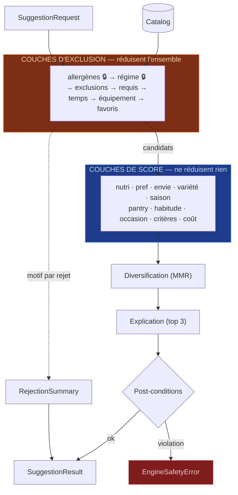

# Moteur — L3 Sélection — natures de couches, contrat, registre, archétypes, pipeline

> Partie de la spécification du moteur. Index et ordre de lecture : [`../ENGINE.md`](../ENGINE.md).
> **La numérotation des sections (§4, §6.6 bis…) est celle du document d'origine et n'a pas bougé** —
> toute référence `ENGINE §x.y` faite ailleurs reste valide.

---

## 6. L3 — Sélection

### 6.1 Deux natures de couches — la distinction qui structure tout

Le pipeline n'est pas du code figé : c'est un **registre ordonné de couches** partageant un contrat
commun. Mais elles se répartissent en deux natures qu'il ne faut jamais confondre.

| Nature | Effet sur l'ensemble | Composition | Exemples |
|---|---|---|---|
| **Exclusion** | **Retire** des candidats | Intersection | allergènes · régime · exclusions perso · requis · temps · équipement |
| **Score** | **Ne retire rien**, repondère | Somme pondérée | préférences · envies · santé · frigo · habitude… |

> **Le piège à éviter.** Si « préférences » était une couche d'exclusion, détester les champignons
> éliminerait toute recette en contenant — y compris celle où ils sont une garniture accessoire.
> Une préférence doit **déclasser, jamais supprimer.** Seules quatre choses suppriment : un
> allergène, un régime déclaré, un temps impossible, un équipement absent et indispensable.



### 6.2 Le contrat commun

```ts
export type LayerKind = 'exclusion' | 'scoring'

export interface SelectionLayer<Config = unknown> {
  readonly id: LayerId
  readonly kind: LayerKind
  readonly critical: boolean        // true → indésactivable, par aucun réglage
  readonly defaultWeight: number    // scoring uniquement

  /** Extrait du contexte ce dont la couche a besoin. Pure. */
  readonly configure: (req: SuggestionRequest, catalog: Catalog) => Config

  /** Exclusion → renvoie un sous-ensemble + motifs. Score → renvoie un score 0-1 par candidat. */
  readonly apply: (candidates: CandidateSet, config: Config) => LayerResult
}
```

Une couche ne connaît **ni les autres couches, ni le pipeline**. Elle reçoit un ensemble de
candidats et une configuration, elle retourne un résultat. C'est ce qui la rend utilisable seule
(§6.7) et testable isolément.

### 6.3 Le registre

```ts
export const LAYERS: readonly SelectionLayer[] = [
  // — exclusion, dans l'ordre de priorité de MOTIF —
  allergenLayer,          // 🔒 critical
  dietLayer,              // 🔒 critical
  personalExclusionLayer, // exclusions personnelles (HardConstraints.excludedFoodIds)
  requiredFoodLayer,      // miroir dur — MealContext.requiredFoodIds, contexte Aujourd'hui seulement
  timeLayer,
  equipmentLayer,    // seulement l'équipement `requis`
  favoriteLayer,     // inerte hors `onlyFavorites` — motif le moins informatif, donc en DERNIER

  // — score —
  nutriLayer,        // 0.25
  preferenceLayer,   // 0.25
  cravingLayer,      // 0.20
  varietyLayer,      // 0.15
  seasonLayer,       // 0.10
  pantryLayer,       // 0.05 — dominant en mode « vider le frigo »
  habitLayer,        // 0.00 → croît avec l'historique (§7.5)
  occasionLayer,     // 0.05 — nul hors période
  speedLayer,        // 0.00 → relevée par l'archétype « Rapide » (§6.3 bis)
  topicLayer,        // 0.00 — nul tant qu'aucune thématique active
  costLayer,         // 0.05 — v3
]
```

**18 couches au registre (7 exclusion + 11 score), dont `topic` (v2) et `cost` (v3) en réserve à
poids nul — mais six couches de score réellement actives au premier lancement** : `topic`,
`cost`, `habit` et `speed` démarrent à 0, `occasion` est nul hors période. La complexité perçue
n'augmente pas avec le nombre de couches.

> Correction de comptage (session du 2026-07-24) : la prose de ce document et d'ETAT.md disait
> longtemps « registre de 12 couches », alors que la liste ci-dessus en énumère 14 (4 exclusion +
> 10 score) depuis le début. Le code (`app/src/engine/domain/layer-ids.ts`) implémente les 14 et
> le signale déjà en commentaire. **Le code fait foi** ; toute occurrence de « 12 couches » dans
> ce document et dans ETAT.md est une coquille corrigée par cette note, pas une décision qui change.
> Mise à jour (session 2) : une 5ᵉ couche d'exclusion `exclusions` (rejet personnel,
> `excludedFoodIds`) a été ajoutée — le registre est désormais à **15** (5 exclusion + 10 score).
> Le code fait foi.
> Mise à jour (session du 2026-07-25) : une 6ᵉ couche d'exclusion `requis` (miroir dur, lit
> `MealContext.requiredFoodIds`) a été ajoutée — le registre est passé à **16** (6 exclusion +
> 10 score). Le code fait foi.
> Mise à jour (session du 2026-07-25, suite) : `speed` a rejoint le registre comme couche de score
> à part entière — le registre est désormais à **17** (6 exclusion + 11 score). Voir §6.5, note ¶
> révisée : la précédente affirmation « `speed` n'est pas une 17ᵉ couche du registre » est fausse
> depuis cette décision. Le code (`app/src/engine/domain/layer-ids.ts`,
> `app/src/engine/selection/index.ts`) fait foi.
> Mise à jour (session du 2026-07-26, P1c lot 4) : une 7ᵉ couche d'exclusion `favoris` (lit
> `SuggestionRequest.onlyFavorites` + `favoriteRecipeIds`) a été ajoutée — le registre est
> désormais à **18** (7 exclusion + 11 score). Le flag §8.1 aurait pu rester un pré-filtre du set
> initial : en faire une couche fait tomber son motif de rejet dans `RejectionSummary`, donc dans
> l'entonnoir du banc d'essai. Couche INERTE tant qu'`onlyFavorites` n'est pas explicitement levé
> — les favoris restent un marque-page, conformément à §10.1. Le code fait foi.

#### 6.3 ter — Chaîne d'inclusion des régimes (couche `regime` 🔒) — **CODÉ (2026-07-26)**

```
vegetalien  ⊂  vegetarien  ⊂  pescetarien  ⊂  omnivore
```

Une recette est compatible avec le régime demandé si elle porte **ce régime, ou un régime plus
restrictif** dans la chaîne ci-dessus (`DIET_CHAIN`, `app/src/engine/selection/regime.ts`).

**Ce que ça remplace.** P1a imposait une **égalité stricte de chaîne**, sans hiérarchie. Le défaut
n'était pas théorique — mesuré sur le catalogue réel de 34 recettes, AVANT correction :

| Régime déclaré | Recettes visibles avant | Après |
|---|---|---|
| `vegetalien` | 5 | 5 |
| `vegetarien` | 11 | **16** |
| `pescetarien` | 11 | **27** |
| `omnivore` | **7** | **34** |

Le cas le plus grave n'était pas le pescétarien mais l'**omnivore** — le réglage le plus courant :
il ne voyait que les 7 recettes littéralement étiquetées `omnivore`, c'est-à-dire uniquement les
plats de viande. Ni poisson, ni pâtes, ni soupe.

**Deux propriétés qui font que c'est sûr dans une couche 🔒 critique :**

1. **La chaîne n'élargit JAMAIS vers la droite.** Demander `vegetarien` ne fait jamais entrer une
   recette `omnivore` : un plat de viande reste structurellement inatteignable pour qui a déclaré
   végétarien. Un test dédié verrouille les six directions interdites.
2. **Un régime hors chaîne retombe sur l'égalité stricte.** `sans_gluten`, `halal`, `casher`,
   `sans_lactose` ne s'emboîtent dans rien — ils ne sont pas dans `DIET_CHAIN` et ne bénéficient
   d'aucune inclusion, ni dans un sens ni dans l'autre. `DietCode` étant un `string` ouvert
   (aucune contrainte CHECK en base), la chaîne est du **vocabulaire connu**, pas une union fermée.

**L'alternative écartée** était d'étiqueter chaque recette avec tous les régimes qu'elle respecte
(le taboulé porterait 4 facettes). Rejetée pour son mode de défaillance : une étiquette oubliée sur
une recette parmi cent la fait disparaître pour une partie des utilisateurs, **sans erreur, sans
trace, sans que personne ne le remarque**. La chaîne s'écrit une fois et ne s'oublie pas.

> Conséquence pour le contenu : une recette déclare **le régime le plus restrictif qu'elle
> respecte**, un seul. Un plat végétalien déclare `vegetalien`, pas la liste des quatre.

Les poids sont normalisés (`Σ = 1`) avant application. L'utilisateur les module via un petit jeu
d'**archétypes nommés** — voir §6.3 bis ci-dessous, qui généralise l'idée initiale de « quatre
préréglages » (*équilibre · plaisir · rapidité · budget*) sans changer le principe : peu de
préréglages nommés, **jamais douze curseurs**.

#### Sur l'ordre des couches

| Nature | L'ordre compte-t-il ? |
|---|---|
| **Exclusion** | **Pas pour le résultat** — une intersection d'ensembles est commutative. **Oui pour le rapport** : on veut annoncer « écarté pour allergène » plutôt que « écarté pour temps » quand les deux s'appliquent. L'ordre encode la priorité de motif. |
| **Score** | **Jamais.** C'est une somme pondérée ; seuls les poids comptent. |

#### Deux invariants garantis par le registre

1. **`critical: true` est indésactivable.** Aucun réglage, aucun test, aucun futur développeur ne
   peut retirer la couche allergènes du pipeline. La sécurité devient structurelle plutôt que
   confiée à la vigilance.
2. **Aucune couche de score ne peut réduire l'ensemble des candidats.** Vérifié par
   `assertTopicsNeverExclude`, étendu à toutes les couches `kind: 'scoring'`.

### 6.3 bis — Archétypes *(CODÉ, P1b-2 — mécanique moteur ; sélecteur UI reste P3)*

> Généralise et remplace l'idée initiale de « quatre préréglages nommés » (§6.3, §13). Le principe
> ne change pas : peu de choix nommés, jamais un tableau de bord de curseurs. Décision de
> conception de la session du 2026-07-24 (`docs/archive/RECAP_SESSION.md`), **codée et noms validés par
> l'utilisateur en session du 2026-07-25** (`app/src/engine/selection/archetypes.ts`,
> `ArchetypeId` dans `app/src/engine/domain/archetype-ids.ts` — placé en `domain/`, pas
> `selection/`, pour que `SuggestionRequest.archetype` puisse le référencer sans faire dépendre
> `domain/` de `selection/`, §2/§3).

Un **archétype = un vecteur de poids nommé** appliqué aux couches de **score** uniquement. Un
archétype ne touche **jamais** les couches critiques (`allergenes` 🔒, `regime` 🔒) — elles restent
actives et non pondérables, quel que soit l'archétype choisi (invariant §6.3) ; la table des
surcharges (`ARCHETYPE_WEIGHT_OVERRIDES`) est typée pour n'accepter qu'un `ScoringLayerId` en clé,
ce qui rend une surcharge d'une couche d'exclusion une erreur de compilation plutôt qu'un cas à
intercepter au runtime.

**Jeu CODÉ, 6 archétypes, noms validés, table des surcharges appliquées telles quelles** :

| Archétype | `ArchetypeId` | Surcharge (`ARCHETYPE_WEIGHT_OVERRIDES`) | Effet dominant |
|---|---|---|---|
| **Équilibre** *(défaut)* | `equilibre` | `{}` — aucune surcharge | Poids de référence du §6.5, aucune couche mise en avant |
| **Envie** | `envie` | `{ craving: 0.40 }` | `craving` ↑ |
| **Découverte** | `decouverte` | `{ variety: 0.35 }` | `variety` ↑ |
| **De saison** | `de_saison` | `{ season: 0.30 }` | `season` ↑ |
| **Mes goûts** | `mes_gouts` | `{ preference: 0.40 }` | `preference` ↑ |
| **Rapide** | `rapide` | `{ speed: 0.30 }` | `speed` ↑ (§6.5) |

Pas d'archétype « budget » en v1 — `cost` reste une couche de réserve pour v3 (§6.3). La
normalisation Σ = 1 déjà en place dans `runScoringPass` (§6.4) fait le reste : relever une couche
abaisse mécaniquement la part des autres, sans recalcul manuel des overrides.

**Cycle de vie** : choisi par l'utilisateur à la **première utilisation** (onboarding) et
modifiable ensuite dans les **Paramètres** — les deux volets UI sont **P3**, hors périmètre P1b.
Le moteur n'expose qu'un vecteur de poids nommé ; l'écran qui le pilote est une couche
d'application au-dessus, comme pour toute autre couche (§6.8).

### 6.4 Exécution du pipeline

```ts
function runPipeline(catalog: Catalog, req: SuggestionRequest): PipelineOutcome {
  const enabled = LAYERS.filter(l => l.critical || isEnabled(l.id, req))

  // ① exclusion — intersection successive, motif conservé
  let candidates = catalog.indexes.recipesBySlot.get(req.context.creneau)!
  const rejections: RejectionEntry[] = []
  for (const layer of enabled.filter(l => l.kind === 'exclusion')) {
    const r = layer.apply(candidates, layer.configure(req, catalog))
    rejections.push(...r.rejected)      // premier motif rencontré = motif retenu
    candidates = r.kept
  }

  // ② score — accumulation, aucune réduction
  const scores = new Map<RecipeId, ScoreBreakdown>()
  for (const layer of enabled.filter(l => l.kind === 'scoring')) {
    const r = layer.apply(candidates, layer.configure(req, catalog))
    accumulate(scores, layer.id, r.scores, weightOf(layer, req))
  }

  return { candidates, scores, rejections }
}
```

Ajouter une fonctionnalité, c'est **ajouter une entrée au registre** — le pipeline ne change pas.
« Vider le frigo », le budget, un futur critère d'empreinte carbone : une couche chacun.
