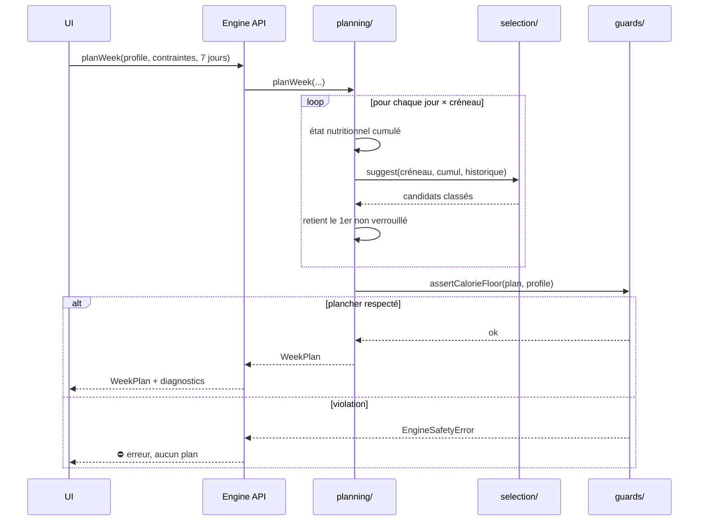
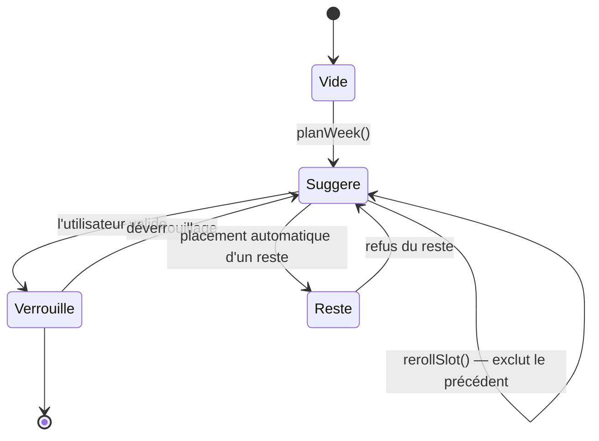

# Moteur — L4 Planification

> Partie de la spécification du moteur. Index et ordre de lecture : [`../ENGINE.md`](../ENGINE.md).
> **La numérotation des sections (§4, §6.6 bis…) est celle du document d'origine et n'a pas bougé** —
> toute référence `ENGINE §x.y` faite ailleurs reste valide.

---

## 7. L4 — Planification

### 7.1 Algorithme de planification — CODÉ (2026-07-28, `engine/planning/plan-week.ts`)

Glouton jour par jour, état nutritionnel cumulé réinjecté à chaque créneau.

**Fenêtre glissante de 2 à 14 jours**, démarrant à n'importe quelle date — pas de semaine
calendaire figée. Le minimum à 2 jours couvre le départ en week-end ; le maximum à 14 jours couvre
la planification anticipée. Conséquences sur le moteur :

| Élément | Adaptation |
|---|---|
| Cible nutritionnelle | Calculée sur la durée réelle de la fenêtre, pas sur 7 jours fixes |
| Fenêtre de variété | Reste à 21 jours glissants, indépendante de la fenêtre de planification |
| Liste de courses | Générée sur la fenêtre courante |



**Pourquoi glouton et pas optimisation globale :** l'optimisation d'un planning de 21 créneaux sous
contraintes multiples est NP-difficile, mais surtout **elle est incompréhensible pour
l'utilisateur** — modifier une préférence rebat toutes les cartes, y compris les repas qu'il
aimait. Le glouton produit un résultat stable, où chaque changement est local et explicable.

#### Ce qui fait une SEMAINE et non N suggestions — l'historique de travail

Après chaque choix, la recette retenue est ajoutée à l'historique passé au créneau suivant, avec
`origine: 'choisi'` et la date du créneau. `variety` et `habit` la voient donc comme un repas
réellement pris.

**Sans ce mécanisme, `planWeek` ne serait qu'une boucle appelant `suggestMeals`** : chaque créneau
verrait le même historique initial, donc les mêmes scores, donc la même tête de classement — sept
fois le même dîner, sans que rien ne le signale.

Deux protections se cumulent, et ce n'est **pas** une redondance : l'historique fait *baisser* le
score d'un plat récent (signal continu qui décroît avec les jours), `placedRecipeIds` *interdit* le
doublon exact (garantie dure). Le premier seul laisserait passer un doublon quand tous les autres
candidats sont mauvais ; le second seul ne dirait rien de la lassitude à J+3.

> La suggestion est **injectée** (`SuggestForSlot`), pas reconstruite : L4 ne peut pas importer
> `api/` (L5), et surtout une copie du pipeline **dériverait** — `suggestMeals` exécute au passage
> `assertNoDeclaredAllergen` et `assertCriticalLayersRan`. C'est le `P->>S: suggest` du diagramme.

> Un créneau que le catalogue ne peut pas remplir devient **vide** (`recipeId: null`), il ne fait
> pas échouer le plan : `NoViableRecipeError` est rattrapée ici, et seulement ici. Faire perdre
> treize créneaux pour un impossible serait pire.

#### ⚠️ Ce que ce lot ne fait PAS

- ~~La cible nutritionnelle RESTANTE~~ — **CODÉE le 2026-07-28**, voir ci-dessous.
- **Les restes** (`planLeftovers`, §7.3).
- ~~Le mode repas~~ (`service`) — **PARTIELLEMENT OUVERT le 2026-08-04**, voir ci-dessous.

#### Le mode repas — un accompagnement EN PLUS du plat (2026-08-04, décision 54 ETAT §4)

`planWeek` produit **deux `MealPlanEntry` sur un même créneau** quand il pose un plat en déjeuner ou
en dîner : l'une `service: 'plat'`, l'autre `service: 'accompagnement'`. C'est le correctif du
plancher calorique de §6.5 : `checkCalorieFloor` compare une JOURNÉE à un plancher journalier alors
que le plan ne posait que des PLATS — la comparaison n'a jamais été homogène. Mesuré sur 20 graines
× 7 jours (`npm run engine:plancher`) : **min 813 → 1 302 kcal, 0/20 → 20/20 semaines sans
avertissement**.

**Ce qui n'est PAS produit** : `entree`, `fromage` et `dessert` ; ni le petit-déjeuner ni le goûter,
qui restent en mode recette. Un plat posé SEUL garde `service: null` — **le champ dit le MODE, pas la
recette**.

> ⛔ **TOUT LECTEUR DE `WeekPlan.entries` DOIT CESSER DE SUPPOSER UNE ENTRÉE PAR CRÉNEAU.** Un
> `find` sur `(date, creneau)` rend le plat, jamais l'assiette entière ; un `entries.length` compte
> des lignes, pas des repas. Quatre endroits portaient le défaut le jour même — voir
> `reference/PIEGES.md`, « Les bancs mentent par omission ».

**Les deux protections contre la répétition sont DISSOCIÉES pour la première fois.**
L'accompagnement est exempté de `placedRecipeIds` — l'interdit dur du doublon exact — parce qu'on
mange du riz plusieurs fois par semaine ; mais il **passe par l'historique de travail**, donc
`variety` fait décroître son score. *Le riz peut revenir, il ne doit pas lasser.* Mesuré sans
l'historique : `7× Ratatouille` sur 14 créneaux.
#### La cible nutritionnelle RESTANTE — CODÉE, et MESURÉE INSUFFISANTE

`SuggestionRequest.nutrientTarget` est le point d'injection qui manquait. À chaque créneau,
`planWeek` vise `(référence journalière − déjà placé aujourd'hui) / créneaux restants` au lieu de la
part fixe `MEAL_SLOT_SHARE`. Un déjeuner léger relève donc mécaniquement la cible du dîner. Le cumul
est remis à zéro chaque jour, et la cible est planchée à zéro — un négatif ferait *disparaître* le
nutriment du score au lieu de dire « on a assez ».

> ⛔ **MESURÉ : l'effet est marginal, et c'était prévisible.** Pire jour d'un plan à 3 créneaux :
> 1 061 → **1 125 kcal**, toujours sous le plancher. Sur 4 créneaux, le minimum passe de 1 258 à
> 1 218 — la différence est du bruit de glouton.
>
> **La raison est arithmétique** : `scoreNutri` moyenne l'écart sur les **9 nutriments**, et `nutri`
> pèse **0,25**. L'énergie représente donc `0,25 / 9 ≈ **2,8 %**` de la note finale. Déplacer sa
> cible ne peut pas renverser un classement arbitré par la saison, les préférences et l'envie.
>
> Le mécanisme est **conforme à §7.1 et correct** — un déjeuner léger DOIT relever la cible du dîner
> — mais il ne résout pas la décision 34. La cause réelle est ailleurs : voir ci-dessous.

#### La fenêtre de candidats demandée à `suggest` — un bug et sa correction

`slotRequest` doit fixer `limit` **et** `skipDiversification`. Ce n'est pas un réglage de confort :
sans eux, `suggestMeals` rend **5** suggestions diversifiées, le glouton écarte celles déjà placées,
et le créneau reste **vide** dès que les 5 le sont — alors que des dizaines de candidats attendent.

Mesuré avant correction : **11 petits-déjeuners placés sur 14** avec 17 recettes disponibles ;
39 créneaux sur 42 en 14 jours × 3. Après : 14/14 et 42/42.

> `limit` vaut `jours × créneaux + 1` — tout ce qui peut déjà avoir été placé, plus un. La
> diversification MMR est désactivée : elle réordonnerait un ensemble dont on ne prend qu'un
> élément, et la variété du plan vient déjà de l'historique de travail et de `placedRecipeIds`.

> ⚠️ **Ce bug était invisible en test unitaire**, qui utilise une suggestion factice sans limite.
> Il a fallu le banc de stress sur données réelles (`npm run engine:plan-stress`, 20 configurations)
> pour le voir. Le relancer après toute modification du glouton.

#### Résultat mesuré sur le catalogue réel (2026-07-28)

7 jours × 4 créneaux : **28 créneaux remplis, 28 recettes distinctes, aucun doublon**, 1 258 à
1 788 kcal/jour.

> ⛔ **Sur TROIS créneaux (sans goûter), le plan ÉCHOUE** — `assertCalorieFloor` lève à 1 125 kcal.
>
> ⚠️ **Le catalogue N'EST PAS trop léger** — c'était ma première conclusion, et la mesure l'a
> démentie. La meilleure journée possible sur 3 repas atteint **2 127 kcal** (488 + 819 + 819). Le
> contenu suffit ; c'est le CHOIX qui est mauvais.
>
> La cause réelle est un défaut d'ÉTIQUETAGE : **61 des 183 recettes portant `dejeuner` ou `diner`
> apportent moins de 300 kcal**, parce que des entrées, des accompagnements et des desserts sont
> étiquetés comme repas principaux — « Carottes Vichy » (147 kcal), « Œufs mimosa » (176),
> « Blancs en neige sucrés » (126), « Soupe de carottes à l'ail » (103). Une soupe à 103 kcal est
> une bonne soupe ; ce n'est pas un dîner. En les retirant des créneaux principaux, il reste
> **122 plats de médiane 432 kcal**.
>
> C'est exactement le trou que `CourseKind` (entrée/plat/accompagnement/dessert) comblerait — il
> existe dans le domaine mais **n'est pas sur `Recipe`**. ~~**Décision ouverte** — ETAT §4 n°34.~~
> ⚠️ *Phrase datée du 2026-07-28, fausse depuis : la 34 est fermée et `Recipe.service` existe — voir
> juste en dessous.*
>
> ✅ **SUITE, 2026-08-03 puis 2026-08-04.** `Recipe.service` existe et est désormais LU par
> `planWeek` (décision 53) : un repas principal placé automatiquement doit être un plat, en
> PRÉFÉRENCE et non en exigence — la version dure avait fait retomber le végétalien 14 j de 42/42 à
> 32/42 créneaux remplis. **Ce filtre seul n'a PAS réglé le plancher** (0/20 → 1/20 graines
> propres) : la cause de fond était que le plan comparait des PLATS à une JOURNÉE. C'est la
> décision 54 — l'accompagnement posé en plus du plat — qui l'a réglée (20/20).

### 7.2 États d'un créneau



Un créneau **verrouillé** est invisible pour toute replanification ultérieure. C'est le mécanisme
qui rend le glouton acceptable : l'utilisateur fige ce qu'il veut et relance le reste.

### 7.3 Gestion des restes

Une recette de 4 portions cuisinée pour 2 personnes laisse 2 portions. Le planificateur les place
dans un créneau ultérieur compatible, dans la limite de `recipe.conservationJours`.

```ts
planLeftovers(plan: WeekPlan, profile: UserProfile, convives?: number): WeekPlan
```

Gain : moins de cuisine, moins de gaspillage, et un planning qui ressemble à la façon dont les gens
cuisinent réellement. C'est la fonctionnalité qui distingue le plus un vrai planificateur d'un
générateur de recettes.

**CODÉ le 2026-07-28** (`engine/planning/plan-leftovers.ts`). Mesuré sur le catalogue réel,
7 jours × 3 créneaux pour 2 convives : **6 créneaux deviennent des restes** et le gaspillage tombe
de **26 à 2 portions**.

#### Signature étendue, et pourquoi

`convives` **n'existait nulle part**. §7.3 parle d'« une recette de 4 portions cuisinée pour
2 personnes », mais rien dans le domaine ne disait combien de personnes mangent — `facteurPortion`
(0,7…1,5) est un APPÉTIT individuel, pas une taille de foyer. Sans ce champ, aucun reste n'est
calculable. Ajouté sur `WeekPlanRequest`, défaut 1.

`profile` sert à **recalculer les avertissements** : placer un reste remplace un plat, donc les
totaux caloriques du jour changent. Conserver ceux du plan d'origine ferait mentir le plan.

#### Les cinq règles de placement, et ce qu'elles protègent

| Règle | Ce qu'elle empêche |
|---|---|
| Un reste **remplace** un plat prévu | Un mécanisme qui ne comblerait que les créneaux vides ne servirait qu'aux plannings incomplets |
| **Le lendemain au plus tôt** | Le même plat midi et soir. `variety` ne peut pas l'empêcher : le reste est placé APRÈS le scoring |
| Dans la limite de `conservationJours` | Servir un plat périmé |
| Créneau que la recette **porte** | Un reste de dîner au petit-déjeuner |
| Jamais un créneau **verrouillé** (§7.2) | Écraser un choix que l'utilisateur a figé — sa seule garantie face au glouton |

> ⚠️ **Idempotent**, et ça a demandé une correction : la première version recalculait les portions
> plaçables sans déduire les restes DÉJÀ placés, si bien qu'un second appel en ajoutait d'autres.
> Trouvé par test.

> Un plan contenant des restes répète volontairement une recette. Tout comptage de variété doit donc
> ignorer les entrées `isLeftover` — le banc CLI le faisait à tort et signalait un faux doublon.

### 7.4 Liste de courses — CODÉE (2026-07-28, `engine/planning/shopping-list.ts`)

```ts
buildShoppingList(plan: WeekPlan, opts?: ShoppingOptions): ShoppingList
```

Agrégation des ingrédients → arrondi → regroupement par rayon. `opts.joursDeCourses` scinde la
liste : chaque `ShoppingListItem` porte sa `tranche` d'achat (0 = première virée).

#### ⚠️ Un reste ne se rachète pas

**L'interaction essentielle avec §7.3, et la première erreur possible ici.** Un plat cuisiné une
fois puis mangé trois fois s'achète **une** fois : les entrées `isLeftover` sont ignorées à
l'agrégation. Les compter multiplierait la liste par le nombre de repas et annulerait exactement le
gain que les restes existent pour produire.

Mesuré sur le catalogue réel, 7 jours pour 2 convives : **24 kg de courses sans les restes,
15 kg avec** — un tiers de moins.

#### Le rayon n'est pas le groupe

`Food.groupe` est une classification **nutritionnelle** (celle de Ciqual), un rayon une organisation
de **magasin**. Assez proches pour qu'on soit tenté de les confondre, et divergentes là où ça
compte : « matières grasses » réunit le beurre et l'huile d'olive, **qui ne sont pas au même
endroit**. On départage par `resolveAnimalOrigin`, qui remonte la chaîne `deriveDe`
(beurre → lait entier → mammifère) — le champ posé pour la cohérence des régimes sert ici une tout
autre question, signe qu'il est au bon niveau.

Six rayons : `fruits et légumes` · `boucherie` · `poissonnerie` · `crèmerie` · `épicerie` · `cave`.
C'est le nombre de fois qu'on traverse un magasin, pas le nombre de familles d'aliments.

#### L'arrondi — deux régimes, toujours au-dessus

`arrondiAchat` ne descend **jamais** sous le besoin : mieux vaut un reste de course qu'un ingrédient
manquant au moment de cuisiner. L'asymétrie est voulue, ne pas « optimiser » en arrondissant au plus
proche.

| Cas | Règle | Exemple |
|---|---|---|
| **Conditionné** (`Food.conditionnementG`) | `⌈besoin ÷ paquet⌉` paquets | plaquette de 250 g : **240 g → 250 g**, **260 g → 500 g** |
| **Au poids** (`null`) | pas croissant : 10 g sous 100 g, 50 g sous 1 kg, 100 g au-delà | 43 g → 50 g |

**Un seul nombre par aliment suffit**, pas une échelle de tailles : deux plaquettes de 250 g valent
une de 500 g au moment de payer.

**107 aliments sur 199 sont conditionnés**, 92 restent au poids — légumes, fruits, viandes et
poissons se vendent à la coupe, leur inventer un paquet produirait des quantités fausses.

Effet sur la liste réelle : `70 g de beurre` devient **une plaquette de 250 g**, `150 g de lait`
**une brique d'un litre**, `200 g d'œuf` **4 œufs**.

> ⚠️ L'`unite` reste `'g'`. Afficher « 4 œufs » ou « 1 plaquette » plutôt que « 240 g » est un
> travail d'INTERFACE — le moteur donne la quantité, pas sa formulation.

#### Quatre usages que la liste doit servir (§2 ARCHITECTURE)

| Usage | État |
|---|---|
| **Faire les courses** — ranger par **rayon** | ✅ six rayons |
| Ranger par **repas** et par **jour** | ✅ `ShoppingListItem.pourSlots` |
| **Scinder en plusieurs virées** | ✅ `joursDeCourses` → `tranche` |
| **Ne pas racheter ce qu'on a** | ✅ `pantryFoodIds` |

> ⚠️ **`pourSlots` a été ajouté après coup, et le manque ne se voyait pas.** §2 exige une liste
> « rangeable par rayon / repas / jour » ; l'agrégation DÉTRUIT l'information de repas si on ne la
> conserve pas. La liste avait pourtant l'air complète — c'est le genre de trou qu'on ne trouve
> qu'en énumérant les usages, pas en relisant le code.

#### Compter en pièces, et taire le grammage

`Food.poidsPieceG` — « 3 carottes » plutôt que « 350 g », parce que c'est ce qu'on compte devant le
bac. **Prime sur le conditionnement** : un œuf porte les deux, on compte des œufs.

> ⚠️ **UN SEUL poids moyen, pas petit/moyen/gros.** Trois tailles demanderaient à l'utilisateur
> laquelle il trouvera en magasin — information qu'il n'a pas au moment de planifier. Un poids moyen
> plus l'arrondi à la hausse suffit ; c'est ce que font les livres de cuisine.

#### Les fonds de placard sortent par défaut

`Food.fondDePlacard` — sel, poivre, épices sèches. `sel_fin` apparaît **163 fois « au goût »** au
catalogue : le lister à chaque virée noierait les vraies lignes sous du bruit.
`inclureFondDePlacard` les réaffiche. Effet mesuré : 77 → **68 lignes** sur une semaine.

#### « Vider le frigo » ne viole pas le principe de non-sollicitation

`pantryFoodIds` (table `user_pantry`, §4.3 ARCHITECTURE, **v1**) retire ce que l'utilisateur déclare
avoir. Le principe n°2 interdit d'**exfiltrer** des données, pas d'en demander ; et la règle « l'appli
ne demande rien » de §6.2 vise les **pathologies**.

> ⚠️ **TOUT OU RIEN.** `user_pantry` porte une `quantite_approx`, mais « il me reste un peu de
> farine » ne permet pas de calculer combien en racheter — prétendre le contraire ferait manquer
> l'ingrédient. L'aliment sort de la liste ou y reste entier.
>
> Ponctuel, jamais un inventaire à tenir : c'est ce qui le distingue de la « gestion du
> garde-manger » (v3). Champ vide → liste complète.

#### Deux choix qui pourraient surprendre

- **Les quantités ne sont pas divisées par les convives.** On cuisine la recette entière — c'est
  précisément ce qui produit les restes (§7.3). Diviser ferait acheter de quoi cuisiner un demi-plat.
- **Les optionnels sont inclus**, cohérent avec `aggregateRecipe` : un ingrédient `optionnel` fait
  partie du plat servi par défaut, l'omettre le ferait manquer en cuisine.

### 7.5 Anticipation sans IA — la couche `habit`

« Anticiper ce que la personne veut » se réduit à **quatre statistiques locales**, toutes
explicables en une phrase.

```ts
computeHabitProfile(signals: readonly UserSignal[], catalog: Catalog): HabitProfile
```

| Signal | Ce qu'il capte | Explication produite |
|---|---|---|
| **Affinité jour de semaine** | Fréquence par créneau × jour | « tu choisis souvent des plats mijotés le dimanche » |
| **Affinité saisonnière** | Fréquence par mois | « tu reviens aux soupes en novembre » |
| **Co-occurrence d'ingrédients** | Ce qui revient dans les plats aimés | « tu aimes les plats au citron » |
| **Facettes pondérées par récence** | Cuisines et textures récentes | « beaucoup d'asiatique ces temps-ci » |

Aucun apprentissage, aucun modèle : des compteurs pondérés sur `user_signal`, recalculés à la
volée. La couche reste une fonction pure comme les treize autres.

**Trois propriétés qu'un modèle opaque ne peut pas offrir :**

1. **Démarrage à froid propre.** Sans historique, le poids vaut 0 et croît avec le volume de
   signaux — aucune suggestion absurde au premier lancement.
2. **Chaque suggestion reste justifiable en une phrase.** Un système de recommandation classique
   ne peut pas dire *pourquoi*. C'est notre différenciateur, rendu visible.
3. **Réversibilité totale.** Un bouton « oublier mes habitudes » vide `user_signal` et remet les
   compteurs à zéro. Impossible avec un modèle entraîné.

> ⚠️ Rappel §6.5 ARCHITECTURE : `user_signal` enregistre ce que l'utilisateur **a aimé ou voulu**,
> jamais ce qu'il a consommé. La couche `habit` ne doit jamais formuler un constat de consommation
> (« 4 fois des pâtes cette semaine ») — seulement une affinité (« tu sembles aimer les plats
> mijotés le dimanche »). La différence entre les deux est exactement le principe 6.

---
