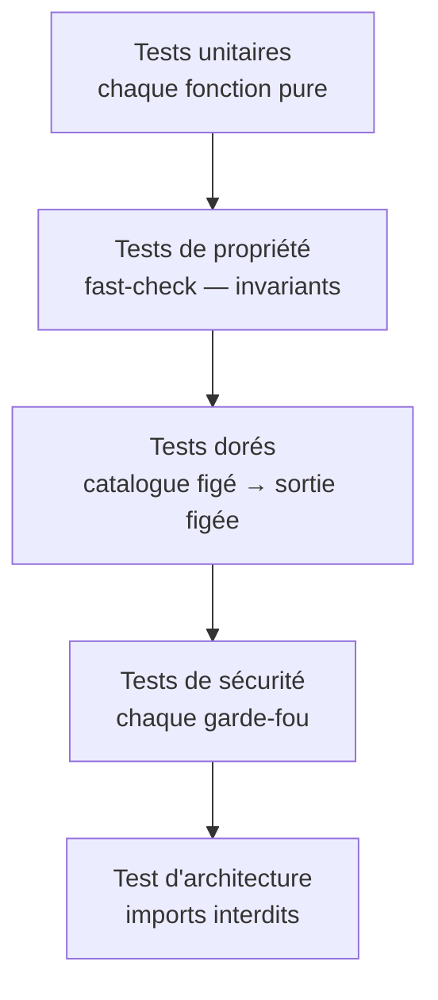
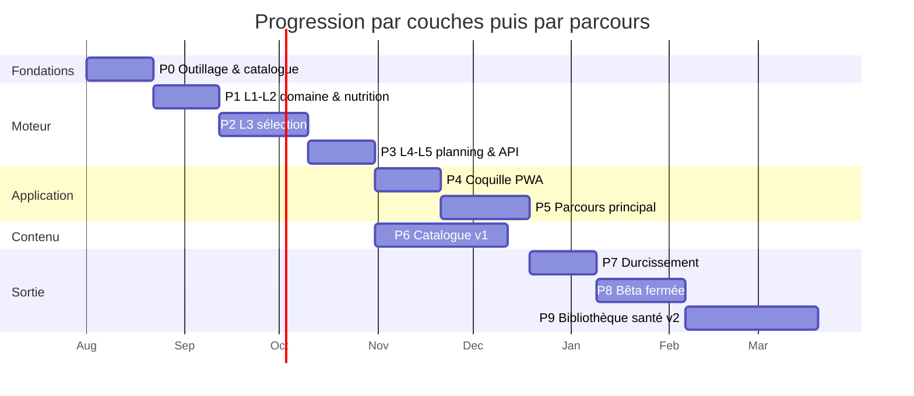
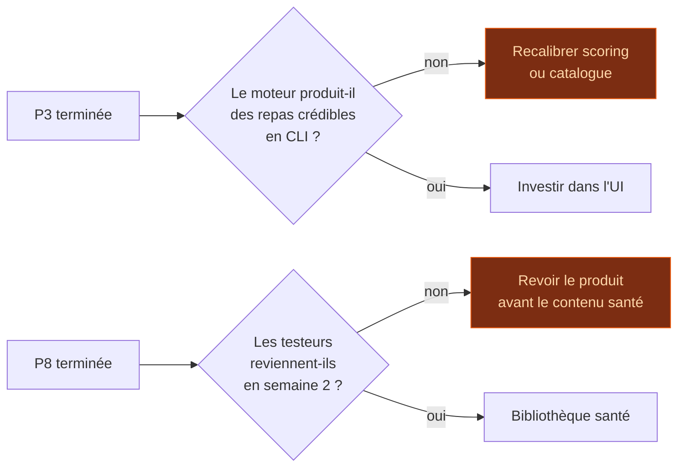

# Moteur — Stratégie de test · Plan de lancement · Décisions à valider

> Partie de la spécification du moteur. Index et ordre de lecture : [`../ENGINE.md`](../ENGINE.md).
> **La numérotation des sections (§4, §6.6 bis…) est celle du document d'origine et n'a pas bougé** —
> toute référence `ENGINE §x.y` faite ailleurs reste valide.

---

## 11. Stratégie de test

Couverture visée sur `engine/` : **≥ 90 %**, et 100 % sur `guards/`.



### 11.1 Tests de propriété — le cœur du dispositif

Un test unitaire vérifie un cas. Un test de propriété vérifie un **invariant sur des milliers
d'entrées générées** — exactement ce qu'il faut pour un filtre de sécurité.

```ts
test.prop([arbProfile, arbAllergies, arbContext])(
  'aucune suggestion ne contient jamais un allergène déclaré',
  (profile, allergies, ctx) => {
    const r = engine.suggestMeals({ profile, constraints: { allergies }, context: ctx, ... })
    for (const s of r.suggestions) {
      expect(allergensOf(s.recipeId)).not.toIntersect(allergies)
    }
  }
)
```

Invariants à couvrir de cette façon :
- Aucun allergène déclaré dans une suggestion — **jamais**
- **Aucune couche `kind: 'scoring'` ne réduit l'ensemble des candidats** — vérifié couche par couche
- **Aucune couche `critical` ne peut être retirée du registre**, quel que soit le réglage
- Le score reste dans [0, 100] quelles que soient les pondérations
- `planWeek` respecte toujours le plancher calorique ou lève
- Deux appels de même graine et mêmes entrées produisent une sortie identique

### 11.2 Tests dorés

Un catalogue de test figé (~20 recettes) + un jeu de requêtes → sorties enregistrées en snapshot.
Toute modification du scoring fait apparaître le diff exact. C'est le filet de sécurité contre les
régressions silencieuses de pondération.

### 11.3 Banc d'essai en ligne de commande — **CODÉ** (`app/src/cli/try-engine.ts`, script npm `engine:try`)

```bash
npm run engine:try -- --slot diner --temps 30 --envie "leger,chaud" --seed 42
```

Affiche, dans l'ordre, l'en-tête de contexte effectif (avec une commande « à rejouer » où tous les
défauts implicites sont rendus explicites), l'**entonnoir d'exclusion** (§6.8), les **poids
appliqués** (après archétype, bascule d'envie, normalisation), puis le **classement diversifié**
(MMR, §6.6) avec la contribution de chaque couche et l'**explication** (§6.7) par candidat — ou le
**motif de rejet dominant** si 0 candidat après exclusion — **sans navigateur ni UI**. Options :
`--slot --date --temps --envie --archetype --allergies --regime --exclus --requis --pref --favoris
--only-favoris --variete --limit --seed --lambda --no-mmr`.

> `--lambda` (§6.6, CODÉ) fixe `mmrLambda` sur la requête ; `--no-mmr` (drapeau booléen, CODÉ)
> positionne `skipDiversification` et affiche alors le classement brut par score, pour comparaison
> directe avec le classement diversifié.
>
> `--favoris id1,id2` (§8.1, CODÉ) peuple `favoriteRecipeIds` ; `--only-favoris` (drapeau booléen)
> lève `onlyFavorites`. Les deux sont indépendants : `--favoris` seul ne filtre rien (les favoris
> sont un marque-page), `--only-favoris` seul ne conserve rien et lève `NoViableRecipeError`.
> `--variete auto|surprise|classiques` (§8.1, CODÉ) fixe `varietyMode`.
>
> ⚠️ **Au banc, `--variete` déplace les SCORES sans changer l'ORDRE** : l'historique du banc est
> VIDE (§7.5, démarrage à froid), donc toutes les recettes ont la même récence et la même
> familiarité — l'override les décale toutes du même montant. Mesuré à 10 recettes : `auto` 57,6 ·
> `surprise` 65,5 · `classiques` 49,7 pour la même tête de classement.
>
> ⚠️ **Ce blocage-ci n'est PAS celui de λ et le contenu ne l'a pas levé.** La cause est l'absence
> d'HISTORIQUE au banc, pas la taille du catalogue : passer à 212 recettes n'y change rien. Observer
> l'effet sur le classement demande d'injecter un historique de repas, pas plus de recettes.

**Le banc passe désormais entièrement par `engine.suggestMeals(request)` (CODÉ, P1c)** — c'est le
changement de structure du lot : il n'appelle plus `runExclusionPass`/`runScoringPass`/`diversify`/
`explainSuggestion` à la main, et ne re-dérive plus son propre catalogue enrichi via
`attachDerivedIndexes` (§8). Entonnoir, poids, classement et explications viennent tous du
`SuggestionResult` retourné par `suggestMeals` ; la « limite d'API » précédemment documentée en §8
est levée par ce même changement. ✅ **La similarité est revenue au banc le 2026-08-07** — elle avait
disparu de cet affichage, et ce paragraphe annonçait qu'elle attendrait la calibration de λ. La
piste qu'il proposait était mauvaise : le champ ne va PAS sur `ScoredSuggestion` (§8.2), qui est ce
que l'interface rend et où un nombre de similarité finirait affiché à côté d'un plat. Il vit sur
**`EngineDiagnostics.diversification`**, canal de diagnostic déjà existant que l'UI ne lit pas — et
`diversify` produisait la valeur depuis toujours, `suggestMeals` la jetait. Date par défaut
**fixe en dur** (`2026-06-15`), jamais l'horloge système, pour rester reproductible d'un run à
l'autre (§1) — notamment vis-à-vis de la couche `season`, sensible au mois.

Cet outil permet de valider et calibrer tout le produit avant d'écrire le premier composant React.
Construit en phase 1, il servira jusqu'à la fin du projet.

---

## 12. Plan de lancement



> Durées indicatives pour un développeur seul à temps partiel. **P6 (contenu) est parallélisable**
> avec le développement applicatif — c'est le chemin critique réel du projet, pas le code.

### Phases et critères de sortie

| Phase | Contenu | Critère de sortie — vérifiable |
|---|---|---|
| **P0** Fondations | Repo, Vite, TS strict, Vitest, `build.mjs`, import CIQUAL | `catalog.db` généré depuis 10 recettes de test ; le build échoue sur une recette invalide |
| **P1** Domaine & nutrition | L1 + L2 + guards | Besoins énergétiques conformes à Mifflin-St Jeor sur 20 cas de référence ; 4 garde-fous couverts à 100 % |
| **P2** Sélection | Registre de **18** couches + banc CLI | Banc CLI **outillé** (`engine:try`, CODÉ — §11.3), qui passe désormais par `suggestMeals` (§8). Diversification (§6.6) et explication (§6.7) sont **CODÉES et câblées bout-en-bout** (P1c) : le pipeline produit mécaniquement des suggestions diversifiées et expliquées, démontré par le banc CLI et par les tests (**572 tests verts, 44 fichiers** au 2026-07-29). Le critère littéral (« 5 suggestions expliquées et diversifiées ») est rempli. `DEFAULT_MMR_LAMBDA` (§6.6) **est CALIBRÉ depuis le 2026-08-07** — 0,4 → 0,3, banc `engine:calibrate-lambda`, 288 configurations sur 305 recettes ; chaque couche s'exécute et se teste seule ; les tests de propriété passent |
| **P3** Planning & API ✅ | L4 + L5 + restes + courses | **REMPLI (2026-07-29)** — `planWeek`, `rerollSlot`, `planLeftovers`, `buildShoppingList`, `scaleRecipe`, `suggestAlternatives` codés et jouables en CLI (`engine:plan`, `engine:plan-stress` → 20/20 configurations saines). Restent non câblées : `analyzeWeek` (pas de type `NutritionReport`) et `suggestSubstitutions` (table vide, décision 27) |
| **P4** Coquille PWA ▓▓ | React, routage, SQLite/OPFS, consentement, sauvegarde | **ENTAMÉE** — React 19 + Vite 7 + Tailwind 4 + SQLite WASM ; `catalog.db` chargé et lu dans le navigateur, écran « Aujourd'hui » branché sur le vrai moteur. ⛔ Restent : **`user.db` / OPFS** (rien n'est persisté), le routage, le consentement, la sauvegarde. Le critère (« données conservées après 8 jours ») n'est pas approché |
| **P5** Parcours principal | Onboarding, suggestions, planning, courses, tips | Un utilisateur non accompagné planifie sa semaine et obtient sa liste |
| **P6** Contenu v1 | **200-300 recettes** (cible revue, décision 4), photos, ~60 tips | Bundle < 15 Mo ; 7 jours planifiables sans répétition ; `CREDITS.md` complet. **Recettes et aliments DÉPASSÉS** (241 / 199), lexique complété (62 gestes) ; restent **les photos (0 sur 241)** et les tips (aucune table) |
| **P7** Durcissement | Hors-ligne, export/import, garde-fous TCA, lint de contenu | Zéro requête réseau après chargement (test automatisé) ; restauration d'une sauvegarde vérifiée |
| **P8** Bêta fermée | 15-25 testeurs, collecte manuelle des retours | Aucun bug bloquant ; ≥ 60 % des testeurs planifient une 2ᵉ semaine |
| **P9** Bibliothèque santé | 8-10 chapitres, fiches, filtre optionnel | Relecture externe des chapitres ; revue juridique ; `assertTopicsNeverExclude` verte |

### Points de non-retour



**Ne pas écrire d'interface avant P3.** Si le moteur ne produit pas des repas crédibles en ligne de
commande, aucune interface ne le sauvera — et une interface déjà écrite rend douloureux le fait de
remettre en cause le moteur. C'est le principal piège de ce type de projet.

**Ne pas rédiger les chapitres santé avant P8.** Ce sont les artefacts les plus coûteux et les plus
exposés juridiquement. Les écrire avant d'avoir confirmé que le produit est utilisé serait investir
le plus cher dans le plus incertain.

---

## 13. Décisions à valider

### Tranchées

| # | Décision | Retenu |
|---|---|---|
| 1 | Pipeline en dur ou registre de couches ? | **Registre de 18 couches** à contrat commun (§6.2) |
| 2 | « Vider le frigo » : filtre ou score ? | **Score**, avec un mode où son poids devient dominant |
| 3 | Suivi des préférences | **Signaux uniquement**, jamais un journal alimentaire (§6.5 ARCHI) |
| 4 | Média du lexique | **WebP animée**, boucle muette ~3 s, ~80 Ko (§8.5 ARCHI) |
| 5 | Fêtes mobiles | **Table figée sur 10 ans**, pas de calcul lunaire (§8.6 ARCHI) |
| 6 | Macros affichés | **Optionnel, `false` par défaut**, sans compteur de reste |
| 7 | Équipement | **Deux niveaux** : `requis` exclut, `accelere` déclasse |
| 8 | « Carnivore » | **Préférence, pas régime** — aucune autorité de santé derrière |
| 9 | Fenêtre de planification | **2 à 14 jours glissants**, à partir de n'importe quel jour |
| 10 | Mode sportif | **Affichage descriptif seul** — aucun objectif, aucun compteur de reste |
| 11 | Poids et nutrition sportive | **Chapitres d'information**, jamais objectifs pilotant le moteur |
| 12 | Gestes tactiles | **Accélérateurs uniquement**, toujours doublés d'un contrôle visible |
| 13 | Humeur / fatigue | Traduite en **envie sensorielle**, jamais en carence supposée |

### Ouvertes

| # | Question | Recommandation |
|---|---|---|
| 1 | `NutrientVector` en `Float64Array` ou objet ? | **Float64Array** — l'API reste lisible derrière des accesseurs |
| 2 | Nombre de nutriments suivis | **~40** (macros, fibres, 12 minéraux, 13 vitamines, AG saturés/insaturés) |
| 3 | Historique de variété | **21 jours** glissants |
| 4 | Réglage des poids exposé ? | **Non** — un petit jeu d'**archétypes nommés** (§6.3 bis, généralise les « 4 préréglages » initiaux). **Tranché et CODÉ** : 6 archétypes, noms validés. Jamais un curseur par couche |
| 5 | Restes en v1 ou v2 ? | **v1** — structurant pour le planificateur, coûteux à ajouter après |
| 6 | Substitutions en v1 ou v1.5 ? | **v1.5** — coût de contenu, pas de code |
| 7 | Volume du lexique | **30-40 gestes**, dérivés automatiquement des étapes de recette |
